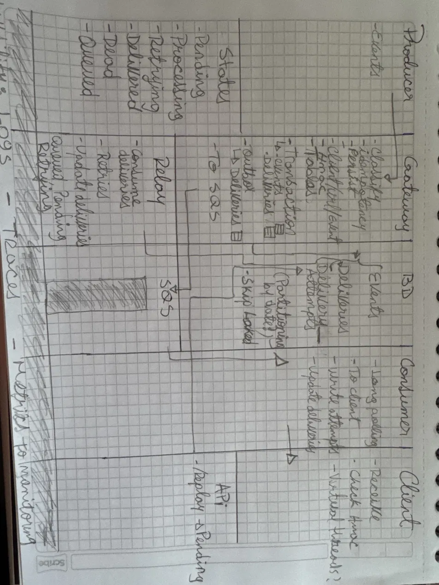
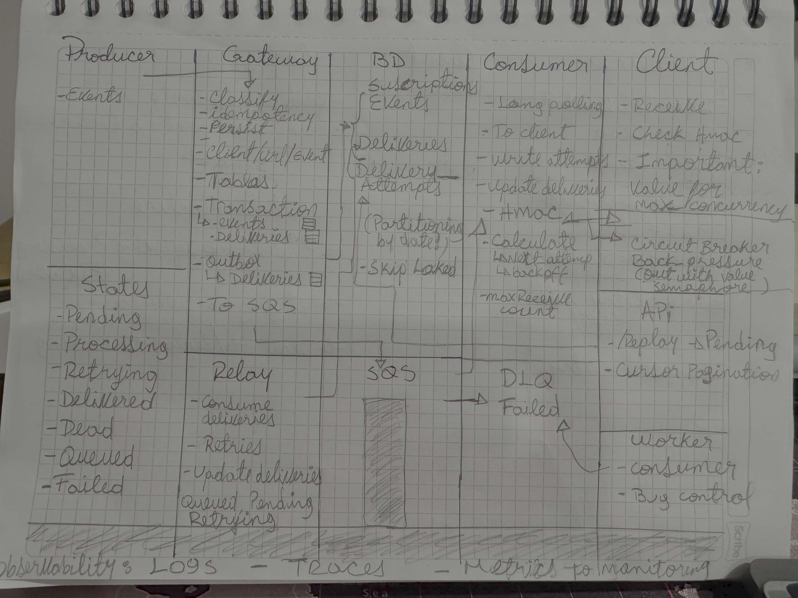
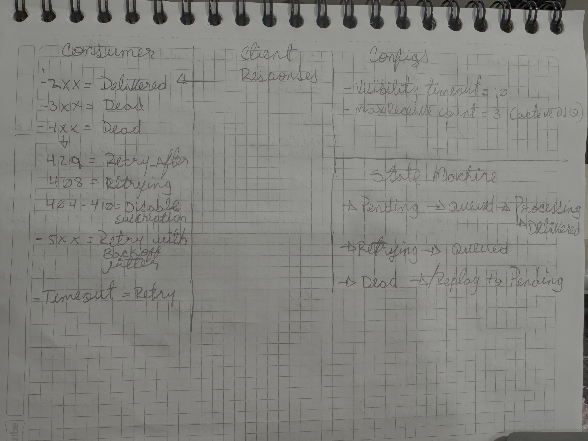
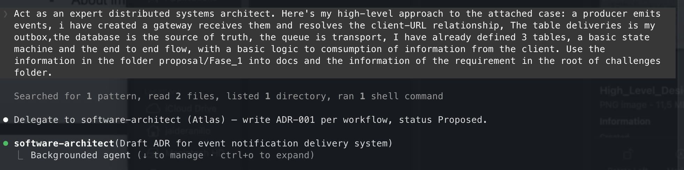
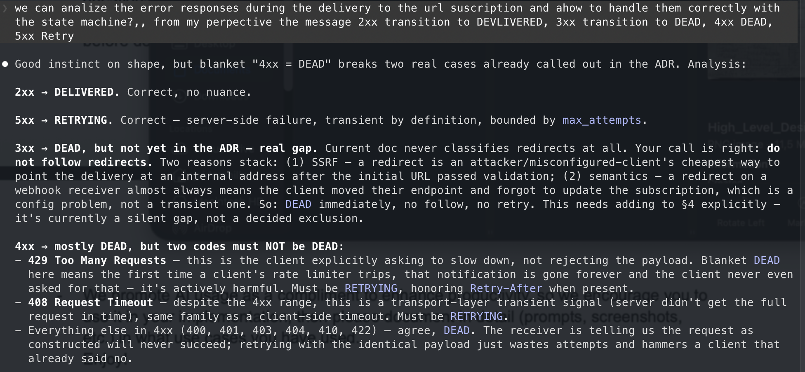
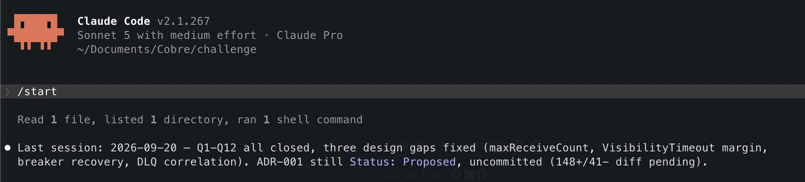
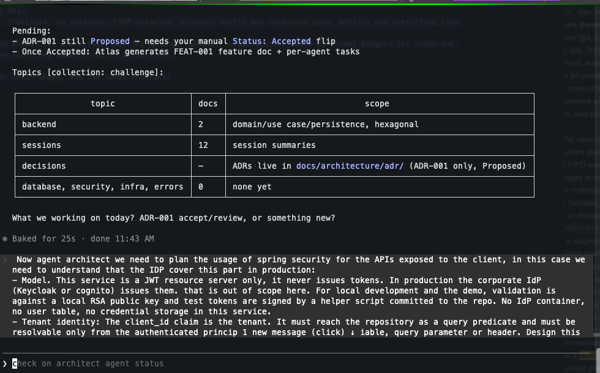
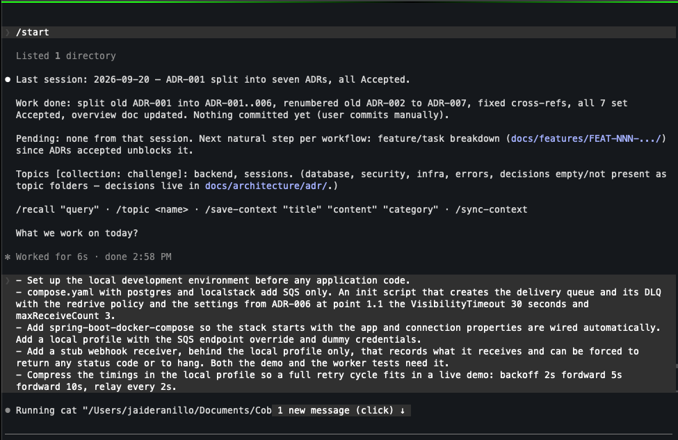
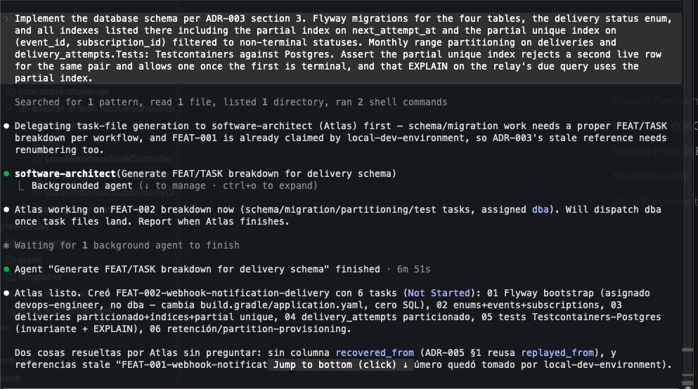

# AI Integration & Development Process

This document explains how I used AI while building this challenge, written from my own perspective. I made every architectural and design decision myself. Claude Code and its specialized agents complemented that work, drafting documentation, generating ADRs and task files against decisions I had already made, and executing implementation strictly within the scope I defined. The sections below walk through that process from ideation to delivery.

## Introduction / Ideation Phase

*[Placeholder for paper sketch images: Hand-drawn architectural sketches used to initialize the context]*

### Phase 1

### Phase 2

## Section 1: How I Used AI

I started every design decision on paper, sketching the flow by hand before opening an editor. The images above are those sketches, used to give the AI a concrete starting context instead of a blank prompt.

From there, I leveraged Claude Code and specialized LLM agents as an adversarial design reviewer: I fed them a proposed design and asked them to push back on it, surface edge cases, and challenge assumptions before any code existed. I made the call on every objection raised.

Once a design was settled, the AI's role shifted to execution: generating code strictly against those pre-determined decisions, and drafting documentation (ADRs, feature breakdowns, task files) from parameters I had already fixed. It never originated a decision on its own.

## Section 2: Design & Challenges

| Challenge Raised | Resolution |
| :--- | :--- |
| Dual write between DB commit and enqueue | Deliveries becomes the outbox; relay as guaranteed path |
| Kafka head-of-line blocking per partition | SQS Standard, isolation per message |
| Retry stampede on a recovering client | Relay does not enqueue while the circuit is open |
| Circuit breaker state shared across pods | State in PostgreSQL, writes only on transitions |

*[Prompt for design process]*

*[Prompt for design process]*

## Section 3: Implementation

*[Custom command image: The custom /start command restoring the last session and loading context]*

*[Agent workflow image: Orchestrated agent workflow boosting development capabilities]*

*[Placeholder for implementation prompt images: Initial base project setup prompts in Claude Code]*

## Section 4: What I Did Not Delegate

Architecture decisions were entirely mine; the AI only reviewed and executed.

## Section 5: The ADR to Feature to Task Workflow

I did not let the AI freestyle code against a vague prompt. Every non-trivial change in this repo goes through a fixed pipeline: an ADR first, then a feature breakdown, then per-concern tasks, and only then implementation.

software-architect (Atlas) drafts an ADR in docs/architecture/adr/ with status Proposed. I am the one who reads it and flips it to Accepted or Rejected, since no agent self-approves its own design. That gate was deliberate. I wanted every irreversible architectural call (outbox pattern, circuit breaker in Postgres, SQS over Kafka) to have my explicit sign-off before a line of code existed.

Once an ADR is Accepted, Atlas breaks it into a docs/features/FEAT-NNN folder with one tasks/TASK-NNN-XX file per unit of work. Each task is scoped to roughly three files and one concern, and assigned to exactly one implementing agent: backend-engineer, dba, security-engineer, or devops-engineer. That sizing rule is not cosmetic, since a task that does not fit in one sitting gets split, never crammed.

Implementing agents work only from their assigned task file. They never run git add or git commit. They mark the task Ready for Review and stop. I review the working tree myself and commit by hand. That kept me as the actual gatekeeper of what lands in history, not just a reviewer of a finished PR.

## Section 6: Why This Flow Made the Engineering Better

The ADR gate forced design conversations to happen in writing, before code, where I could challenge an assumption cheaply. The docs/concerns.md escape hatch meant a disagreement with a settled decision got logged and kept moving, instead of turning into a mid-implementation re-litigation.

The task-file boundary kept each agent narrow. A dba task never touched a controller, a security-engineer task never touched SQL. That made each diff reviewable in isolation, and it made the blast radius of any one AI-generated change small and easy to audit.

The net effect: I piloted every decision that mattered, what to build, in what order, and whether to accept a design, while the AI carried the mechanical weight of drafting ADRs, generating task files, and writing the implementation against a spec I had already approved.
