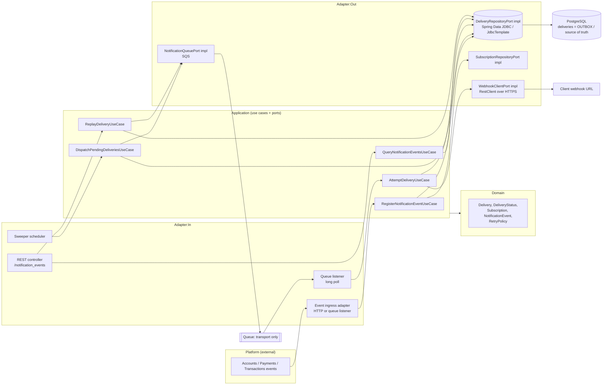

# Architecture Overview: Webhook Notification Delivery

Shared context, component map and cross-cutting assumptions for ADR-001 through ADR-007. This document records no decisions of its own; each decision lives in the ADR named in the index below.

## Context

Cobre is an event-driven microservices platform (accounts, payments, transactions). A new capability is required: notify each client individually about platform events (balance update, event creation, payment received, etc.) by calling a client-specific HTTPS webhook URL.

The case statement requires two halves:

**A. Delivery pipeline**
- Confirm via a subscription that an event must be delivered at all, and that the target client is the owner of the event (tenant isolation is called out as mandatory).
- Deliver the notification to the client's HTTPS endpoint.
- Handle delivery errors with an efficient retry strategy.
- Persist final delivery information.
- Near real-time observability so an internal monitoring team can detect behavior deviation and answer client complaints.

**B. Self-service REST API**
- `GET /notification_events` — list per client, filterable by event creation date and `delivery_status`.
- `GET /notification_events/{notification_event_id}` — single event detail.
- `POST /notification_events/{notification_event_id}/replay` — re-send a notification whose delivery has definitively failed.

The sample payload at `docs/challenge/notification_events.json` fixes the externally visible shape: `{ event_id, event_type, content, delivery_date, delivery_status ("completed" | "failed"), client_id }`.

Non-functional asks: scalability, resiliency, hexagonal architecture, Java/Spring Boot, and at least three OWASP Top 10 risks relevant to a publicly exposed API with mitigations.

### Constraints that are already fixed by the project (CLAUDE.md)

- Java 21, Spring Boot 4.1.1, Gradle, package root `com.cobre.challenge`.
- Hexagonal layout: `domain/model` (framework-free) <- `application/port` + `application/usecase` <- `adapter/in/web` and `adapter/out/*`.
- Blocking Spring MVC on virtual threads (`spring.threads.virtual.enabled=true`). No WebFlux, no reactive types.
- Spring Data JDBC / `NamedParameterJdbcTemplate`. No JPA, no lazy loading, explicit SQL.
- PostgreSQL is the only datastore. Dev services via `compose.yaml`; tests via Testcontainers.
- OpenTelemetry + Micrometer tracing into a `grafana/otel-lgtm` stack, already wired.
- One human developer. The design must be implementable by one person in reasonable time.

### The design direction being formalized

This ADR formalizes the user's own whiteboard design (`docs/challenge/proposal/Fase_1/High_Level_1.png`): `Producer -> Gateway -> DB -> Consumer -> Client`, where the `deliveries` table is an outbox and the single source of truth, and the queue (SQS in the sketch) is pure transport. This ADR does not propose a different architecture; it makes that one precise and names the parts that were ambiguous on the whiteboard (see **Assumptions** below).

The queue transport is **Amazon SQS**, confirmed by the user (Q1). The rest of the design stays queue-agnostic regardless: SQS is load-bearing in exactly one place, the `NotificationQueuePort` implementation, plus the two SQS-specific settings in ADR-006 §1.1 (`VisibilityTimeout`, `maxReceiveCount`).

## Component Diagram

## Assumptions

Each item below is **resolved** — stated as a decision, and every ADR in the index below is now `Status: Accepted`. Nothing was silently guessed — each is an explicit interpretation. **The open set is now empty:** every question Q1-Q12 is resolved, including the three that were open in the previous revision (Q8, Q10, and Q12's reactivation half). The numeric proposals flagged in Q5 and Q7 remain validate-against-real-SLOs tuning items, not blockers — they are configuration values that change no contract and no state machine. Each Qn's full reasoning lives in the ADR that owns the decision it belongs to; only the two project-wide items (Q9, Q11) are stated in full here.

| | Owning ADR |
| --- | --- |
| Q1 Queue technology | ADR-001 (Assumptions) |
| Q2 "tobias" label | ADR-003 (Assumptions) |
| Q3 "check nonce" | ADR-003 (Assumptions) |
| Q4 Public status vocabulary | ADR-003 (Assumptions) |
| Q5 Retry numbers | ADR-004 (Assumptions) |
| Q6 Per-client ordering | ADR-001 (Assumptions) |
| Q7 Concurrency cap + breaker | ADR-006 (Assumptions) |
| Q8 `client_id` metric cardinality | ADR-002 (Assumptions) |
| Q9 Subscription mgmt out of scope | this document, below |
| Q10 Producer auth for ingest | ADR-002 (Assumptions) |
| Q11 Deployment topology | this document, below |
| Q12 Auto-deactivation + reactivation | ADR-004 (Assumptions) |

- **Q9 — Subscription management is out of scope (resolved: assumed, and relied on throughout).** This ADR consumes a `subscriptions` table (client, event types array, URL, secret reference, `active` flag, concurrency/circuit/throttle state — ADR-003 §3) but does not design its CRUD API. This has not been re-litigated at any point and the rest of the document is built on it: ADR-003 §3's `active` flag as the deactivation mechanism, ADR-002 §1.1's and ADR-003 §2's tenant-isolation query, and Q12's whole framing all assume the table exists and is managed elsewhere. Treated as settled. The three endpoints in the case remain the only public surface. It is recorded here as an assumption rather than a confirmed requirement, so if subscription CRUD is in fact expected, that is a separate ADR and feature, not an amendment to this one.
- **Q11 — Deployment topology (resolved: assumed single application).** Relay, sweeper, consumer and API run as beans in one Spring Boot application, scaled as identical instances. This matches the project's own stated constraint (one human developer, single Gradle module — CLAUDE.md, and ADR-002 §1's "the relay and the consumer are separate processes logically, but in this single-module project they are beans in the same application"), has never been contradicted, and the whole document is written against it. Treated as settled for v1. The design does not *depend* on it: the components communicate only through the `deliveries` table and the queue, so splitting them into separate deployables later is a packaging change with no contract change. Worth revisiting if the project scope grows, not before.

## ADR Index

All seven ADRs are `Status: Accepted`.

- **ADR-001 — Transactional Outbox Architecture and Queue Transport** (Accepted). Decides that the `deliveries` table in PostgreSQL is the single source of truth and the queue is pure transport, and that the queue is Amazon SQS rather than Kafka.
- **ADR-002 — Delivery Pipeline Execution: Ingest, Relay, Worker and Observability** (Accepted). Decides the runtime shape of the pipeline: the synchronous ingest path, the relay's guaranteed due-query, the delivery worker's per-message flow, and the tracing/metrics/logging surface.
- **ADR-003 — Delivery Data Model, State Machine, Idempotency and Ingest-Side Tenant Isolation** (Accepted). Decides the delivery state machine, who writes which transition, the gateway's idempotency and tenant-isolation invariants, and the four-table schema contract.
- **ADR-004 — Retry Strategy and Outbound Webhook Signing** (Accepted). Decides the retry schedule, response classification and per-attempt timeout budget, the outbound webhook envelope, and the HMAC signing and secret-rotation scheme.
- **ADR-005 — Self-Service API, Replay and Target-URL Ownership Verification** (Accepted). Decides the three client-facing endpoints, replay-as-insert, the port shapes behind them, and the `GET` challenge that proves the subscriber owns the target URL.
- **ADR-006 — Resilience Policies: Circuit Breaker, Bulkhead and Queue Configuration** (Accepted). Decides the SQS settings, the per-subscription circuit breaker and its recovery path, and the per-subscription bulkhead.
- **ADR-007 — Self-Service API Security: JWT Resource Server, Structurally Enforced Tenant Isolation, Scope Model and Rate Limiting** (Accepted). Decides how client tokens are validated and how the tenant predicate is enforced structurally on the self-service API.

With all seven Accepted, the feature/task breakdown at `docs/features/FEAT-001-webhook-notification-delivery/` and `docs/features/FEAT-002-api-security-and-tenant-isolation/` (per CLAUDE.md's delivery workflow) is unblocked.
