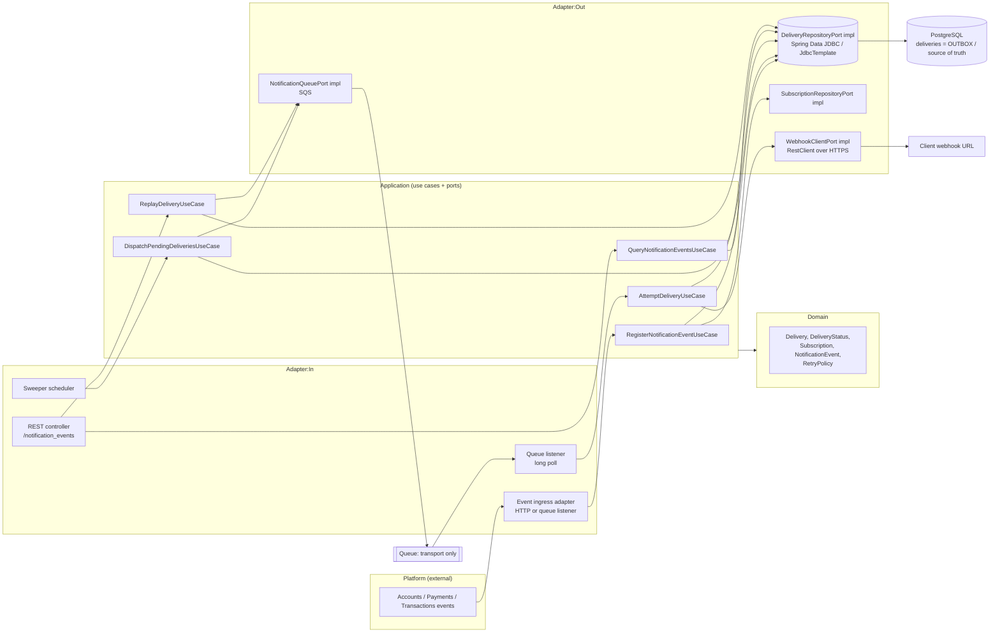
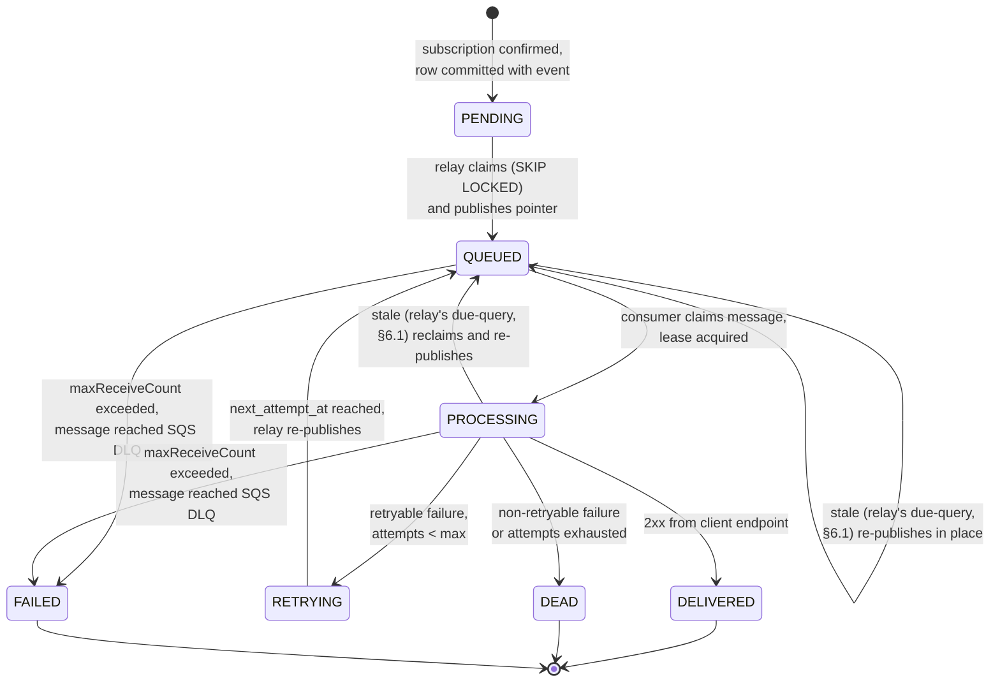
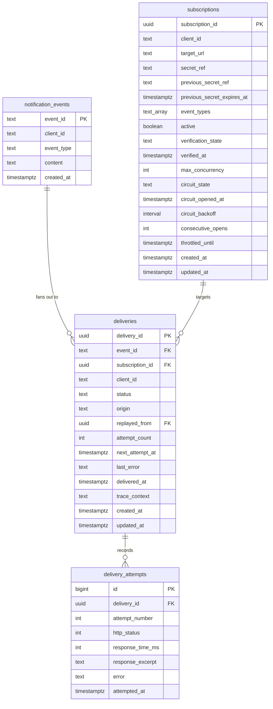
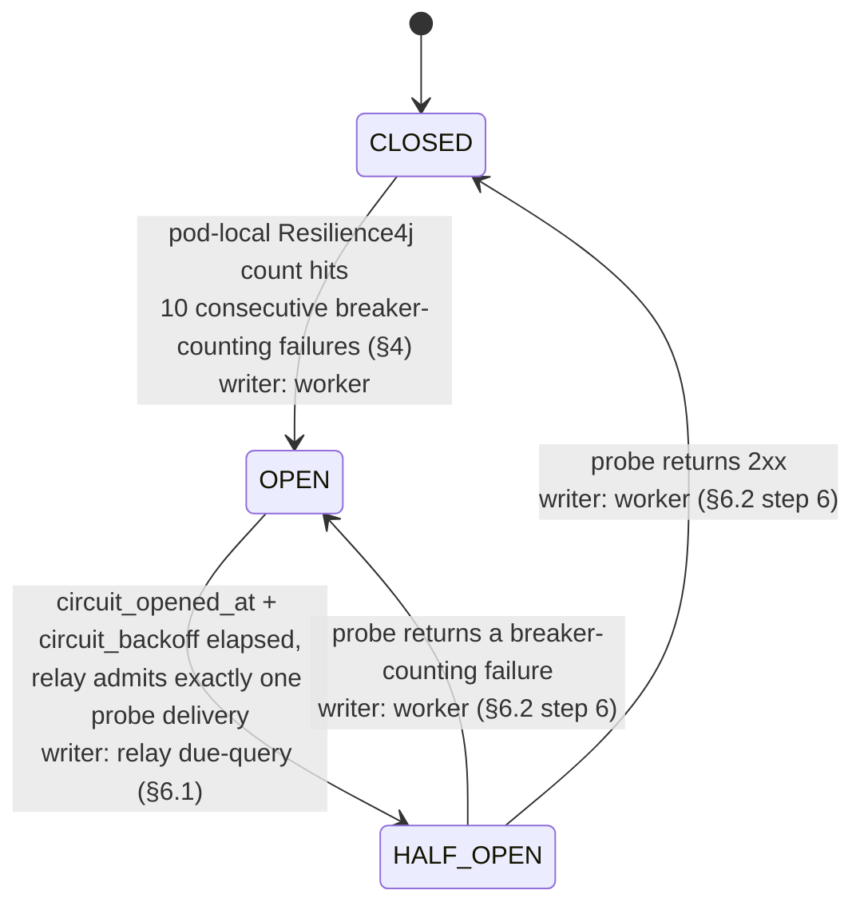

# ADR-001: Webhook Notification Delivery via Transactional Outbox, Queue Transport and Self-Service API

## Status

Proposed <!-- change only by the user: Proposed | Accepted | Rejected | Superseded by ADR-NNN -->

## Context

Cobre is an event-driven microservices platform (accounts, payments, transactions). A new capability is required: notify each client individually about platform events (balance update, event creation, payment received, etc.) by calling a client-specific HTTPS webhook URL.

The case statement requires two halves:

**A. Delivery pipeline**
- Confirm via a subscription that an event must be delivered at all, and that the target client is the owner of the event (tenant isolation is called out as mandatory).
- Deliver the notification to the client's HTTPS endpoint.
- Handle delivery errors with an efficient retry strategy.
- Persist final delivery information.
- Near real-time observability so an internal monitoring team can detect behavior deviation and answer client complaints.

**B. Self-service REST API**
- `GET /notification_events` — list per client, filterable by event creation date and `delivery_status`.
- `GET /notification_events/{notification_event_id}` — single event detail.
- `POST /notification_events/{notification_event_id}/replay` — re-send a notification whose delivery has definitively failed.

The sample payload at `docs/challenge/notification_events.json` fixes the externally visible shape: `{ event_id, event_type, content, delivery_date, delivery_status ("completed" | "failed"), client_id }`.

Non-functional asks: scalability, resiliency, hexagonal architecture, Java/Spring Boot, and at least three OWASP Top 10 risks relevant to a publicly exposed API with mitigations.

### Constraints that are already fixed by the project (CLAUDE.md)

- Java 21, Spring Boot 4.1.1, Gradle, package root `com.cobre.challenge`.
- Hexagonal layout: `domain/model` (framework-free) <- `application/port` + `application/usecase` <- `adapter/in/web` and `adapter/out/*`.
- Blocking Spring MVC on virtual threads (`spring.threads.virtual.enabled=true`). No WebFlux, no reactive types.
- Spring Data JDBC / `NamedParameterJdbcTemplate`. No JPA, no lazy loading, explicit SQL.
- PostgreSQL is the only datastore. Dev services via `compose.yaml`; tests via Testcontainers.
- OpenTelemetry + Micrometer tracing into a `grafana/otel-lgtm` stack, already wired.
- One human developer. The design must be implementable by one person in reasonable time.

### The design direction being formalized

This ADR formalizes the user's own whiteboard design (`docs/challenge/proposal/Fase_1/High_Level_1.png`): `Producer -> Gateway -> DB -> Consumer -> Client`, where the `deliveries` table is an outbox and the single source of truth, and the queue (SQS in the sketch) is pure transport. This ADR does not propose a different architecture; it makes that one precise and names the parts that were ambiguous on the whiteboard (see **Assumptions and Open Questions**).

The queue transport is **Amazon SQS**, confirmed by the user (Q1). The rest of the design stays queue-agnostic regardless: SQS is load-bearing in exactly one place, the `NotificationQueuePort` implementation, plus the two SQS-specific settings in §10.1 (`VisibilityTimeout`, `maxReceiveCount`).

## Options Considered

### Option A: Direct synchronous delivery from the event consumer (no outbox)

The service consumes a platform event, looks up the subscription, and performs the HTTPS POST inline, retrying in-process.

- Pros:
  - Least moving parts; fastest to implement.
  - Lowest latency in the happy path.
- Cons:
  - No durable record of intent before the attempt: a crash mid-attempt loses the notification entirely.
  - Retry state lives in memory, so retries do not survive a restart or a deploy.
  - A slow or hanging client endpoint directly consumes the event-consumption capacity and back-pressures unrelated clients (noisy-neighbor).
  - Cannot satisfy "store final delivery information" as a source of truth, nor `POST /replay`, without bolting a table on anyway.
  - Fails the resiliency non-functional outright.

### Option B: Persist to the queue first, treat the queue as the source of truth

The gateway writes the delivery intent straight to SQS; workers consume, deliver, and only then write an audit row to Postgres.

- Pros:
  - Simple write path; queue provides fan-out and visibility timeouts for free.
  - Native dead-letter queue support handles definitive failure.
- Cons:
  - Dual-write problem with no transaction: the platform event can be accepted and the enqueue can fail (or vice versa), silently losing notifications.
  - The API endpoints (`GET` list/detail, `replay`) need a queryable, filterable store; a queue is not queryable, so a table is required regardless.
  - Message retention caps (SQS: 14 days maximum) make the queue unusable as a system of record for delivery history.
  - Replay of a definitively failed delivery becomes a DLQ-redrive operation rather than an API call against a row the client can see.

### Option C: Transactional outbox in Postgres, queue as transport only (whiteboard design)

The gateway validates the subscription and writes a `deliveries` row in the same transaction as accepting the event. A relay publishes a lightweight pointer message to SQS. Consumers claim rows with `SELECT ... FOR UPDATE SKIP LOCKED`, perform the HTTPS attempt on a virtual thread, and write the outcome back to the `deliveries` table. The queue only wakes consumers; losing a message loses nothing, because a sweeper re-publishes any row left in a non-terminal state past its `next_attempt_at`.

- Pros:
  - Single source of truth in Postgres: durable, queryable, filterable, directly backing all three API endpoints.
  - No dual-write hazard: the delivery intent is committed with the event in one transaction.
  - `SKIP LOCKED` gives safe horizontal scaling of consumers with no double-claim and no distributed lock service.
  - At-least-once delivery semantics with an explicit, inspectable retry schedule that survives restarts and deploys.
  - Replay is a state transition on an existing row, not an infrastructure operation.
  - Queue outage degrades latency, not correctness: the sweeper keeps draining the outbox.
- Cons:
  - More components than Option A: gateway, relay, sweeper, consumer.
  - The outbox table is a write-hot table needing index and retention discipline (partitioning, archival).
  - Requires the DB to absorb the claim traffic; polling cadence needs tuning.
  - At-least-once means clients must tolerate duplicates; this obligation must be documented and supported with a delivery id header.

## Decision

**Adopt Option C: a transactional outbox in PostgreSQL (`deliveries` table) as the single source of truth, with the queue as pure transport, `SELECT ... FOR UPDATE SKIP LOCKED` claiming, virtual-thread-based delivery workers, and a self-service REST API reading from the same table.**

### 0. Core decision: the database is the source of truth, the queue is transport

**Decision.** All delivery state lives in PostgreSQL. SQS carries a single delivery attempt pointer and nothing more. A message never represents the lifecycle of a delivery — the row does.

**Why.** A queue cannot be queried, cannot be filtered by status, and deletes its own history (SQS retention caps at 14 days). The self-service API needs exactly those three things: query, filter, history. Making the queue authoritative would mean maintaining delivery state in two places that cannot be kept transactionally consistent — the dual-write hazard named in Option B's cons.

**Consequences that follow from this and are not separately negotiable:**

- **No separate outbox table.** `deliveries` is not a business table plus a parallel outbox table kept in sync — it *is* the outbox. There is exactly one write path: the gateway inserts the `deliveries` row (status `PENDING`) in the same DB transaction that accepts the event. There is no dual write between "record the delivery" and "enqueue the delivery" — only one of those is a write at all.
- **Nothing is ever enqueued before it is committed.** The relay only ever reads rows that already exist and are already committed; it cannot publish a pointer message for a delivery that isn't durably recorded, because the row is the precondition for the publish, not a side effect of it.
- **A message lost in SQS is recoverable; a row lost in PostgreSQL is not.** The design is built around that asymmetry, not around making the queue reliable. This is why the relay/sweeper's `SKIP LOCKED` claim over `deliveries` — not SQS redelivery — is the guaranteed-delivery path (§6): losing a message only costs latency, because the row it would have pointed to is still there and still due. There is no equivalent recovery path for a row that was never committed, which is exactly why the write-then-publish ordering above is non-negotiable.
- **Duplicate enqueues are harmless and therefore not defended against with coordination.** Two pointer messages for the same `deliveries` row (relay double-publish, SQS at-least-once redelivery, the relay's own due-query racing a normal publish, §6.1) are safe by construction: the consumer's claim is `UPDATE ... WHERE status = 'QUEUED'` (the state-guard from §2.1/§3), so only the first claim succeeds — every subsequent claim attempt on an already-`PROCESSING` or already-terminal row affects zero rows and the consumer discards the message. No deduplication table, no message-id tracking, no exactly-once queue configuration is needed; the row's `status` column *is* the deduplication mechanism.

### 0.1 Queue technology: SQS, not Kafka

**Decision.** Amazon SQS Standard for the delivery queue, with a redrive policy to a DLQ.

**Why not Kafka.** Kafka is a partitioned, ordered log. Webhook delivery is the opposite shape: independent per-message work, with retry horizons spanning seconds to hours, requiring isolation per destination.

- **No native delay.** Retrying in 15 minutes means either sleeping the consumer (which blocks the partition) or building tiered retry topics by hand.
- **Head-of-line blocking.** Partitioning by `client_id` means one client with a dead endpoint freezes every client sharing that partition.

SQS Standard has no partitions, so a message reattempts on its own schedule and a failing destination never affects another. `DelaySeconds` covers short backoff natively; longer horizons are covered by the relay (§6), which the design needs regardless of queue choice.

**Ordering is deliberately not offered.** FIFO would reintroduce head-of-line blocking within a message group and cap throughput, and staggered retries break ordering anyway — a retried event arrives after events that came later (§4, "Ordering"). Instead, the outbound webhook body carries `created_at` (the platform event's creation timestamp, `notification_events.created_at`, §9) with `event_id` as a deterministic tiebreak, so a client that cares can order or discard stale notifications on its own side (envelope shape in §4.1). This does not change Q6: the platform still does not guarantee delivery order, it only gives the client the information needed to reconstruct it if they want to.

**Why a timestamp and not a per-client sequence counter.** An earlier draft of this ADR proposed a `deliveries.sequence_number`, monotonic per `client_id` and assigned at ingest. That is the correct *idea* — hand the client a total order it can sort on — implemented the wrong way: a monotonic-per-client counter needs a per-client row that is read-modify-written on every single ingest, which serializes all inserts for that client behind one row. That is exactly the hot-row pattern §10.2 deliberately refuses for the circuit breaker's failure count, and it would be worse here, because the circuit breaker only writes on a state *transition* while an ingest counter writes on every event. Two ways out exist: a **global** Postgres `SEQUENCE` (monotonic and increasing, gapped per client — fine, because only relative order matters, not density), or **no new column at all**, using `created_at` plus `event_id`. This ADR takes the second. A global sequence would still be a new column, a new database object, and a second ordering key to explain to clients, and it would buy nothing `created_at` does not already provide: `created_at` is already stored (§9), already indexed for the list endpoint's date-range filter (§5, §9), and — per §4.1 — already inside the signed webhook body, so the client can trust it. `event_id` breaks ties deterministically for two events sharing a timestamp. Adding a column whose only job is to re-encode an ordering two existing fields already express is the YAGNI violation, so `sequence_number` is dropped rather than reimplemented.

**Not chosen: a managed webhook-delivery service** (e.g. a hosted outbound-webhook product). Correct answer for a real product on total cost of ownership; excluded here because building this mechanism is the exercise.

### 1. Components and flow



Roles:

| Component | Responsibility |
| --- | --- |
| Gateway (ingress adapter + `RegisterNotificationEventUseCase`) | Synchronous HTTP entry point for producers, no outbound calls. Validates, resolves subscriptions with tenant isolation built into the query itself, writes `notification_events` + `deliveries` rows in one transaction, responds `202`, then best-effort publishes to SQS. Full detail in §1.1. |
| Relay / dispatcher (`DispatchPendingDeliveriesUseCase`) | Claim rows that are due (`PENDING`/`RETRYING` with `next_attempt_at <= now()`) with `SKIP LOCKED`, move them to `QUEUED`, publish a pointer message. Also acts as the sweeper that re-publishes rows whose queue message was lost. |
| Consumer (queue listener + `AttemptDeliveryUseCase`) | Long-poll, load the row, transition to `PROCESSING`, perform the HTTPS POST on a virtual thread with strict timeouts, write the attempt outcome and the next state back to the table. Full per-message flow, including the claim/bulkhead/breaker/delete ordering, in §6.2. |
| API (`adapter/in/web` + query/replay use cases) | Read from the same `deliveries` table; replay inserts a new `PENDING` row rather than mutating the terminal one (§5). |

The relay and the consumer are separate processes logically, but in this single-module project they are beans in the same application; nothing in the design prevents splitting them later, because they communicate only through the table and the queue.

### 1.1 Ingest path

The gateway is the **only** synchronous entry point for producers. It makes no outbound HTTP call of any kind — that happens exclusively in the consumer (§1, §4). This also settles Q10 in full — both halves: event ingress is a synchronous HTTP endpoint, not a queue listener, and producers authenticate to it with AWS IAM (step 1 below).

1. **Validate the event** — schema, and producer authentication. The caller is a platform-internal service, not a client, and it authenticates with **AWS IAM (SigV4-signed requests / IAM role-based auth)**, resolved in Q10: the platform already runs on AWS (SQS is confirmed, Q1), so internal service-to-service calls ride the identity system that is already there rather than a bespoke service token, an internal JWT or mTLS, none of which would add anything IAM does not already provide and each of which would add its own issuance, rotation and revocation surface. This credential is deliberately distinct from the self-service API's per-client auth (§5's OWASP A07 row) — two different callers, two different identity systems, no shared credential. The concrete wiring (which IAM role, how the request is verified at the edge vs. in the application) is a security-engineer implementation detail, not an open architectural question.
2. **Resolve matching subscriptions.** The lookup is keyed on the event's `client_id`: the query predicate is `WHERE client_id = :event.client_id AND event_type = :event.event_type AND active`, not a fetch-then-compare. Tenant isolation is enforced **structurally, in the query itself** — there is no code path where a subscription belonging to a different client is ever materialized in memory and then checked; it is simply never returned by the query. This is stronger than the "fetch a subscription, then assert its `client_id` matches" pattern (an earlier draft of §3 read that way and has been corrected to match — see below).
3. **One transaction:** insert the `notification_events` row (idempotent on `event_id` — the table's own primary key, `ON CONFLICT (event_id) DO NOTHING`) plus one `deliveries` row per matched subscription, each `PENDING`. Zero matches means the event is still stored (for audit/debugging) and nothing downstream happens — no error, no rejection.
4. **Commit, respond `202 Accepted`.**
5. **Best-effort `SendMessage` to SQS**, *after* the response has already been returned to the producer.

**If the transaction in step 3 fails, nothing exists** — no `notification_events` row, no `deliveries` rows, no message. The producer's retry (at-least-once upstream, §3) hits the same idempotent insert and the failed attempt leaves no trace to reconcile.

**If step 5 fails, the `deliveries` rows are already durable** (committed in step 3, before step 4's response was even sent) and the relay picks them up on its next sweep regardless (§0, §6 — "relay is the guaranteed path"). Step 5 is purely a latency optimization; losing it costs a poll interval, not correctness. **No network call is ever made inside a database transaction** — this is the same discipline §0's "nothing is ever enqueued before it is committed" already established, now stated for the ingest side specifically: the DB transaction (steps 1-3) and the queue publish (step 5) are strictly sequential and never share a unit of work.

### 2. Delivery state machine



`DEAD` no longer transitions back to `PENDING`. Replay does not mutate the `DEAD` row at all — see the revised §5 and §9 below; the arrow that used to read `DEAD --> PENDING: POST /replay` is gone because replay creates a *new* `deliveries` row rather than resurrecting the old one, which is also what finally resolves the §5/§9 contradiction the architecture review (previous turn) flagged as its most severe finding.

A stale `QUEUED`/`PROCESSING` row also no longer resets to `PENDING`: §6.1's due-query reclaims it directly back into `QUEUED` (status doesn't actually change for an already-`QUEUED` row, only `next_attempt_at` and a fresh publish; a stale `PROCESSING` row moves to `QUEUED`). This replaces what an earlier draft of this ADR called "lease expiry" with a single mechanism — the relay's own periodic due-query is both the normal dispatcher and the reclaim path, so there is no separate "lease" concept or column (consistent with §9 dropping `lease_owner`/`lease_expires_at`; this is the answer to how reclaim actually works without them).

Justification per state:

| State | Why it exists |
| --- | --- |
| `PENDING` | Committed intent that no worker owns yet. Separating it from `QUEUED` is what makes the outbox safe: a crash between commit and publish leaves the row visibly unclaimed and the sweeper picks it up. |
| `QUEUED` | Handed to transport, not yet picked up. Distinguishing it from `PROCESSING` lets observability separate "queue is backed up" from "clients are slow". |
| `PROCESSING` | A worker holds a lease and an HTTPS call is in flight. Needed to prevent a second worker double-sending, and to detect stuck/crashed workers via lease expiry. |
| `RETRYING` | Failed but scheduled for another attempt at `next_attempt_at`. A separate state (rather than reusing `PENDING`) keeps "never attempted" and "attempted and failing" distinguishable in dashboards and in the API filter. |
| `DELIVERED` | Terminal success. Maps to the sample data's `completed`. |
| `DEAD` | Terminal, client-facing, business failure — the webhook was attempted and definitively failed (retries exhausted or non-retryable response). The only status `POST /replay` accepts as its input. Maps to the sample data's `failed`. |
| `FAILED` | Terminal, internal failure — the *message* could not even be processed (poison payload, unhandled exception in the consumer), not a webhook outcome. Written by the DLQ consumer, not by `AttemptDeliveryUseCase`. Never client-visible via the public `delivery_status` vocabulary (§2's mapping table) and never accepted by `POST /replay` — an internal-failure row needs a code fix and an operator action, not a client retry. This reverses what §4's DLQ paragraph previously said ("a DLQ message does not change the row's state") — that was the design before this state existed; `FAILED` is the correction. **Recovery never mutates the `FAILED` row** (§2.1): once the underlying bug is fixed, an internal (non-public) recovery action inserts a *new* `deliveries` row — same insert-not-mutate shape as `POST /replay`'s handling of `DEAD` (§5), so a `FAILED` row's audit trail is preserved exactly like a `DEAD` row's, and the state diagram needs no new outgoing edge from `FAILED` for this — the new row simply re-enters through the existing `[*] --> PENDING` arc, same as any other insert. |

Terminal states are `DELIVERED`, `DEAD`, and `FAILED`. `QUEUED`/`PROCESSING` have two different timeout paths that operate on different clocks and don't conflict: the relay's own due-query (fast, 5s cycle, §6.1) reclaims a stale row back into `QUEUED` for an ordinary re-publish; only after a *single message's* receives exceed `maxReceiveCount` (**3**, §10.1) does that message reach the DLQ and the row move to `FAILED` instead.

**These two counters are not the same counter, which is why `maxReceiveCount = 3` is compatible with unlimited reclaims.** `ApproximateReceiveCount` is a property of one SQS message, not of the `deliveries` row. Every relay re-publish (§6.1) produces a *new* message with its own receive count starting at zero; the previous message was already deleted by the worker (§6.2 — every path the worker takes ends in `DeleteMessage`, see §10.1). So a row can cycle through due-query reclaims dozens of times and never accumulate receives at all. The only way one message is received three times is that the consumer took it and died before deleting it, three times over — which is precisely the poison-message / crash-loop condition `maxReceiveCount` exists to detect. `FAILED` therefore means "this pointer repeatedly killed the consumer", not "this delivery was busy".

The `circuit_state` referenced by §6.1's due-query and §6.2's breaker check is a **separate three-state machine on the `subscriptions` row** (`CLOSED | OPEN | HALF_OPEN`, full mechanics and transitions in §10.2), not a delivery state. The two never merge: a delivery's `status` says where this one row is in its own lifecycle; `circuit_state` says whether the *destination* is currently worth calling at all. Wherever this ADR says "circuit is `OPEN`" as a gate, read it as "`OPEN` and still inside its cooldown" — an `OPEN` subscription whose cooldown has elapsed is admitted as `HALF_OPEN` (§10.2), not blocked.

### 2.1 Who writes what

| Actor | Write |
| --- | --- |
| Gateway | Insert `notification_events` row + N x `deliveries` rows (`PENDING`), one transaction. |
| Relay | `PENDING`/`RETRYING` -> `QUEUED`, advances `next_attempt_at`. |
| Worker (claim) | `QUEUED` -> `PROCESSING`, conditional on current status (`UPDATE ... WHERE status = 'QUEUED'`, the state-guard from §0/§3). |
| Worker (2xx) | Insert `delivery_attempts` row, -> `DELIVERED`, sets `delivered_at`. |
| Worker (retryable failure) | Insert `delivery_attempts` row, -> `RETRYING`, `attempt_count++`, sets `next_attempt_at` per §4/§10's schedule. |
| Worker (budget exhausted / non-retryable) | -> `DEAD`, `next_attempt_at = NULL`. |
| DLQ consumer | -> `FAILED` (only actor that ever writes this status; see §4's DLQ paragraph). |
| `POST /replay` | Insert a **new** `deliveries` row in `PENDING`, `attempt_count = 0`, `origin = 'REPLAY'`, `replayed_from = <original DEAD row's delivery_id>` (§9). Never writes to the original row. |
| Internal recovery (ops-triggered, not the public API) | Insert a **new** `deliveries` row in `PENDING`, `attempt_count = 0`, `origin = 'RECOVERED'`, `recovered_from = <original FAILED row's delivery_id>` (§9). Never writes to the original row — mirrors `POST /replay`'s insert-not-mutate shape, but is not client-triggerable: `FAILED` signals an application bug (§2, §4), so this is an operator action taken after the underlying bug is fixed, not a self-service endpoint. |

Every writer above changes exactly one row's status via a conditional `UPDATE ... WHERE status = <expected prior state>` (or is an `INSERT`); this is the state-guard pattern from §0 applied uniformly, and it is what makes concurrent workers, relay instances, and a racing sweeper all safe without a lock service.

**Public naming:** the sample file uses `delivery_status` values `completed` and `failed`. The API exposes a stable public vocabulary and maps internal states to it in the controller's mapping step (never leaking the domain enum):

| Internal state | Public `delivery_status` |
| --- | --- |
| `PENDING`, `QUEUED`, `PROCESSING`, `RETRYING` | `pending` |
| `DELIVERED` | `completed` |
| `DEAD`, `FAILED` | `failed` |

`FAILED` shares `DEAD`'s public status so a client sees the same "failed" outcome either way — the internal/business distinction (§2) is an operational concern, not something the client needs to reason about. `POST /replay` still rejects a `FAILED` row (409, §5): the public status looks identical to `DEAD`, but only `DEAD` is replay-eligible.

The public vocabulary being a superset of the sample file's two values is an assumption; see Q4.

### 3. Idempotency and tenant isolation at the gateway

Both are gateway-side invariants, enforced before the row is written, inside the same transaction.

**Tenant isolation (mandatory per the case).** Enforced structurally in the subscription-lookup query itself (§1.1): `SubscriptionRepositoryPort` is called with the event's `client_id` as part of the query predicate (`WHERE client_id = ? AND event_type = ? AND active`), not fetched broadly and checked afterward. A subscription belonging to a different client is never returned by the query, so there is no code path where it could be materialized and the post-hoc check forgotten. If there is no active subscription, the event is recorded as "not subscribed" and **no** `deliveries` row is written. This is the single point where a cross-tenant leak could originate, so it is enforced at the query boundary and in the use case (framework-free, unit-testable), not left to an adapter's discipline.

**Idempotency.** The gateway relies on a **partial unique index** on `deliveries (event_id, subscription_id) WHERE status NOT IN ('DELIVERED', 'DEAD', 'FAILED')` (§9) — at most one *live* (non-terminal) row per `(event_id, subscription_id)` pair at any time, rather than a hard unique constraint. Re-ingesting the same platform event while its delivery is still live produces the same pair; the insert violates the partial index and the use case treats that as success (returning the existing delivery) rather than an error. Once a delivery reaches a terminal state, the pair is free again — which is exactly what lets `POST /replay` insert a second row for the same `(event_id, subscription_id)` after the first went `DEAD` (§5), while still blocking a second concurrent replay or a genuine duplicate ingest while one is in flight. This is the property the whiteboard's "identify/potency" box was after, now stated precisely enough to coexist with replay-as-insert.

**Duplicate protection at the client.** Because the pipeline is at-least-once, the outbound request carries the delivery id (`X-Cobre-Delivery-Id`) and the attempt number in headers so the client can deduplicate without parsing the payload. That stays exactly as it was — §4.1 pins the envelope without moving the delivery id out of the header, because header-side dedup is precisely the case for "the client needs this before it deserializes anything." The attempt number is additionally carried in the signed body (`attempt`, §4.1) so a client that wants to *act* on it rather than merely log it is acting on signed data. The client-facing contract is explicitly at-least-once, not exactly-once.

### 4. Retry strategy

- **Policy:** exponential backoff with jitter, expressed in the domain as a pure `RetryPolicy` (no Spring, no clock dependency beyond an injected `Clock`).
- **Schedule:** `5s -> 30s -> 2m -> 10m -> 1h -> 6h`, 6 steps, each with ±20% jitter. Jitter is mandatory, not cosmetic: without it, a batch of deliveries that failed together (e.g. a shared upstream blip) retries in the same instant and re-DDoSes the same client endpoint that just recovered. These numbers are a proposal, not derived from measured client behavior; see Q5. See also §10 (Resilience policies) for how this composes with the circuit breaker and bulkhead.
  **Note (implementation detail, not a new decision):** the schedule is a Spring `@ConfigurationProperties`-bound value, read once at startup and passed into the framework-free `RetryPolicy` at construction — the domain object stays unaware of Spring, only the wiring adapter knows where the numbers came from. The ADR does not currently say whether this schedule is **global** (one `RetryPolicy` for every subscription) or **overridable per subscription** the way `max_concurrency`/`circuit_backoff` already are (§9, stored on the `subscriptions` row). Left as a global config value for v1 is the simpler reading and consistent with YAGNI (§5); a per-subscription override would need its own column and is not currently modeled.
- **Redirects (3xx):** treated as `DEAD`, not followed. Two reasons: an unvalidated redirect is a standard vector for smuggling the request to an internal address after the original URL passed validation (SSRF, A01), and a receiver that redirects almost always means the client moved their endpoint without updating the subscription — a config problem, not a transient one.
- **Response classification:**

| Response | Action | Counts toward circuit breaker (§10) |
| --- | --- | --- |
| 2xx | `DELIVERED`, resets in-memory failure count | — |
| 3xx | `DEAD` immediately, not followed (see above) | yes |
| 400, 422 | `DEAD` immediately, no retry | no |
| 401, 403 | `DEAD` immediately, no retry | no |
| 404, 410 | `DEAD` immediately, **and deactivate the subscription** (`active = false`, §9) | no |
| 408 | `RETRYING` | yes |
| 429 | `RETRYING`, honoring `Retry-After` when present and sane, **and sets `throttled_until` on the subscription** (§9) | no |
| 5xx | `RETRYING` | yes |
| Timeout / connection reset / DNS failure / TLS failure | `RETRYING` | yes |

  Only 2xx is success; a 200 carrying an error payload in the body is still `DELIVERED` — the contract is the status code, not the body (the body is opaque to this service beyond the truncated `response_excerpt` kept for audit, §9).

  **404 and 410 both deactivate the subscription**, not just 410. A 404 at the client's registered URL is treated the same as 410 Gone: the endpoint no longer exists at that address, and continuing to schedule deliveries against it wastes worker capacity for something no retry count will ever fix. This is a deliberate choice, not the HTTP-spec-conservative reading (410 is a stronger, permanent signal; 404 could in principle be transient). Its consequence is resolved in **Q12**: this ADR's v1 deliberately ships **no** reactivation path — not a client-facing one and not an operator-facing one. Recovering from a deactivation is a subscription-management action (reactivate, or create a replacement subscription), and subscription management is out of scope here (Q9), so it is deferred to that future API as a client-initiated action rather than pulled into this design as an admin endpoint.

  **429 does not count toward the circuit breaker.** A 429 is the client explicitly asking to slow down — a rate-limit signal, not evidence the endpoint is down. It is deliberately escalated to the *subscription* (`throttled_until`, §9) rather than handled per-delivery, so every other in-flight delivery for that client also stops instead of each one independently rediscovering the same 429. Folding 429 into the breaker's failure count would risk tripping the breaker (and its exponential cooldown, §10) off ordinary, healthy rate-limiting.

  **Outcomes that count toward the circuit breaker are availability signals** — 5xx, 408, timeout/connection/DNS/TLS failure, and 3xx (a redirect from what should be a static webhook target is itself a signal something changed). **Outcomes that don't** are either permanent/business (400, 401, 403, 404, 410, 422 — the endpoint is telling us the request is wrong, not that it's down) or already handled by a more specific mechanism (429 -> throttle, not breaker). This is the concrete definition of "failure" behind §10's "in-memory per-subscription failure count," which the earlier draft of §10 left unstated.

- **Non-HTTP non-retryable cases** (-> `DEAD` immediately, not covered by the response table above since no response was received): subscription deactivated between scheduling and attempt, and a URL that fails the egress allow-list check at attempt time.
- **Exhaustion:** reaching `max_attempts` moves the row to `DEAD`.
- **Per-attempt timeouts** are mandatory so one hanging client cannot hold a worker indefinitely. They are also not free parameters: their sum plus the surrounding DB writes must fit inside the SQS `VisibilityTimeout` (**30s**, §10.1), because a message whose visibility expires mid-attempt is redelivered and burns one of only three receives. The budget, worst case, per §10.1:

| Step | Budget | Note |
| --- | --- | --- |
| Conditional claim `UPDATE` (§6.2 step 1) | ~100ms | single-row update by PK |
| Bulkhead permit acquire (§10.3) | **2s** | local semaphore; no longer trimmed — see §10.1 |
| Connect (DNS + TCP + TLS) | **2s** | arbitrary internet endpoint, needs real headroom |
| Read (response) | **5s** | the client-facing attempt SLO |
| `delivery_attempts` insert + `deliveries` status update (§6.2 step 6) | ~200ms | one transaction |
| **Worst-case total** | **~9.3s** | ~20.7s margin under the 30s `VisibilityTimeout` — the margin is 2.2x the worst case itself |

  Connect and read are stated additively, which is conservative for a JDK `HttpClient` where the request timeout spans the whole exchange; the real worst case is lower.
- **Attempt history:** each attempt writes a row to a `delivery_attempts` child table (attempt number, timestamp, HTTP status or error class, latency, truncated response snippet). The `deliveries` row keeps the current state and counters. This is what makes a complaint ("you never called me at 14:02") answerable. Exact schema and partitioning are the DBA's call in a later task.

**SQS DLQ vs. `DEAD` — two different dead-letter concepts, not one.**

`DEAD` is a business state on the `deliveries` row: the *webhook* was attempted and definitively failed (retries exhausted or non-retryable response). It is client-visible, queryable, and replayable via `POST /replay`. It is produced by normal, successful processing of a pointer message — the consumer ran without error and recorded a business failure.

The SQS redrive policy's DLQ is a *transport* safety net for a different failure: the consumer itself cannot process the pointer message — unexpected exception in `AttemptDeliveryUseCase` before it reaches the HTTPS call, or a crash loop on the same message. SQS's `maxReceiveCount` (**3**, the whiteboard's value — see §10.1) moves such a message off the main queue into `deliveries-dlq` so it stops being redelivered and blocking other messages.

**`maxReceiveCount = 3` is only correct because no expected, routine path ever returns a message to the queue.** An earlier draft of this ADR proposed 50, on the grounds that bulkhead-timeout deferrals returned the message via `ChangeMessageVisibility` and so consumed receives that had nothing to do with poison. That argument no longer applies, because that mechanism is gone: §10.1 replaces every `ChangeMessageVisibility` deferral with *delete the message and reschedule the row*, so a deferral costs zero receives instead of one. With deferrals, duplicate claims (§6.2 step 2) and post-write crashes (§6.2 step 7) all ending in `DeleteMessage`, the receive counter measures exactly one thing — the consumer dying on this message — and 3 is a tight, correct threshold for that. A budget of 50 would now be actively wrong: it would let a genuinely poisonous pointer crash the consumer fifty times before anyone is paged.

**A message landing in the SQS DLQ does move the `deliveries` row's state — to `FAILED` (§2), not to `DEAD`.** (This corrects an earlier draft of this ADR, which had the DLQ leave the row untouched; `FAILED` was added as its own terminal state specifically so a poison-message row is visible and distinguishable from an ordinary in-flight one, instead of silently looking like normal backlog.) The dedicated DLQ-consumer actor (§2.1) reads the pointer, extracts `delivery_id`, and writes `FAILED`. `FAILED` shares `DEAD`'s public `failed` status (§2) — the client still sees the delivery as failed — but is never accepted by `POST /replay` (§5): it signals an application bug, not something a client-side retry can fix. This is also the trigger for the platform-admin alert (distinct from the client-facing dead-letter rate metric) — an application-bug signal that pages the on-call engineer, not something that appears on the client-facing dashboard. Draining/inspecting the DLQ itself remains a manual operator action (redrive after a fix ships, or discard) and is out of scope for the public API either way.

**`delivery_id` extraction cannot fail — the pointer-message envelope is designed so that it can't.** An earlier draft left this as an acknowledged residual gap ("when the message is too malformed to extract a `delivery_id` at all, no row can be updated"). That gap is closed structurally rather than with a fallback heuristic, by pinning the envelope contract here:

- **The message carries four top-level scalar fields and nothing else:** `delivery_id` (uuid), `subscription_id` (uuid), `attempt_hint` (int, advisory only), `traceparent` (string, §8). There is no nested document, no embedded webhook body, no variable-shape sub-object. The event `content`, the target URL and the secret reference are all loaded from PostgreSQL by the consumer, which has to read the row anyway (§6.2 step 1). This is §0's "the message is a pointer and nothing more" made concrete: a flat envelope of fixed arity has no independently-malformable part, so there is no shape in which the body parses "partially" and loses the id.
- **`delivery_id` is additionally set as an SQS message attribute**, transported and length-validated by SQS separately from the body. The DLQ consumer reads the attribute first and only falls back to parsing the body. Correlation therefore survives a body that fails JSON parsing outright.
- **Both publishers write the same envelope through the same adapter.** The only two call sites are the gateway's `SendMessage` (§1.1 step 5) and the relay's `SendMessageBatch` (§6.1), and both go through the single `NotificationQueuePort` implementation (§5's port list). The envelope is constructed in exactly one place in the codebase.

Consequently a DLQ message with no extractable `delivery_id` is **not a lost delivery** — it is a message this system did not produce (a misrouted publisher, a manual injection, or a queue misconfiguration pointing two systems at the same ARN). It is logged in full and raised as an operational/security alert on that basis, and it is deliberately *not* correlated to any `deliveries` row, because there is none to correlate it to. Every message this design actually emits is always correlatable.

**Recovering a `FAILED` row, once the underlying bug is fixed, never mutates it.** An internal recovery action (§2.1) — distinct from `POST /replay`, and not exposed on the public API — inserts a new `deliveries` row (`origin = 'RECOVERED'`, `recovered_from = <original FAILED row>`, `PENDING`, `attempt_count = 0`), the same insert-not-mutate shape §5 already uses for `DEAD`. The original `FAILED` row stays untouched as permanent incident audit, and no new state-diagram edge is needed — the new row enters through the same `[*] --> PENDING` arc as any other insert.

**Ordering:** this design does not guarantee per-client ordering of webhook deliveries. Concurrent workers plus independent retry schedules mean a retried event can land after a later event. Ordering was not requested in the case; see Q6. What the client *is* given is the material to reconstruct order itself: `created_at` and `event_id` inside the signed body (§0.1, §4.1).

### 4.1 Outbound webhook envelope

The body the client receives is fixed here rather than left to the signing-scheme follow-up, because two of its fields are load-bearing for decisions already made in this ADR (`created_at` for ordering, §0.1/Q6; `attempt` for the at-least-once duplicate contract, §3).

```json
{
  "notification_event_id": "uuid-del-delivery",
  "event_id": "EVT001",
  "event_type": "credit_card_payment",
  "client_id": "CLIENT001",
  "created_at": "2024-03-15T09:30:22.145231Z",
  "attempt": 2,
  "content": "..."
}
```

`notification_event_id` is the `deliveries.delivery_id` (§9's naming note), `created_at` is `notification_events.created_at`, and `content` is the platform event body verbatim.

**`created_at` rides in the body, not in a header, and that is a security property rather than a formatting preference.** The HMAC is computed over the body plus the `X-Cobre-Timestamp` header value (OWASP A02/A04 row), so a field placed in any other header is outside the signature: an intermediary could rewrite it and every signature would still verify. A client that used a header-borne `created_at` to order or discard notifications would therefore be ordering on unauthenticated data — and since ordering is the *only* thing this field exists for (§0.1), an attacker able to alter it can make a client discard a current notification as stale or accept a replayed stale one as current. Putting it in the signed body closes that at zero cost: the client deserializes the body regardless, so there is no parse it avoids by reading a header instead.

**Headers carry only what the client needs *before* parsing the body**, and nothing that ordering or business logic depends on:

| Header | Purpose |
| --- | --- |
| `X-Cobre-Signature` | The HMAC, so the client can verify before trusting the body. |
| `X-Cobre-Timestamp` | The **send time** of this HTTP request, covered by the signature, used for replay-window rejection (below). |
| `X-Cobre-Delivery-Id` | The `delivery_id`, so a client can deduplicate without opening the payload (§3, unchanged — the delivery id and attempt number keep riding in headers; `attempt` is additionally in the body so it is signed). |

**`X-Cobre-Timestamp` and `created_at` are two different timestamps and must not be conflated.** `X-Cobre-Timestamp` is when *this attempt* was sent — it moves on every retry of the same delivery, and its only job is replay protection: the client rejects a request whose timestamp is outside a **~5 minute window** of its own clock, so a signed request captured off the wire cannot be replayed at it later. `created_at` is when the *platform event occurred* — it is identical across every attempt of that delivery and across the whole replay chain (§5), and its only job is the client-side ordering/dedup reconstruction that replaces `sequence_number` (§0.1). Signing over "body + timestamp" was already the stated scheme in the A02/A04 row; what is new here is naming which timestamp that is (the header one) and stating the freshness check explicitly, since a signed timestamp that nobody validates the age of provides no replay protection at all. This is also the narrow, in-scope half of what Q3's "check nonce" could have meant; a full per-request nonce with server-side state remains out of scope.

All three endpoints read the same `deliveries` table (joined to `notification_events` for the event body), through `port/out` interfaces. No separate read model, no projection, no cache in v1 (YAGNI).

| Endpoint | Use case | Behavior |
| --- | --- | --- |
| `GET /notification_events?created_from=&created_to=&delivery_status=&cursor=&limit=` | `QueryNotificationEventsUseCase` | Always scoped to the authenticated caller's `client_id`, taken from the security context and never from a request parameter. Filters by event creation date range and public `delivery_status`. Keyset (cursor) pagination on `(created_at, id)` — offset pagination degrades on a write-hot table. **Bounded page size** (proposed: default 50, max 200 — `limit` above the max is clamped, not rejected) and a **default date window** (proposed: last 30 days) applied when `created_from`/`created_to` are omitted, so an unbounded query can never be issued against a write-hot table by accident. Both numbers are proposals, not derived from measured usage — same caveat as Q5/Q7. |
| `GET /notification_events/{notification_event_id}` | `GetNotificationEventUseCase` | Returns 404, not 403, when the row exists but belongs to another client, so the endpoint does not leak existence of other tenants' ids. Response includes the full attempt history (all `delivery_attempts` rows for this delivery, §9), not just the current `deliveries` row — this is what makes a client's "you never called me at 14:02" complaint answerable from this one endpoint instead of requiring a separate call. |
| `POST /notification_events/{notification_event_id}/replay` | `ReplayDeliveryUseCase` | Accepted only when the target delivery is in `DEAD` (not `FAILED` — §2, §4). Does **not** mutate the original row. Inserts a **new** `deliveries` row: same `event_id`/`subscription_id`/`client_id`, `status = PENDING`, `attempt_count = 0`, `origin = 'REPLAY'`, `replayed_from = <original row's delivery_id>` (§9). The original `DEAD` row is untouched and stays queryable as-is — permanent audit of the original attempt chain. Returns `409 Conflict` if the target is not `DEAD`, or if a partial-unique constraint (§9) rejects the insert because a non-terminal or already-`DELIVERED` row already exists for this `(event_id, subscription_id)` pair (i.e. a replay is already in flight, or already succeeded). Requires an `Idempotency-Key` header for early HTTP-level rejection of a double click, on top of that DB-level guard. **Returns an acknowledgment that the replay was accepted, not a delivery outcome** — the response carries the new row's id and `status = PENDING`; the actual attempt happens later, asynchronously, through the same relay/worker pipeline as any other delivery (§6.1, §6.2), so there is no outcome to return synchronously. |

Replay deliberately re-enters the pipeline as a fresh `PENDING` row rather than publishing directly to the queue: it reuses one code path (the gateway's own insert shape), and a queue outage cannot lose a replay. Inserting instead of mutating also means the `notification_event_id` a client held before replaying still resolves to the original `DEAD` record with its full history intact; `GET /notification_events/{notification_event_id}/replay`'s response carries the *new* row's id, since that is now the live delivery to poll.

**Port shapes** (contract-level, to be finalized in the feature breakdown):

- `port/in`: `RegisterNotificationEventUseCase`, `DispatchPendingDeliveriesUseCase`, `AttemptDeliveryUseCase`, `QueryNotificationEventsUseCase`, `GetNotificationEventUseCase`, `ReplayDeliveryUseCase` — one method each, taking an immutable command record and returning an immutable result record. `Optional`/empty collections, never `null`.
- `port/out`: `DeliveryRepositoryPort`, `DeliveryAttemptRepositoryPort`, `SubscriptionRepositoryPort`, `NotificationQueuePort`, `WebhookClientPort`, `ClockPort` (if the domain needs time beyond an injected `Clock`).
- `domain/model`: `NotificationEvent`, `Delivery`, `DeliveryStatus`, `DeliveryAttempt`, `Subscription`, `RetryPolicy` — plain Java records/enums, zero framework imports.

### 5.1 Target-URL ownership verification (GET challenge)

Subscription CRUD itself remains out of scope (Q9), but the **verification contract its create/update endpoints must implement is designed here**, because it is a security control (A06) and controls are stated explicitly at design time rather than deferred. Whichever API owns subscriptions, it owes this behavior.

The subscriber exposes **one URL serving two methods at the same path** — the Meta/Facebook Graph API webhook shape:

| Method on `target_url` | Use case | Behavior |
| --- | --- | --- |
| `GET <target_url>?challenge=<random-token>&verify_token=<subscription-scoped-secret>` | `VerifySubscriptionTargetUseCase` | Ownership handshake, issued by the platform. The subscriber's server must respond `200` with the `challenge` value echoed verbatim as the plain-text response body, within a bounded timeout. Success is: `200` + exact body match + within timeout. Anything else (non-`200`, mismatched body, timeout, TLS failure, URL rejected by the A01-SSRF validation) is a failure. The challenge token is single-use, generated by the platform per verification attempt, and never reused. The exact query-parameter names, the token length, and whether `verify_token` is per-subscription or a client-level shared secret are a follow-up detail, not settled here. |
| `POST <target_url>` | `AttemptDeliveryUseCase` (§6.2, unchanged) | The actual webhook delivery. Only ever issued once verification has succeeded — nothing in §6.1/§6.2 changes except that an unverified subscription is not deliverable and therefore never enters a claim batch. |

**Lifecycle.** A subscription is created in `verification_state = PENDING_VERIFICATION` (§9) and is **not deliverable** in that state. The platform issues the `GET` challenge; on success the subscription moves to `VERIFIED` and becomes deliverable (subject to `active`, as before). On failure or timeout it stays `PENDING_VERIFICATION`, and the failure is reported to the client over the existing self-service API's response/error shape (§5) — the same 4xx-with-reason convention the other endpoints use. Re-attempting verification is a client-initiated action on the subscription resource, consistent with Q12's ownership reasoning: the platform does not retry indefinitely on its own.

**Cadence: once at creation, and again on any `target_url` change.** Changing the URL puts the subscription back to `PENDING_VERIFICATION` and re-runs the handshake, because a new URL is a new target and carries none of the old one's proof. There is **no periodic re-verification** — it would add a scheduled job and a new failure mode (a healthy subscription silently going undeliverable because a one-off handshake blipped) for no gain against the threat A06 names, which is *registering* someone else's endpoint.

**Proposed numbers, not derived from measured usage** — same caveat as this section's page-size defaults and as Q5/Q7: verification timeout ~5s connect + ~5s read, and the challenge token valid only for the duration of that single attempt. Both are configuration, not contract.

**Relationship to the SSRF controls.** The `GET` challenge runs *through the same URL validation* as a delivery attempt (A01-SSRF row: HTTPS only, public DNS only, private/loopback/link-local/metadata ranges denied, redirects denied, resolve-then-pin). Verification is layered on top of those controls, not in place of them: the SSRF validation decides whether the URL may be called at all, and verification decides whether the party behind it agreed to be called.

### 6. Scalability and resiliency argument

- **Horizontal scaling without coordination.** `SELECT ... FOR UPDATE SKIP LOCKED LIMIT n` lets N relay/consumer instances claim disjoint batches with no leader election, no Redis lock, no ZooKeeper. This is the whiteboard's "skip lock strategy" and it is the core reason the design scales by adding instances.
- **Virtual threads are the right concurrency primitive here.** Webhook delivery is almost entirely blocked on remote I/O. Each in-flight delivery is one virtual thread doing a blocking HTTPS call; thousands are cheap, and the platform-thread count stays small. No WebFlux, consistent with the project constraint.
- **Pinning risk, called out explicitly:** a virtual thread pinned during a blocking call defeats the whole model. The implementation must not hold `synchronized` around the HTTPS call or around JDBC work; use `ReentrantLock` if mutual exclusion is genuinely needed. It must not carry large `ThreadLocal`/`MDC` state across attempts beyond the tracing context. The HTTP client must be a JDK-`HttpClient`-backed `RestClient` (virtual-thread friendly) rather than a legacy client with `synchronized` internals — that choice is a concrete implementation constraint for the backend task.
- **Bounded blast radius.** Per-attempt timeouts, a bounded claim batch size, and per-subscription `max_concurrency` (§9) together cap how much capacity a single misbehaving client can occupy; the circuit breaker (§9) additionally stops scheduling attempts entirely against a subscription in sustained failure, rather than merely bounding its share.
- **At-least-once with no loss.** The intent is committed before any attempt; the queue can lose messages and the sweeper re-publishes; a worker can die mid-attempt and the relay's due-query reclaims the stale `PROCESSING` row back into `QUEUED` (§6.1 — there is no lease concept or lease column, §9). The only cost is possible duplicate delivery, which the design accepts and mitigates with a delivery-id header.
- **Backpressure without reactive streams.** The relay claims a bounded batch per poll. If consumers fall behind, rows simply stay `PENDING` and the visible queue depth grows — an observable signal, not a hidden memory buildup.
- **Failure modes covered:** duplicate ingest (partial unique index, §3, §9), concurrent claim (SKIP LOCKED + state guard in the UPDATE's WHERE clause), crash mid-attempt (relay's own due-query reclaims it, §6.1), queue outage (sweeper — same mechanism as the relay, §6.1), client endpoint down (retry then DEAD), constraint violation on insert (treated as idempotent success), replay of an in-flight delivery (409, §5).

### 6.1 The relay — the guaranteed path

A scheduled job (`fixedDelay`, 5s) is the only mechanism that must work for delivery to happen at all. One query covers three cases at once: orphans the gateway's best-effort SQS publish never reached (§1.1), due retries (§4), and replays the API just created (§5).

```sql
SELECT d.* FROM deliveries d
JOIN subscriptions s ON s.subscription_id = d.subscription_id
WHERE d.status IN ('PENDING', 'RETRYING', 'QUEUED', 'PROCESSING')
  AND d.next_attempt_at <= now()
  AND (d.status <> 'PENDING' OR d.created_at < now() - interval '30 seconds')
  AND (d.status <> 'PROCESSING' OR d.updated_at < now() - interval '60 seconds')
  AND (s.circuit_state <> 'OPEN' OR s.circuit_opened_at < now() - s.circuit_backoff)  -- elapsed cooldown => probe admitted, §10.2
  AND (s.throttled_until IS NULL OR s.throttled_until <= now())
ORDER BY d.next_attempt_at
LIMIT 500
FOR UPDATE SKIP LOCKED
```

Then, in the same transaction: mark the batch `QUEUED`, push `next_attempt_at` forward by 5 minutes. Commit. Then `SendMessageBatch` (10 per call).

**One addition to the original design of this query: `PROCESSING` is included, with its own staleness guard (`updated_at < now() - 60s`).** Without it, a worker that crashes after claiming a row (`QUEUED -> PROCESSING`) but before writing an outcome leaves that row permanently stuck — the original query only covered `PENDING`/`RETRYING`/`QUEUED`, and §2's state machine promises a `PROCESSING -> PENDING` lease-expiry path that nothing was actually implementing. This closes that gap using the same due-query rather than a separate mechanism: a stale `PROCESSING` row (worker died mid-HTTP-call) is swept back into `QUEUED` and re-published, exactly like a lost message. The 60s threshold is chosen to comfortably exceed the worst normal in-flight time (~9.3s: 2s bulkhead acquire + 2s connect + 5s read + the two DB writes, §4's budget table, §10.1) — roughly 6.5x margin. It also deliberately sits above the 30s `VisibilityTimeout` (§10.1), so the ordinary "message came back before the worker finished" case is absorbed by the conditional claim (§6.2 step 1) long before this staleness reclaim ever considers the row. It's a proposal, not a derived number.

Design points:
- **`FOR UPDATE SKIP LOCKED` lets relay instances run in parallel without contending:** each takes a disjoint batch. Locks are row-level and live for milliseconds. The alternative — leader election — serializes instead of scaling.
- **The 30-second grace window on `PENDING`** prevents re-enqueueing a delivery the gateway just sent via its own best-effort publish (§1.1, step 5). On the happy path the row is already `DELIVERED` before it's ever eligible here.
- **Pushing `next_attempt_at` forward before enqueueing is the recovery mechanism for a lost message:** if nothing processes the row within 5 minutes (or 60s for a stuck `PROCESSING` row), it becomes eligible again on its own, no separate sweeper process needed — this query *is* the sweeper (§0, §6: "relay = guaranteed path").
- **The `subscriptions` join is the backpressure point.** Deliveries for a client whose circuit is `OPEN` *and still cooling* or whose throttle window is active are never enqueued at all (§10.2). They wait as rows in PostgreSQL instead of as messages cycling through SQS and worker capacity. The cheapest backpressure is not producing the work.
- **This query is also the circuit's recovery trigger.** A subscription whose `circuit_opened_at + circuit_backoff` has elapsed passes the predicate above, and the relay then promotes it `OPEN -> HALF_OPEN` and admits exactly one probe delivery for it in this batch (§10.2). No background reaper job, no separate scheduler: recovery rides the poll cycle that already runs every 5s. The per-subscription in-flight cap the batch is built against is therefore `0` while `OPEN`-and-cooling, `1` while `HALF_OPEN`, and `max_concurrency` while `CLOSED` (§9, §10.2, §10.3) — one predicate, three values, no new mechanism.
- **`SendMessageBatch` is partially fallible.** Failed entries stay `QUEUED` and are recovered by the already-pushed clock — no special-case error handling needed for a partial batch failure.
- **Two independent publish call sites feed the same queue:** the gateway's opportunistic single-message `SendMessage` (§1.1, happy path, low latency) and the relay's batched `SendMessageBatch` (this section, the guarantee). Either can be lost without consequence; only this query's own execution is load-bearing.

**Required index** (supersedes the earlier, narrower version in §9):

```sql
CREATE INDEX idx_deliveries_due ON deliveries (next_attempt_at)
  WHERE status IN ('PENDING', 'RETRYING', 'QUEUED', 'PROCESSING');
```

Partial, so `DELIVERED`, `DEAD`, and `FAILED` rows leave the index automatically. The table may hold tens of millions of rows while the index holds only what is outstanding.

### 6.2 Delivery worker

The consumer side of §1's `CONS -> UC3` (`AttemptDeliveryUseCase`). Long-poll (`WaitTimeSeconds = 20`), receive in batches of 10, process each message independently on its own virtual thread. Scaled horizontally by **queue depth** (KEDA on `ApproximateNumberOfMessagesVisible`), not by CPU — the workload is I/O-bound and CPU stays flat while the backlog grows; a CPU-based HPA would never scale this deployment out.

**Per-message flow:**

1. **Conditional claim:** `UPDATE deliveries SET status = 'PROCESSING' WHERE delivery_id = ? AND status = 'QUEUED'`. Narrower than an earlier draft of this flow, which guarded on `status IN ('QUEUED', 'RETRYING', 'PENDING')` — but §2.1 is explicit that only the relay ever writes `PENDING/RETRYING -> QUEUED`, and a pointer message is only ever published after that transition commits (§6.1). There is no legitimate path by which a real SQS message points at a row still `PENDING` or `RETRYING`; guarding on those statuses too would silently let the worker claim a row the relay hasn't dispatched yet. `= 'QUEUED'` is the correct and only expected prior state, consistent with §2.1's own statement of this write.
2. **Zero rows affected** means another worker already claimed this delivery (duplicate message, SQS at-least-once redelivery, a relay double-publish, §0, or a message that came back because its 30s `VisibilityTimeout` expired while the first worker was still finishing). **`DeleteMessage` immediately and stop** — this is the concrete meaning of "the consumer discards the message" in §0's duplicate-enqueue paragraph, stated here explicitly because it matters operationally: with `maxReceiveCount = 3` (§10.1), leaving such a message in the queue to redeliver would exhaust the poison budget in three benign races and mark a perfectly healthy delivery `FAILED` (§2). The receive budget is reserved for one thing only — the consumer dying on this message — so every other path deletes on sight.
3. **Bulkhead permit** (§10.3): acquire the per-subscription semaphore, **2s** timeout. On timeout, **defer**: one conditional `UPDATE deliveries SET next_attempt_at = now() + <10-20s jittered> WHERE delivery_id = ? AND status = 'QUEUED'`, then `DeleteMessage`. No attempt occurred, so `attempt_count` does not move and no `delivery_attempts` row is written; the row simply becomes due again shortly and the relay re-publishes it as a *fresh* message (§6.1). See §10.1 for why this replaced the earlier `ChangeMessageVisibility` deferral.
4. **Breaker check** (§10.2): if the subscription's circuit is `OPEN` and still cooling, defer exactly as in step 3. If it is `HALF_OPEN`, this delivery is the probe — proceed, and record the circuit transition on its outcome in step 6. In practice neither branch should trigger often, since the relay's due-query already applies both gates at claim time (§6.1); this is a second, defensive check for the window between the relay's query and this worker's processing.
5. **Sign and POST** the §4.1 envelope (HMAC over body + the `X-Cobre-Timestamp` header value, computed here per the OWASP A02/A04 row — see below) on the virtual thread, with the per-attempt timeouts from §4's budget table.
6. **Insert the `delivery_attempts` row, then update `deliveries`' status** (2xx -> `DELIVERED`; retryable failure -> `RETRYING`; exhausted/non-retryable -> `DEAD`) per §2.1's write table and §4's classification. **If and only if this delivery was a `HALF_OPEN` probe** (step 4), the same transaction also writes the subscription's circuit transition — `-> CLOSED` on 2xx, `-> OPEN` on a breaker-counting failure (§4's classification column), both conditionally guarded on `circuit_state = 'HALF_OPEN'` (§10.2). A `CLOSED`-circuit attempt writes nothing to `subscriptions`, which is what keeps that row cold (§10.2).
7. **`DeleteMessage`**, last.

**Every path through this flow ends in `DeleteMessage`** — success, business failure, duplicate claim (step 2), bulkhead deferral (step 3), open-circuit deferral (step 4). Nothing is ever handed back to SQS for redelivery. That is a deliberate invariant, not an accident of the steps above: it is what makes `maxReceiveCount = 3` (§10.1) safe, because the only remaining way a message is received twice is that the consumer process died before reaching step 7. Re-dispatch, in every deferral case, goes through the relay's due-query (§6.1) — the single guaranteed path (§0) — rather than through queue redelivery.

**Ordering (steps 6 then 7) is not incidental.** Deleting the SQS message before the attempt/status write commits would lose the attempt record entirely and strand the row in `PROCESSING` with no due-query re-entry until the 60s staleness reclaim (§6.1) — a self-inflicted version of the crash case that reclaim already exists to cover. Committing the DB write first and deleting after means the worst case on a crash between steps 6 and 7 is the message reappearing once `VisibilityTimeout` (30s, §10.1) elapses: harmless, because the conditional claim in step 1 already absorbs it (zero rows affected, delete, done) at a cost of one receive out of three. This is the same asymmetry §0 states generally ("a message lost in SQS is recoverable; a row lost in PostgreSQL is not") applied to this specific ordering decision.

### 8. Observability

Tie into the OTel/Micrometer + `grafana/otel-lgtm` stack already wired in `compose.yaml` and `TestcontainersConfiguration`. No new observability infrastructure.

- **Tracing:** one trace per delivery lifecycle. The ingest span's trace context is persisted on the `deliveries` row (W3C `traceparent`) and restored by the consumer, so ingest -> queue -> attempt -> outcome reads as one trace in Tempo across process boundaries. Spans: `notification.ingest`, `notification.dispatch`, `notification.attempt` (with `http.status_code`, attempt number, outcome). Client-side URL and response body are **not** put on spans.
- **Metrics (Micrometer -> Mimir):** deliveries by state transition (counter, now including the `-> FAILED` transition separately from `-> DEAD`, §2), attempt outcomes by HTTP status class (counter), attempt latency (timer), outbox depth by state and age of the oldest `PENDING` row (gauges — the single most useful alerting signal), retry count distribution, `DEAD` rate (business, client-facing) tracked separately from `FAILED` rate (internal, admin-facing), replay count (derived from `origin = 'REPLAY'` rows, §9, not a stored counter), **circuit-state transitions by direction** (`CLOSED->OPEN`, `OPEN->HALF_OPEN`, `HALF_OPEN->CLOSED`, `HALF_OPEN->OPEN`, §10.2 — a rising `HALF_OPEN->OPEN` rate means probes keep failing, i.e. a client is down for a long time rather than flapping), **bulkhead deferrals** (counter, §10.3 — sustained deferrals mean `max_concurrency` is undersized for that subscription's volume, not that anything is failing), and **zero-row conditional claims** (counter, §6.2 step 2 — the leading indicator that the 30s `VisibilityTimeout` is too tight, per §10.1). Tagged by `event_type` and status class only; **never** tagged by `client_id` or `subscription_id` (resolved, Q8). Both fields are unbounded-cardinality labels for a time-series store, and `subscription_id` is strictly worse than `client_id`, not a way around it: one client can hold many subscriptions, so subscription-level tagging multiplies the same unbounded label set rather than reducing it. Mimir degrades on unbounded label cardinality regardless of *which* unbounded field is chosen, so "tag by both and group afterwards" pays the full cardinality cost up front and only aggregates it away at query time. **Per-client and per-subscription drill-down happens against logs and traces instead** (Loki/Tempo), which already carry `delivery_id`, `client_id` and `event_id` on every line and span (see the logging bullet below and the tracing bullet above) and are filterable per client at no cardinality cost, unlike a Mimir label. If a persistent per-client or per-subscription *dashboard* — a standing panel, not an ad hoc query — is genuinely needed later, the safe path is log-derived metrics (e.g. LogQL recording rules aggregating the fields already logged) rather than raw high-cardinality labels on the primary metric stream.
- **Logging (Loki):** structured, with `delivery_id`, `client_id`, `event_id`, attempt number, and trace id. Webhook response bodies are truncated and secrets/signature headers are never logged (OWASP A09).
- **Monitoring-team surface:** the dashboard answers "is the pipeline healthy" (oldest pending age, dead rate, p99 attempt latency) and "what happened to client X's event Y" (search by `delivery_id`/`event_id`, pivot to the trace). Suggested alerts: oldest `PENDING` age above threshold, dead-letter rate spike, sustained 5xx rate for a single client, and **any message landing in the SQS DLQ** — this last one pages the platform on-call directly (application-bug signal, distinct from the client-facing dead-rate metric above; see the SQS DLQ vs. `DEAD` distinction in the retry-strategy section).

### 8.1 Actuator and OpenTelemetry wiring (implementation detail, no decision changed)

This subsection makes §8's tracing/metrics/logging decisions concrete at the Spring Boot Actuator / OpenTelemetry SDK level. It adds implementation detail only — it does not revise the trace/metric/log shape already decided above.

- **Trace propagation across SQS, precisely.** §8's "restored by the consumer" and §4's envelope's `traceparent` field (also present as a top-level SQS **message attribute**, per the "`delivery_id` extraction cannot fail" paragraph in §4) are the same mechanism applied to context propagation, not just correlation: the relay's publish (§6.1) injects the current W3C `traceparent` as an SQS `MessageAttribute` (not only in the JSON body), and the consumer's `AttemptDeliveryUseCase` extracts it from the message attribute first, falling back to the persisted `deliveries.trace_context` column (§9) if the message attribute is absent (e.g. a sweeper re-publish long after the original span ended). This is what makes `notification.ingest -> notification.dispatch -> notification.attempt` **one continuous trace** in Tempo rather than three correlated-but-separate traces stitched together after the fact by shared `delivery_id` — OpenTelemetry's context propagation API (`TextMapPropagator`) reads/writes the SQS message attribute the same way it would an HTTP header, so no bespoke correlation logic is needed beyond wiring the attribute name (`traceparent`) at the `NotificationQueuePort` adapter boundary.
- **Structured JSON logs carry the trace id via MDC, not as an ad hoc field.** §8's logging bullet lists `delivery_id`, `client_id`, `event_id`, attempt number, and trace id; concretely, each of `delivery_id`, `event_id`, `client_id`, and `trace_id` is placed in SLF4J MDC at the start of `notification.ingest`, `notification.dispatch`, and `notification.attempt` (and cleared at span end, so no leakage across virtual-thread carrier reuse), and the Logback JSON encoder includes the MDC map on every line. `trace_id` in MDC is the OTel trace id already bound to the active span (Micrometer Tracing's `MDCScopeDecorator`), so it is never set by hand and never drifts from what Tempo shows for the same request.
- **`content` (the platform event body) and `response_excerpt` (the client's HTTP response body, §9's `delivery_attempts` column) are the PII layer.** Both are payload the platform does not control the shape or sensitivity of, so — beyond §9's existing truncation and the OWASP A09 row's "never log full client response bodies" — neither field is ever placed in MDC, in a log message, or on a span attribute; they only ever exist as database columns (`notification_events.content`, `delivery_attempts.response_excerpt`, both already truncated at write time per §9) and as the literal outbound HTTP request/response bodies at the moment of the webhook call itself. Every other field this section names (`delivery_id`, `event_id`, `client_id`, `trace_id`, attempt number, HTTP status, latency) is metadata *about* a delivery, not the delivery's payload, which is the line this design draws between "operationally necessary to log" and "PII that must stay in the audit table only."
- **Percentile histograms, not just averages.** §8's "attempt latency (timer)" and the monitoring surface's "p99 attempt latency" are backed by Micrometer's percentile-histogram publishing (`micrometer.distribution-summary`/`timer` with `percentiles-histogram: true` and explicit SLO buckets aligned to §4's per-attempt timeout budget — 2s connect, 5s read, ~9.3s worst case) rather than a client-side-computed average, so Mimir/Grafana can render accurate p50/p95/p99 (and arbitrary ad hoc percentiles) instead of an approximation that only a fixed, pre-chosen quantile set would give.
- **`client_id` stays off every counter/gauge/timer, confirmed.** This is not a new decision — it restates Q8 (already resolved in §8) as an implementation constraint on the Micrometer meter registry itself: no `Tag.of("client_id", ...)` or `Tag.of("subscription_id", ...)` is ever added to a meter anywhere in the codebase, enforced by code review rather than a runtime filter, since a `MeterFilter` that strips the tag after the fact still pays the cardinality cost inside the process before the filter runs. `client_id` and `subscription_id` remain trace/log-only dimensions (the bullet above), consistent with the cardinality argument already made in §8's metrics bullet.
- **Readiness fails when PostgreSQL is unreachable; liveness does not.** Actuator's built-in health-group split is used as designed rather than folded into one endpoint: `management.endpoint.health.probes.enabled=true` exposes `/actuator/health/liveness` and `/actuator/health/readiness` separately (Kubernetes-style, but equally valid behind any orchestrator or load balancer probing this service). The `db` `HealthIndicator` (Spring Boot's default Postgres check via the datasource) is assigned to the **readiness** group only — a Postgres outage means this instance cannot durably accept events (§1.1) or safely claim/write `deliveries` rows (§6.2), so it should stop receiving new traffic, which is exactly what a failed readiness probe causes an orchestrator to do (remove from load-balancing, stop routing). It is deliberately **excluded from the liveness group**: liveness answers "is this JVM process still functioning," and a Postgres outage is an external dependency problem, not evidence this process is deadlocked or corrupted — failing liveness would cause the orchestrator to **restart** the instance, which fixes nothing (the database is still down) and adds restart-storm risk on top of an already-degraded dependency. This is the standard Kubernetes liveness/readiness distinction (liveness = "restart me if broken," readiness = "don't route to me if not ready") applied to the one dependency (§0's "the database is the source of truth") whose unavailability changes correctness, not just performance.

### 9. Data model

Four tables. `notification_events` and `subscriptions` are inputs; `deliveries` is the outbox and sole source of truth; `delivery_attempts` is its append-only history. Exact SQL/migration/partitioning is the DBA's call in the feature breakdown — this is the contract, not the DDL.



**`notification_events`** — immutable, append-only record of what the platform emitted. `event_id` is the platform's id (matches the sample file's `event_id`, e.g. `EVT001`). `created_at` is the event-creation timestamp the API's date-range filter runs against. Never updated after insert.

**`subscriptions`** — the delivery contract with a client, and now also the home of circuit-breaker and throttle state, reused rather than a separate Redis-backed store: the relay already scans `deliveries` and joins `subscriptions` on every claim cycle, so this state is one join away with no extra round trip, no extra moving part, no cache-invalidation problem.
- `event_types` (array) replaces a `unique(client_id, event_type)` design: one subscription row per client, covering N event types, rather than one row per `(client_id, event_type)` pair. Resolves Q9's shape (subscription CRUD API itself still out of scope for this ADR).
- `secret_ref` is a reference (secrets-manager key), never the plaintext HMAC secret, per A04 in the OWASP table. `previous_secret_ref` (nullable, same reference semantics) and `previous_secret_expires_at` (nullable) exist only to carry an in-progress secret rotation: the previous secret stays valid until the window closes, after which `previous_secret_ref` is cleared to `null` and `secret_ref` alone signs. Two slots on this row rather than a secret-history table, since rotation is rare and only the current/previous pair is ever needed at once; the rotation rationale and signing behavior during the window are in the A02/A04 row of the OWASP table, not repeated here.
- `active` lets the gateway's tenant-isolation check reject events for a deactivated subscription without a delete.
- `verification_state` (`PENDING_VERIFICATION | VERIFIED`) and `verified_at` (nullable) carry the target-URL ownership handshake of §5.1. A separate column rather than an overload of `active`, because the two mean different things and are set by different parties: `active` is the client's assertion that the endpoint is live (Q12), `verification_state` is the platform's proof that the endpoint's operator agreed to receive traffic. A subscription is deliverable only when `active = true` **and** `verification_state = 'VERIFIED'`; rows are created `PENDING_VERIFICATION` and return to it whenever `target_url` changes (§5.1). This is the only schema change domain-ownership verification requires — the verification check joins onto the same `subscriptions` row the relay's claim query (§6.1) already reads, so it costs no extra round trip.
- `max_concurrency` bounds how many `deliveries` rows for this subscription the relay may have claimed (`QUEUED`/`PROCESSING`) at once — the claim query's `WHERE` includes a per-subscription in-flight count check. This is the direct answer to Q7 (previously deferred as YAGNI, now adopted): a slow-but-healthy endpoint can no longer occupy an unbounded share of workers.
- `circuit_state` (`CLOSED | OPEN | HALF_OPEN`), `circuit_opened_at`, `consecutive_opens` implement a per-subscription circuit breaker, distinct from `max_concurrency` (which bounds parallelism regardless of outcome) and from per-delivery retry (§4, which governs one row's own backoff regardless of the endpoint's overall health). All three states are used: `CLOSED` (normal), `OPEN` (tripped, blocked until `circuit_opened_at + circuit_backoff`), `HALF_OPEN` (cooldown elapsed, one probe delivery admitted). `circuit_opened_at` and `circuit_backoff` are set to `NULL` and `consecutive_opens` reset to `0` when the circuit closes. Full mechanics — all four transitions, and why the failure *count* deliberately is **not** a persisted column — are in §10.2.
- `throttled_until` is a separate, simpler gate driven by `429`/`Retry-After` (§4): a worker that receives `Retry-After` sets `throttled_until = now() + Retry-After` on the subscription, and the claim query also excludes rows whose subscription is still throttled. This honors a server-requested pause at the subscription level, since a `429` usually reflects the client's overall rate limit, not one delivery's.

**`deliveries`** — the outbox, at most one *live* row per `(event, subscription)` pair at any time (§3), possibly more over time via replay chains (§5), and the only table the self-service API reads from. Column notes:
- `delivery_id` is the public `notification_event_id` the case's three endpoints operate on. This is a deliberate resolution of a naming tension: the case names the path parameter `notification_event_id`, but the design fans one event out to N deliveries (one per subscription) — so the publicly addressable resource is a *delivery*, not the immutable platform event, even though it is named after the event in the API. Documented here explicitly since it is not obvious from the case text alone; flagged for confirmation alongside Q9.
- No separate idempotency-key column: a partial unique index on `(event_id, subscription_id)` filtered to non-terminal statuses (§3) gives the guarantee natively — a derived hash column was redundant and has been dropped, and a *hard* unique constraint on the pair was also dropped once replay needed to insert a second row for the same pair after the first went terminal.
- `origin` (`INGEST | REPLAY | RECOVERED`) and `replayed_from` (nullable, self-referential FK to `deliveries.delivery_id`) record how a row came to exist. `origin = 'INGEST'` for everything the gateway writes; `origin = 'REPLAY'` with `replayed_from` pointing at the original `DEAD` row for anything `POST /replay` writes (§5); `origin = 'RECOVERED'` with `replayed_from` pointing at the original `FAILED` row for the internal (non-public) recovery action (§2.1, §4) — same column reused rather than a separate `recovered_from`, since exactly one of `REPLAY`/`RECOVERED` ever applies per row and `origin` already disambiguates which source row it points at. This is what lets the audit trail chain across both replays and recoveries without ever mutating a terminal row.
- **No `sequence_number` column.** Client-side order reconstruction is served by `notification_events.created_at` with `event_id` as tiebreak, both already stored and both carried in the signed outbound body (§0.1, §4.1, Q6). An earlier draft of this ADR gave `deliveries` a `bigint sequence_number` monotonic per `client_id`; it is dropped, not replaced, because a per-client monotonic counter requires a per-client row updated on every ingest — serializing that client's inserts behind one hot row, the same pattern §10.2 refuses for the breaker's failure count. The alternative that keeps a number (a global Postgres `SEQUENCE`, gapped per client) was considered and also rejected: it costs a column and a database object to express an ordering `created_at` + `event_id` already expresses, over data the client is receiving anyway.
- `status` is the enum from the state machine (§2): `PENDING, QUEUED, PROCESSING, RETRYING, DELIVERED, DEAD, FAILED`.
- `next_attempt_at` drives both the relay/sweeper claim query (§6, "Relay = guaranteed path") and the retry schedule (§4).
- No explicit `lease_owner`/`lease_expires_at` columns: reclaim of a stale `QUEUED`/`PROCESSING` row (§2, §6.1) is inferred from `status` + `updated_at` + `next_attempt_at` by the relay's own due-query — the same query that does normal dispatch, not a separate lease mechanism. Simpler, one fewer pair of columns. The sketch's "tobias" label (Q2) is resolved as a writing slip rather than a column, so this table has no counterpart to it **by design**, not as an unresolved gap.
- `circuit_backoff` (on `subscriptions`, not `deliveries`) is the interval written at trip time alongside `circuit_opened_at`, computed as the exponential cooldown (§10) — stored rather than recomputed on every relay poll, since the due-query (§6.1) reads it directly in its `WHERE` clause.
- `last_error` is a single denormalized field (HTTP status or error class, whichever applies) snapshotting the most recent attempt, so `GET /notification_events` doesn't need to join `delivery_attempts` for its common case; the full history is still in the child table.
- `delivered_at` is set once, on the `DELIVERED` transition — the terminal-success timestamp, distinct from `updated_at`.
- `trace_context` persists the W3C `traceparent` (§8) so the consumer can restore the original trace regardless of which process attempts delivery.
- No `replay_count`/`last_replayed_at`: replay (§5) and recovery (§2.1, §4) don't touch the original row at all, so there is nothing on it to reset or stamp. "How many times has this event been replayed or recovered" is answerable by counting rows with a given `replayed_from` chain, not by a counter column.

Indexes (contract-level, exact definitions belong to the DBA task):
- `idx_deliveries_due` on `(next_attempt_at)` filtered to `status IN ('PENDING','RETRYING','QUEUED','PROCESSING')` — the relay's due-query, §6.1, is the only consumer of this index; it never scans terminal rows.
- Partial unique index on `(event_id, subscription_id) WHERE status NOT IN ('DELIVERED', 'DEAD', 'FAILED')` — the idempotency/anti-double-replay guard (§3, §5).
- Index on `(subscription_id, status)` for the per-subscription in-flight count the bulkhead/`max_concurrency` check needs (§9, §10) — this was missing from the original index list.
- Index on `replayed_from` for chaining a replay's or recovery's history back to its original.
- Index on `(client_id, created_at)` for the list endpoint's default ordering and date-range filter, keyset-paginated (§5).
- Index on `(client_id, status)` for the `delivery_status` filter.

Partitioning: the whiteboard's date-partitioning note is honored by range-partitioning `deliveries` (and `delivery_attempts`) on `created_at`, monthly. Terminal rows (`DELIVERED`, `DEAD`) older than a retention window are archived/dropped by partition, not by row-level delete — the DBA task owns the exact retention period.

**`delivery_attempts`** — append-only, one row per HTTP attempt (or per attempted-but-failed-before-HTTP case, e.g. URL revalidation failure). No separate `outcome` enum column: success/retryable/non-retryable is derived from `http_status`/`error` using the same classification as §4 (including the 3xx / 408 / 429 nuances), not stored redundantly. `response_excerpt` is truncated and never contains signature headers or secrets (A09). This table is what makes a client complaint ("you never called me at 14:02") answerable with a query instead of a guess, and it is what the SQS-DLQ observer (if built, per the earlier DLQ analysis) would correlate against via `delivery_id` when raising an admin alert — the DLQ message itself carries no delivery history, only the pointer. Kept separate rather than collapsed into a JSONB column on `deliveries` because the monitoring requirement is answered with queries over it: p95 endpoint latency per client, failure rate over a window, full history behind a single complaint.

### 10. Resilience policies

Three distinct mechanisms, deliberately not merged into one:

| Mechanism | Granularity | Lives in | Triggered by |
| --- | --- | --- | --- |
| Exponential backoff + jitter | per delivery | `deliveries.next_attempt_at` | any retryable failure |
| Circuit breaker | per subscription | `subscriptions` (PostgreSQL) | consecutive failures |
| Bulkhead (concurrency limit) | per subscription | in-process semaphore | always active |
| Throttle | per subscription | `subscriptions.throttled_until` | HTTP 429 |

**Backoff** (§4): `5s -> 30s -> 2m -> 10m -> 1h -> 6h`, ±20% jitter. Jitter is mandatory: without it, ten thousand deliveries that failed together retry in the same instant and keep the client's endpoint down.

### 10.1 Queue configuration

These start from the whiteboard's numbers (`docs/challenge/proposal/Fase_2/Configs_High_Level.png`). `maxReceiveCount` is adopted verbatim; `VisibilityTimeout` is raised from the whiteboard's 10s to 30s for the reason in point 2 below. The dependent mechanisms are stated alongside them so the set holds together:

| Setting | Value | Source |
| --- | --- | --- |
| `VisibilityTimeout` | **30s** | raised from the whiteboard's 10s — see below |
| `maxReceiveCount` (redrive to `deliveries-dlq`) | **3** | whiteboard |
| `WaitTimeSeconds` (long poll) | 20s | §6.2, unchanged |
| Receive batch size | 10 | §6.2, unchanged |

`maxReceiveCount = 3` is the whiteboard's value and is adopted unchanged; it is tighter than what an earlier draft of this ADR proposed (50). Adopting it required one change elsewhere, which makes the design simpler rather than more complex. `VisibilityTimeout` is the one whiteboard number this ADR does not adopt verbatim, for the reason given in point 2.

**1. `ChangeMessageVisibility` is removed from the design entirely; deferral is delete-and-reschedule.** The old argument for `maxReceiveCount = 50` was that bulkhead-timeout deferrals returned the message to the queue via `ChangeMessageVisibility`, and `ApproximateReceiveCount` increments on every `ReceiveMessage` including such a redelivery — so a busy-but-healthy subscription could burn receives without a single attempt ever being made. That argument is fatal at 3: three deferrals in a row and a healthy delivery is in the DLQ and marked `FAILED`. Rather than raise the budget back up and lose the poison-detection signal, the deferral mechanism itself is replaced (§6.2 steps 3-4): the worker writes `next_attempt_at = now() + 10-20s jittered` on the row (conditionally, `WHERE status = 'QUEUED'`) and **deletes** the message. Re-dispatch then happens through the relay's due-query (§6.1), which publishes a *fresh* message whose receive count starts at zero.

This fits the existing design rather than fighting it. §0 already establishes that the row, not the message, is the source of truth, and §6.1 already establishes the relay as the single guaranteed dispatch path; routing deferrals through it is the consistent choice, whereas `ChangeMessageVisibility` was the one place the design relied on SQS redelivery for correctness. The cost is one extra single-row `UPDATE` per deferral, against the benefit of a deferral no longer being indistinguishable from a crash loop. It is also strictly more observable: a deferred row's `next_attempt_at` says when it will be retried, where an invisible in-flight message says nothing.

With this change every worker path ends in `DeleteMessage` (§6.2), so a second receive of one message can only mean the consumer died holding it. `maxReceiveCount = 3` is then exactly right: three consecutive consumer deaths on the same pointer is a crash loop, not bad luck.

**2. `VisibilityTimeout` is raised from the whiteboard's 10s to 30s, and the per-attempt budget is left alone.** A `VisibilityTimeout` shorter than the worst-case in-flight time means routine redelivery, which both costs receives and produces duplicate-claim churn. The budget (100ms claim + 2s bulkhead acquire + 2s connect + 5s read + 200ms outcome write) sums to ~9.3s, which does not fit under 10s with any usable margin. An earlier revision of this ADR resolved that by cutting the bulkhead acquire timeout from 2s to 500ms, bringing the worst case to ~7.8s and leaving ~2.2s of margin — about 28% of the worst case.

**That trade is reversed here, because the tightness bought nothing.** The question to ask of a shorter `VisibilityTimeout` is what in the design *uses* it, and the answer is nothing: DLQ correctness, `maxReceiveCount = 3`, and the delete-and-reschedule deferral mechanism (§6.2 steps 3-4, point 1 above) are all indifferent to the exact value — they depend only on it comfortably exceeding worst-case in-flight time, so that a message never reappears while its worker is still legitimately working. A tighter timeout does not make a poison message detected sooner (every non-crash path deletes the message immediately, point 1), does not change the receive budget, and does not speed up re-dispatch (that is the relay's 5s due-query, §6.1). It only shrinks the headroom. Paying real capability — a 500ms ceiling on semaphore wait, in a service whose whole concurrency story is cheap blocking virtual threads — for margin nothing consumes is the wrong side of the trade.

At **30s**, the bulkhead acquire timeout goes back to **2s** (§10.3), connect (2s) and read (5s) stay as they were, and the worst case is **~9.3s** (§4's budget table) against a 30s ceiling: **~20.7s of margin, 2.2x the worst case itself**, versus 28% before. Nothing else in the design moves.

**The margin is now genuinely generous, and that is the point.** A GC pause, a slow `deliveries` write, or DNS resolution at the top of the connect budget no longer comes anywhere near pushing an attempt past the ceiling. Should one somehow do so, the case remains *safe*: the message reappears, the second worker's conditional claim affects zero rows (§6.2 steps 1-2), and it deletes — no double POST, because the state-guarded claim, not the visibility timeout, is what prevents duplicate sends. The cost would be one receive out of three. Sustained occurrences would show up as a rise in zero-row claims, which is worth a dashboard line (§8) as the leading indicator that 30s needs revisiting — a signal that should now essentially never fire.

**What did not change.** `maxReceiveCount` stays at **3** and the delete-and-reschedule deferral (point 1) stays exactly as specified. Neither is a function of the `VisibilityTimeout` number; both depend only on the invariant that every worker path ends in `DeleteMessage` (§6.2), which a longer timeout strengthens rather than weakens. §6.1's 60s staleness reclaim also still sits above the `VisibilityTimeout` (60s > 30s), preserving its ordering with the conditional claim, though with less headroom than before — 60s remains a proposal, not a derived number.

### 10.2 Circuit breaker

**State in PostgreSQL, not Redis.** `circuit_state` must be shared across replicas — if each pod learned independently, a dead client would take up to N x the unnecessary traffic before any pod stopped sending to it, N being the replica count. PostgreSQL was chosen over Redis because the relay already reads `subscriptions` every claim cycle (§1, §6): the open-circuit filter is one extra column in a join it already does, not a new piece of infrastructure to run, monitor, and fail over.

To avoid turning `subscriptions` into a hot row, **only the state transition is written**, not a failure counter:
- The trip decision itself is made from an **in-memory** per-subscription failure count, held in each pod (one `Resilience4j CircuitBreaker` instance per `subscription_id`, per pod) — this is what `consecutive_failures` would have been as a column, and deliberately is not one, since writing it on every attempt is exactly the hot-row pattern being avoided.
- When a pod's local breaker trips, it issues one conditional write: `UPDATE subscriptions SET circuit_state = 'OPEN', circuit_opened_at = now(), circuit_backoff = <computed>, consecutive_opens = consecutive_opens + 1 WHERE subscription_id = ? AND circuit_state = 'CLOSED'` — first writer wins; a second pod tripping moments later affects zero rows and does nothing further. `<computed>` is the exponential cooldown (below), evaluated once at trip time and stored in `circuit_backoff` (§9) so the relay's due-query (§6.1) can read it directly rather than recomputing it on every poll.
- This means the **pre-trip** window is genuinely per-pod (each pod's local count is independent, so in the worst case a dead client absorbs traffic from every pod at once until the first one trips), but the **post-trip** state is immediately global: once `circuit_state = 'OPEN'` lands in PostgreSQL, every pod's relay excludes that subscription on its very next claim cycle (§6.1's due-query), regardless of which pod's local breaker was the one that tripped. The N x traffic exposure is bounded to that one pre-trip window, not sustained.
- `consecutive_opens` is the one counter that *is* persisted, because it must survive restarts and be shared to compute an escalating cooldown (§9) — a pod restarting should not reset a chronically dead client back to a short cooldown. `circuit_backoff = base_cooldown * 2 ^ (consecutive_opens - 1)`, capped, computed once at trip time and stored (proposal, not a derived number — same caveat as Q5/Q7).
- Redis would be justified by a genuine need for a true sliding-window failure rate or an exact global concurrency count; neither is required here — the design tolerates the bounded, temporary over-count above.

**Recovery: the full four transitions.** An earlier draft defined only `CLOSED -> OPEN` and flagged "a circuit that trips never recovers" as an open gap. It is closed here. The governing constraint is unchanged: **only transitions are persisted, never a per-attempt counter**, so every write below is conditional, first-writer-wins, and happens at most once per state change — not once per delivery.



| Transition | Who writes it | Conditional `UPDATE subscriptions SET ... WHERE subscription_id = ? AND ...` |
| --- | --- | --- |
| `CLOSED -> OPEN` | worker, when its pod-local breaker trips | `circuit_state = 'OPEN', circuit_opened_at = now(), circuit_backoff = base * 2^consecutive_opens, consecutive_opens = consecutive_opens + 1` ... `AND circuit_state = 'CLOSED'` |
| `OPEN -> HALF_OPEN` | relay, on the poll cycle where the cooldown has elapsed | `circuit_state = 'HALF_OPEN'` ... `AND circuit_state = 'OPEN' AND circuit_opened_at < now() - circuit_backoff` |
| `HALF_OPEN -> CLOSED` | worker, in the probe's outcome transaction | `circuit_state = 'CLOSED', circuit_opened_at = NULL, circuit_backoff = NULL, consecutive_opens = 0` ... `AND circuit_state = 'HALF_OPEN'` |
| `HALF_OPEN -> OPEN` | worker, in the probe's outcome transaction | `circuit_state = 'OPEN', circuit_opened_at = now(), circuit_backoff = base * 2^consecutive_opens, consecutive_opens = consecutive_opens + 1` ... `AND circuit_state = 'HALF_OPEN'` |

Design points behind those four rows:

- **`OPEN -> HALF_OPEN` needs no new component.** The relay's due-query (§6.1) already carries the predicate `circuit_state <> 'OPEN' OR circuit_opened_at < now() - circuit_backoff`, which is precisely "the cooldown has elapsed". The relay promotes the subscription and admits exactly one delivery for it in that batch. There is no reaper job and no timer: recovery rides the 5s poll cycle that has to run anyway. This is the same reasoning that made the relay the reclaim path in §6.1 instead of a separate lease-expiry mechanism.
- **`HALF_OPEN` admits exactly one delivery, not `max_concurrency` of them.** It reuses the per-subscription in-flight count check §9 already specifies for `max_concurrency`, with the effective cap taken from the circuit state: `0` when `OPEN`-and-cooling, `1` when `HALF_OPEN`, `max_concurrency` when `CLOSED`. One predicate, three values. A half-open probe is a single live delivery, so a still-dead endpoint absorbs one request, not ten.
- **One failed probe re-opens; there is no half-open failure threshold.** Requiring N failures in `HALF_OPEN` would mean deliberately sending N requests to an endpoint we already have strong evidence is down. The probe *is* the sample.
- **`consecutive_opens` resets to `0` on a successful close.** Without this the exponential cooldown (`circuit_backoff = base * 2^consecutive_opens`, capped) would escalate permanently for any client that fails occasionally over months, eventually parking healthy subscriptions behind a capped multi-hour cooldown. Resetting on close makes the escalation describe *the current outage*, which is what it is for. The counter is still persisted (and still survives restarts) so a client that is flapping *within* one outage keeps escalating.
- **The probe outcome is written in the same transaction as the delivery outcome** (§6.2 step 6), so a crash between "delivery recorded" and "circuit updated" is impossible. If the worker dies before that transaction commits, nothing moved: the subscription stays `HALF_OPEN`, the row stays `PROCESSING`, and §6.1's 60s staleness reclaim re-admits it as the next probe.
- **Two probes can be admitted concurrently** if two relay instances query in the same instant before either's `HALF_OPEN` write lands. The exposure is bounded (one extra request to a sick endpoint) and the outcomes converge: both workers write the same transition and the second affects zero rows thanks to the `AND circuit_state = 'HALF_OPEN'` guard. This is the same bounded-over-count tolerance already accepted above for the pre-trip window, and the same reason Redis is not needed.
- **Every worker resets its own local breaker when it sees `circuit_state = 'CLOSED'` on a subscription it still considers suspect — otherwise the non-tripping pods never learn the circuit recovered.** The pod that tripped does reset itself: Resilience4j clears its own instance's failure count when *that instance* transitions `HALF_OPEN -> CLOSED`. Every other pod never witnesses that transition, so its local count for the subscription stays frozen at whatever it had reached when the circuit opened. Concretely: `CLIENT002`'s endpoint goes down; pod A accumulates 10 breaker-counting failures and trips; pod B had reached 7 before the relay stopped enqueueing work for that subscription (§6.1). The global state then cycles `OPEN -> HALF_OPEN -> CLOSED` on pod A's probe and the `subscriptions` row is clean — but pod B is still sitting at 7. The next time that client fails, pod B trips after 3 more failures instead of 10. The trip threshold is silently degraded, permanently and invisibly, for every pod that did not run the probe, and the degradation compounds across outages. **The fix:** on each attempt the worker already loads the subscription row for the target URL and the secret reference (§6.2 step 1's territory — the message is a pointer, §4, so the row is read on every single attempt regardless), and that row already carries `circuit_state`. If it reads `CLOSED` while its own local Resilience4j instance for that `subscription_id` is not already closed-and-fresh, it calls `reset()` on that instance before proceeding. **This costs no new query and no new state** — the authoritative value is a column on a row the worker is loading anyway, and `reset()` is a local in-memory operation. It makes PostgreSQL the single source of truth for "is this destination considered healthy" in both directions, rather than only in the `OPEN` direction as the four transitions above did on their own.
- **A `CLOSED`-circuit delivery writes nothing to `subscriptions`.** Only the four transitions above touch that row. The hot-row avoidance this whole subsection is built around is therefore preserved unchanged by adding recovery: three new transitions, each at most once per outage, not once per attempt.
- **Observability (§8):** each transition emits a counter tagged by direction, and `circuit_state` per subscription is the operator-facing answer to "why is this client not receiving anything" — `OPEN` means we stopped calling them, which is materially different from a backlog.

### 10.3 Bulkhead

**A permit set per subscription, sized by `max_concurrency`** (default 10), implemented with Resilience4j so retry, breaker, and bulkhead compose as decorators around one call rather than as hand-rolled acquire/release bookkeeping scattered through `AttemptDeliveryUseCase`.
- Acquisition uses a **2s** timeout, which fits inside the 30s `VisibilityTimeout` budget with room to spare (§10.1, §4). Waiting up to 2s for a local semaphore is the right trade for a saturated-but-healthy subscription: the permit usually frees within that window as an in-flight attempt completes, so the delivery proceeds immediately instead of taking a 10-20s deferral round trip through the relay. Deferral stays cheap and explicit when the wait does time out, so 2s is an upper bound on patience, not a cost paid per attempt.
- **On acquisition failure the delivery is deferred, not attempted and not returned to the queue:** one conditional `UPDATE deliveries SET next_attempt_at = now() + <10-20s jittered> WHERE delivery_id = ? AND status = 'QUEUED'`, then `DeleteMessage` (§6.2 step 3). `attempt_count` does not move and no `delivery_attempts` row is written — no attempt occurred. The jitter matters for the same reason it does in §4: a saturated subscription defers many messages at once, and they must not all come back in the same instant.
- **This is the one state write that a "no attempt happened" path makes**, and it is deliberate. An earlier draft wrote nothing at all and used `ChangeMessageVisibility` instead; §10.1 explains why that is incompatible with `maxReceiveCount = 3` and why a scheduling-only write is the better trade. The invariant the old wording was protecting — that a deferral never looks like an attempt — is fully preserved: `attempt_count`, `delivery_attempts`, `last_error` and the breaker's failure count are all untouched.

**Breaker vs. bulkhead — different problems, not redundant:**
- The **bulkhead is preventive** and applies to a healthy-but-slow client: without it, virtual threads happily open thousands of concurrent connections against an endpoint sized for fifty, and this service becomes the cause of the very outage the breaker exists to detect.
- The **breaker is reactive** and applies once a client is already failing: it stops sending work at all, rather than merely bounding how much is in flight.
- Composition order per call: bulkhead permit first (bounds concurrency even while `CLOSED`), then breaker check (defer if `OPEN`-and-cooling; proceed as the probe if `HALF_OPEN` — both gates are enforced earlier too, at the relay's claim query, so an attempt should rarely reach this layer blocked), then the retry-classified HTTPS attempt itself, and finally the probe's circuit transition if one applies (§10.2).

## Consequences

**Becomes easier**
- All three API endpoints are straightforward reads/writes against one authoritative table; no cross-store reconciliation.
- Delivery history and replay are first-class data, so client complaints are answerable with a query.
- Adding consumer capacity is adding instances; no coordination change.
- The queue is swappable (SQS -> Kafka -> Postgres `LISTEN/NOTIFY` -> plain polling) by replacing one `port/out` adapter; the design degrades to pure DB polling if the queue is removed entirely.
- The domain (state machine, retry policy, tenant check) is framework-free and unit-testable with no Spring context.

**Becomes harder / debt created**
- Three moving parts (gateway, relay — which is also the sweeper, §6.1, not a separate process — and consumer) instead of one; more to reason about for a single developer.
- `deliveries` is write-hot: needs a partial index on `(status, next_attempt_at)` for the claim query, a retention/partitioning plan (the whiteboard's date-partitioning note), and archival of terminal rows. Owned by the DBA in a later task.
- Claim polling adds steady baseline DB load; cadence and batch size need tuning.
- At-least-once puts a deduplication obligation on clients; this must be in the public webhook documentation.
- No per-client ordering guarantee; if a client later needs it, that is a new ADR.

**Blocks / unblocks**
- Unblocks: the schema + migration ADR/task (DBA), the Spring Security and SSRF-defense design (security-engineer), and the outbound webhook signing scheme.
- Blocks nothing already accepted; this is ADR-001.
- Follow-up ADRs likely needed for: webhook payload signing (HMAC vs. mTLS), subscription management API (out of scope here), and outbox retention/partitioning if volume warrants it.

## OWASP / Security Impact

This feature is a publicly exposed API that also makes outbound calls to client-supplied URLs, so it touches several categories. **Named here, not designed here** — full mitigation design is deferred to a `security-engineer` (Sentinel) task in the feature breakdown once this ADR is Accepted.

| OWASP Top 10:2025 | Exposure in this design | Mitigation direction (one line) |
| --- | --- | --- |
| **A01 Broken Access Control (incl. SSRF)** — IDOR | `GET /notification_events/{id}` and `POST .../replay` take a client-controlled id; a missing per-resource tenant check leaks or replays another client's notification. | Every query filters by the authenticated `client_id` from the security context, enforced in the use case and in the SQL `WHERE`, never from a request parameter; return 404 rather than 403 on a foreign id. |
| **A01 Broken Access Control — SSRF** | The webhook URL is client-supplied and the service calls it from inside the platform network — the textbook SSRF vector (cloud metadata endpoints, internal services, `localhost`). | Validate the URL at subscription time and re-validate at attempt time: HTTPS only, public DNS resolution only, deny RFC1918/loopback/link-local/metadata ranges, deny redirects to them, resolve-then-pin to defeat DNS rebinding, and route egress through a controlled path. |
| **A05 Injection** | Filter parameters (`delivery_status`, date range, cursor) and `client_id` reach SQL; `content` reaches an outbound HTTP body. | `NamedParameterJdbcTemplate` bound parameters only, no string-concatenated SQL; `delivery_status` bound to an enum at the adapter boundary via Bean Validation, never passed through as free text. |
| **A06 Insecure Design** | The service makes outbound HTTP requests to a client-supplied subscription URL on behalf of that client. With no proof that the subscriber actually owns the target domain, a malicious client can register a third party's server as its "webhook URL" and use this service as an amplification/DDoS vector against a victim who never consented to the traffic. | **Domain-ownership verification, designed in §5.1, not deferred.** The subscription's target URL must answer a `GET` challenge at the *same path* it will later receive `POST` deliveries on: the platform calls `GET <target_url>?challenge=<random-token>&verify_token=<subscription-scoped-secret>` and the subscriber must echo the `challenge` value back as the plain-text response body within a bounded timeout. A subscription is created in `verification_state = PENDING_VERIFICATION` (§9) and becomes deliverable only once that handshake succeeds; on failure or timeout it stays `PENDING_VERIFICATION`, **no `POST` delivery is ever attempted against that URL**, and the client is told over the existing self-service API surface (§5). Cadence: **once at creation, and again whenever the client changes `target_url` on an existing subscription** (a URL change is equivalent to registering a new target and returns the subscription to `PENDING_VERIFICATION`); no periodic re-verification. This is a **complement to, not a replacement for, the SSRF controls in the A01-SSRF row above** (HTTPS-only, public-DNS-only, RFC1918/loopback/link-local/metadata denial, redirect denial, resolve-then-pin against DNS rebinding) — those remain the primary defense and still run on the `GET` challenge itself. Verification's specific value is narrower and is exactly the A06 concern: it stops a client from silently pointing the platform at *someone else's* server, because the target's operator must actively answer the challenge to opt in. It does not fully close amplification — a client who genuinely controls a domain can still aim it at a third party's infrastructure behind it. **The one piece still deferred to Q9** is the per-client subscription cap: that is a policy number, not a mechanism, and belongs with the subscription-management API. |
| **A07 Authentication Failures** | A public self-service API; weak or absent authn exposes every tenant's notification history. | Spring Security on every endpoint, no permit-all; per-client credentials/token with rate limiting on the replay endpoint in particular. |
| **A09 Logging & Alerting Failures** | The monitoring requirement is explicitly part of the case; logs will carry client ids, URLs, and webhook responses. | Structured logs with trace correlation; never log signature headers, credentials, or full client response bodies; alert on oldest-pending age and dead-rate, not just on errors. |
| **A10 Mishandling of Exceptional Conditions** | The retry/dead classification decides whether an error path fails open (keeps hammering a client) or closed (silently drops a notification). | The state machine has no path that discards a delivery without a terminal state; ambiguous failures default to `RETRYING` (fail safe, bounded), and exhaustion is explicit and visible. |
| **A02 Security Misconfiguration** / **A04 Cryptographic Failures** | Outbound TLS verification and webhook payload signing. | Enforce TLS certificate validation (never disable it for "difficult" clients); sign payloads (HMAC over body + the `X-Cobre-Timestamp` header value) so clients can verify origin. **The body that is signed is pinned in §4.1, not deferred** — including the decision that `created_at` rides inside it rather than in an unsigned header, and the distinction between `X-Cobre-Timestamp` (send time, replay-window protection, rejected outside ~5 minutes) and `created_at` (event occurrence time, client-side ordering). What remains a follow-up is the surrounding scheme (digest algorithm, canonicalization, header encoding, rotation window length), not the envelope. The **replay window is stated here as a requirement rather than an implication**: signing over a timestamp gives no replay protection unless the receiver validates the timestamp's age, so the client-facing contract is that `X-Cobre-Timestamp` must be within ~5 minutes of the receiver's clock and a stale request rejected. HMAC location: computed in `AttemptDeliveryUseCase` (domain-adjacent, framework-free — a pure function of body + timestamp + per-subscription secret), immediately before the call reaches `WebhookClientPort`, never in the adapter. The secret lives on the `subscriptions` row (or a secrets manager reference, not the plaintext, per the DBA task), is loaded once per attempt, and is never logged or included in `delivery_attempts`. The resulting signature is sent as a request header (e.g. `X-Cobre-Signature`) alongside the timestamp; it is not persisted on the `deliveries`/`delivery_attempts` rows, since it is a function of already-persisted data and can be recomputed if needed. **Secret rotation is a named gap**: `subscriptions.secret_ref` is a single scalar today, and a single value cannot represent "two valid secrets, one expiring" — rotating a client's secret with one column forces a hard cutover and a dropped-signature outage while the client updates its verification code. Direction: `subscriptions` holds two secret slots (current + previous) plus an expiry marking the rotation window, not one scalar — a data-model consequence for the DBA task, in the same shape as `replayed_from` in §9 (the column set expands to carry the second reference rather than overloading the existing one). At attempt time the use case signs with the current secret and, while a rotation window is open, also emits a signature under the previous secret so the client's verification succeeds under either until the window expires; once expired the previous slot is cleared and only the current secret signs. The rotation trigger, window length, and whether both signatures ride in one header or two are part of the same signing-scheme follow-up decision, not designed here.

  **Note (session 2026-09-20, controlled scope for this challenge, not a new decision):** the mechanism above is already sufficient to implement — what's open is calibration, not shape. Trigger is client-initiated via the subscription-management API (Q9, out of scope for this ADR) or an internal operator action on suspected compromise; no periodic auto-rotation is proposed. Window length is a tuning value like Q5/Q7's retry numbers — no client SLA data to derive it from yet, a conservative starting point (24-48h) is reasonable and revisited once real client integration timelines are known. Header shape: two headers (`X-Cobre-Signature`, `X-Cobre-Signature-Previous`) is preferred over one comma-joined value — simpler client-side parsing, and the previous header's mere absence (once the window closes) needs no delimiter logic to detect. None of this changes `subscriptions`' two-slot shape already decided above. |
| **A03 Software Supply Chain Failures** | This design introduces at least one new dependency (an AWS SQS SDK or equivalent queue client). | Pin versions, run dependency scanning in the build; flagged for the devops-engineer/security-engineer tasks. |

## Assumptions and Open Questions

Each item below is **resolved** — stated as a decision, needing no further confirmation before `Status: Accepted`. Nothing was silently guessed — each is an explicit interpretation. **The open set is now empty:** every question Q1-Q12 is resolved, including the three that were open in the previous revision (Q8, Q10, and Q12's reactivation half). The numeric proposals flagged in Q5 and Q7 remain validate-against-real-SLOs tuning items, not blockers — they are configuration values that change no contract and no state machine.

| | Status |
| --- | --- |
| Q1 Queue technology | resolved (Amazon SQS, confirmed) |
| Q2 "tobias" label | resolved (writing slip, not a design element) |
| Q3 "check nonce" | resolved |
| Q4 Public status vocabulary | resolved (`pending`/`completed`/`failed` superset) |
| Q5 Retry numbers | resolved (schedule); numbers unvalidated |
| Q6 Per-client ordering | resolved |
| Q7 Concurrency cap + breaker | resolved; trip threshold/cooldown unvalidated |
| Q8 `client_id` metric cardinality | resolved (no client/subscription labels; logs + traces) |
| Q9 Subscription mgmt out of scope | resolved (assumed, relied on throughout) |
| Q10 Producer auth for ingest | resolved (AWS IAM / SigV4) |
| Q11 Deployment topology | resolved (assumed) |
| Q12 Auto-deactivation + reactivation | resolved (deactivate; no reactivation in v1, deferred to Q9) |

- **Q1 — Queue technology (resolved: Amazon SQS).** Confirmed by the user: the delivery queue is AWS SQS Standard with long polling and a redrive policy to a DLQ (§0.1, §10.1), and the two settings in §10.1 (`VisibilityTimeout`, `maxReceiveCount`) are real SQS settings, not placeholders — `maxReceiveCount = 3` as the whiteboard has it, `VisibilityTimeout` raised to 30s there. The rest of the design stays queue-agnostic anyway: SQS is load-bearing in exactly one place, the `NotificationQueuePort` implementation, and the design degrades to pure relay polling with no correctness change if the queue is removed entirely (§0, §6.1). Nothing downstream of this entry is blocked on it.
- **Q2 — "tobias" column on the whiteboard (resolved: not a design element).** The `deliveries` table sketch contains a label read as "tobias". The user confirms it is a writing slip on the whiteboard, not a column, concept or requirement — there is nothing to interpret and nothing to carry into the schema. The earlier guess (an owner/lease-style `lease_owner` / `lease_expires_at` pair) was never incorporated, and the design has since moved further away from it: the lease concept was removed entirely in favour of the relay's own due-query doing both dispatch and reclaim (§2, §6.1, §9's "no explicit `lease_owner`/`lease_expires_at` columns"). §9's schema therefore has no corresponding column **by design**, not as an unresolved gap, and the DBA's schema task inherits nothing from this entry. Closed.
- **Q3 — "check nonce" in the consumer (resolved).** Resolved as the consumer-side idempotency check, and it is now fully specified rather than an interpretation: the state-guarded conditional claim `UPDATE deliveries SET status = 'PROCESSING' WHERE delivery_id = ? AND status = 'QUEUED'` (§6.2 step 1), with the zero-rows-affected path (delete the message, stop) spelled out in §6.2 step 2 and the general pattern stated in §0 and §2.1. That is the mechanism that guarantees a delivery is never double-sent, and it does the job a nonce would have done without a cryptographic construct. **Only open if the word meant something else:** a per-request nonce sent *to* the client for replay protection on their side is a different feature, changes the outbound payload contract, and belongs with the signing scheme (OWASP A02/A04 row, flagged there as its own follow-up decision). Say so if that was the intent.
- **Q4 — Public status vocabulary (resolved: the three-value superset).** The public `delivery_status` vocabulary is `pending` / `completed` / `failed`, mapped from the internal states exactly as §2.1's table states (`PENDING`/`QUEUED`/`PROCESSING`/`RETRYING` -> `pending`, `DELIVERED` -> `completed`, `DEAD`/`FAILED` -> `failed`). This is not an assumption layered on top of the sample file: it follows necessarily from the state machine the user supplied (§2) and its transitions. That machine has non-terminal states by construction — a delivery is committed before it is attempted, and retries are scheduled rather than immediate — so a delivery genuinely exists in an in-flight condition that is neither `completed` nor `failed`, and the list endpoint must be able to name it. The sample file shows only `completed` and `failed` because it shows only settled deliveries. The public vocabulary is therefore a strict superset of the sample's two values, and `pending` is a valid `delivery_status` filter value.
- **Q5 — Retry numbers (schedule resolved; the numbers themselves unvalidated).** The schedule is `5s -> 30s -> 2m -> 10m -> 1h -> 6h`, 6 steps, ±20% jitter (§4, §10), with per-attempt timeouts of 2s bulkhead acquire / 2s connect / 5s read bounded by the 30s `VisibilityTimeout` (§4's budget table, §10.1). *(An earlier version of this entry described a different, superseded policy — "6 attempts, 30s base, 2x multiplier, 1h cap" — which had not been updated when §4 changed; the schedule above is the real one.)* What remains open is not the shape but the calibration: none of these intervals is derived from measured client behaviour or an agreed SLO. Replace with real numbers when they exist. This is a tuning item, not a design gap — every one of them is a configuration value, and changing any of them changes no contract or state machine.
- **Q6 — Per-client ordering (resolved: not required).** The case does not ask for ordered delivery, and this design deliberately does not provide it — concurrent workers plus independent retry schedules make a retried event land after a later one (§4, "Ordering"), and FIFO would reintroduce head-of-line blocking (§0.1). The resolution is unchanged in substance and only changes in mechanism: give the client what it needs to order events itself rather than serialize the pipeline. That material is `created_at` (the platform event's creation timestamp) with `event_id` as a deterministic tiebreak, both carried inside the **signed** webhook body (§0.1, §4.1, §9) — so a client that cares can order or discard stale notifications on its own side, on data an intermediary cannot alter. This replaces the earlier `deliveries.sequence_number` (monotonic per `client_id`, assigned at ingest), which is dropped as a column: a per-client monotonic counter needs a per-client row written on every ingest, serializing that client's inserts behind one hot row for an ordering two already-stored fields express (full reasoning in §0.1 and §9). If a client ever genuinely needs the *platform* to guarantee order, that is per-client serialization and a new ADR, not a revision of this one.
- **Q7 — Per-subscription concurrency cap and circuit breaker (resolved; two numbers unvalidated).** Adopted, no longer deferred. `subscriptions.max_concurrency`, `circuit_state`, `circuit_opened_at`, `circuit_backoff`, `consecutive_opens` and `throttled_until` (§9, §10.2, §10.3) resolve this: a slow endpoint is bounded by `max_concurrency`, a sustained-failing one is not scheduled at all while its circuit is `OPEN`, and the circuit now has a complete recovery path (`OPEN -> HALF_OPEN -> CLOSED`, with `HALF_OPEN -> OPEN` on a failed probe, §10.2). The one remaining open detail is numeric, same caveat class as Q5: the trip threshold (Resilience4j, in-memory, per pod — proposed: **10 consecutive breaker-counting failures**, §4's classification column) and the cooldown shape (`circuit_backoff = base * 2^consecutive_opens`, capped, reset on close). Both are proposals, not derived numbers, and both are configuration rather than contract.
- **Q8 — `client_id` / `subscription_id` as metric tags (resolved: neither; per-client rollups live in logs and traces).** Per-client visibility is what the monitoring team actually wants, and the proposal on the table was to tag metrics by `client_id` *and* `subscription_id` and group/aggregate afterwards. **That does not solve the cardinality problem; it makes it strictly worse.** A `client_id` can hold many `subscription_id`s, so subscription-level tagging multiplies the exact unbounded label set Q8 was raised about instead of reducing it — the series count becomes the sum of subscriptions rather than the count of clients, and "group afterwards" is a query-time operation that only discards, at read time, cardinality that was already paid for at write time. The failure mode is not a matter of which field is picked, either: a time-series backend (Mimir) degrades or falls over on unbounded label cardinality regardless of *which* unbounded field carries it, so choosing `subscription_id` over `client_id` changes the magnitude and nothing else.

  **Decision:** metrics stay tagged by `event_type` and status class only, as §8 already specifies. Per-client and per-subscription drill-down — including the "group after" analysis the proposal was after — happens against **logs and traces** (Loki/Tempo), which already carry `delivery_id`, `client_id` and `event_id` on every structured log line and span (§8) and are naturally filterable per client at no cardinality cost, unlike a Mimir label. Tagging by client or subscription is therefore **rejected**, and the expected client count is no longer a blocking input, because the answer does not depend on it. If a persistent per-client or per-subscription *dashboard* (a standing panel, not an ad hoc query) is genuinely needed later, the safe path is **log-derived metrics** — e.g. LogQL recording rules aggregating fields already present in the logs — rather than raw high-cardinality labels on the primary metric stream. That is a bounded, reversible follow-up, not a reason to change the primary instrumentation now.
- **Q9 — Subscription management is out of scope (resolved: assumed, and relied on throughout).** This ADR consumes a `subscriptions` table (client, event types array, URL, secret reference, `active` flag, concurrency/circuit/throttle state — §9) but does not design its CRUD API. This has not been re-litigated at any point and the rest of the document is built on it: §9's `active` flag as the deactivation mechanism, §1.1's and §3's tenant-isolation query, and Q12's whole framing all assume the table exists and is managed elsewhere. Treated as settled. The three endpoints in the case remain the only public surface. It is recorded here as an assumption rather than a confirmed requirement, so if subscription CRUD is in fact expected, that is a separate ADR and feature, not an amendment to this one.
- **Q10 — Event ingress mechanism and producer auth (resolved: HTTP, authenticated with AWS IAM).** Synchronous HTTP endpoint, not a queue listener — pinned in §1.1. The gateway validates, resolves subscriptions, writes `notification_events`/`deliveries` in one transaction, and responds `202` before ever touching SQS. The producer-authentication mechanism, previously the one unspecified piece of the ingest path, is now resolved: **internal platform services authenticate to the ingest endpoint via AWS IAM (SigV4-signed requests / IAM role-based auth)**. The rationale is that the platform already runs on AWS — SQS is confirmed in Q1 — so the internal call rides the identity, rotation and revocation machinery that already exists rather than introducing a bespoke service token, a signed internal JWT, or mTLS, each of which would need its own issuance and rotation story to reach the same place. This credential is explicitly distinct from the self-service API's per-client auth (§1.1 step 1, OWASP A07 row): two different callers, two different identity systems, no shared credential. What remains is **a security-engineer implementation detail, not an open architectural question** — which IAM role/policy the producers assume, and whether the SigV4 verification happens at the edge or in the application — and it belongs in that agent's task in the feature breakdown.
- **Q11 — Deployment topology (resolved: assumed single application).** Relay, sweeper, consumer and API run as beans in one Spring Boot application, scaled as identical instances. This matches the project's own stated constraint (one human developer, single Gradle module — CLAUDE.md, and §1's "the relay and the consumer are separate processes logically, but in this single-module project they are beans in the same application"), has never been contradicted, and the whole document is written against it. Treated as settled for v1. The design does not *depend* on it: the components communicate only through the `deliveries` table and the queue, so splitting them into separate deployables later is a packaging change with no contract change. Worth revisiting if the project scope grows, not before.
- **Q12 — Auto-deactivation and reactivation (resolved: deactivate on 404/410; no platform-side reactivation in v1, by design).** §4's response classification deactivates the subscription (`active = false`) on both `404` and `410`, confirmed by the user. The gap this creates is real and acknowledged: a client whose endpoint returned a transient `404` (deploy blip, momentary misroute) stays deactivated, and nothing in the pipeline turns it back on.

  **The decision is that the platform deliberately does not reactivate it.** There is no admin-side reactivation endpoint in this ADR's v1, and no automatic un-deactivation on the delivery path — not as an omission, but as the chosen behavior. Reactivating a subscription, or creating a replacement one, is a **client-initiated subscription-management action**: the client reactivates their own subscription once their endpoint is back, or failing that registers a new subscription. Both of those are operations on the subscription resource, which is Q9's territory and explicitly out of scope here, so both are deferred to the future subscription-management API/ADR rather than being pulled into this design as an operator action.

  The reasoning is ownership, not effort. The platform deactivated the subscription because the client's own endpoint told it, twice over (`404`/`410`), that nothing is listening at the registered URL. Only the client knows when that is fixed and whether the URL is still the right one; an operator flipping `active = true` on their behalf is guessing, and an automatic flip would just resume hammering a dead endpoint. Keeping deactivation terminal from the platform's side also keeps `active` honest — it means "the client has asserted this endpoint is live", and only the client can make that assertion.

  Consequence for v1: a deactivated subscription stays deactivated until the subscription-management API exists. Until then, a direct operator write on the row is an out-of-band break-glass action, not a supported product path, and this ADR does not design an interface for it.

## Downstream

Once Accepted, the feature/task breakdown for this ADR lives at `docs/features/FEAT-001-webhook-notification-delivery/`.
