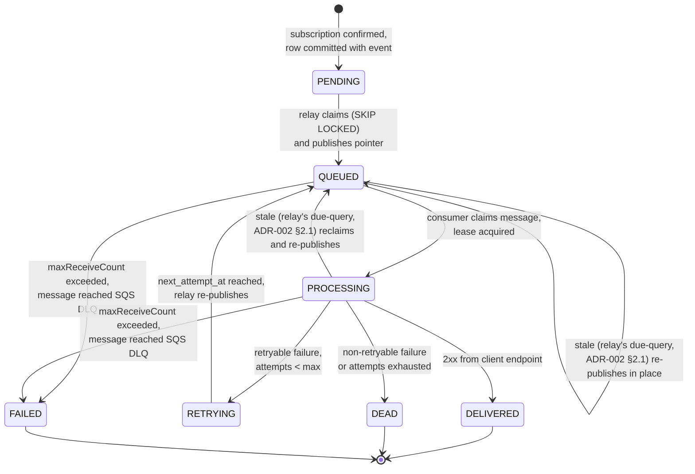
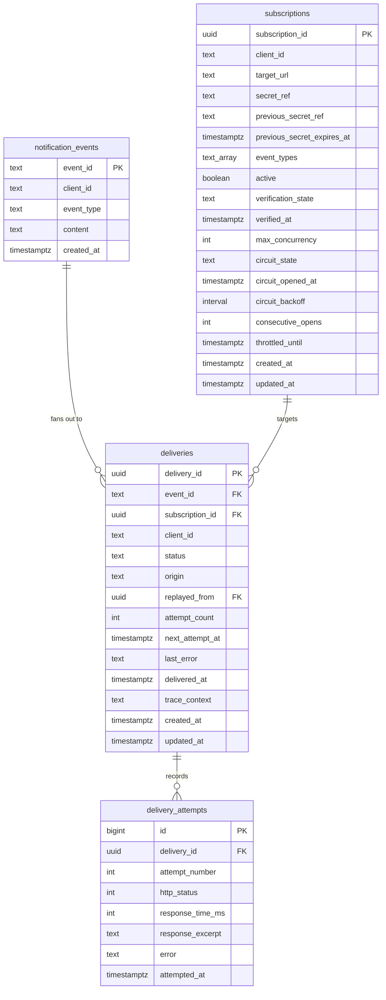

# ADR-003: Delivery Data Model, State Machine, Idempotency and Ingest-Side Tenant Isolation

## Status

Accepted <!-- change only by the user: Proposed | Accepted | Rejected | Superseded by ADR-NNN -->

## Context

See `docs/architecture-overview.md` for full context; this ADR covers the delivery state machine, the gateway's idempotency and tenant-isolation invariants, and the physical data model that stores them.

## Decision

### 1. Delivery state machine

`DEAD` no longer transitions back to `PENDING`. Replay does not mutate the `DEAD` row at all — see the revised ADR-005 §1 and §3 below; the arrow that used to read `DEAD --> PENDING: POST /replay` is gone because replay creates a *new* `deliveries` row rather than resurrecting the old one, which is also what finally resolves the ADR-005 §1/§3 contradiction the architecture review (previous turn) flagged as its most severe finding.

A stale `QUEUED`/`PROCESSING` row also no longer resets to `PENDING`: ADR-002 §2.1's due-query reclaims it directly back into `QUEUED` (status doesn't actually change for an already-`QUEUED` row, only `next_attempt_at` and a fresh publish; a stale `PROCESSING` row moves to `QUEUED`). This replaces what an earlier draft of this ADR called "lease expiry" with a single mechanism — the relay's own periodic due-query is both the normal dispatcher and the reclaim path, so there is no separate "lease" concept or column (consistent with §3 dropping `lease_owner`/`lease_expires_at`; this is the answer to how reclaim actually works without them).

Justification per state:

| State | Why it exists |
| --- | --- |
| `PENDING` | Committed intent that no worker owns yet. Separating it from `QUEUED` is what makes the outbox safe: a crash between commit and publish leaves the row visibly unclaimed and the sweeper picks it up. |
| `QUEUED` | Handed to transport, not yet picked up. Distinguishing it from `PROCESSING` lets observability separate "queue is backed up" from "clients are slow". |
| `PROCESSING` | A worker holds a lease and an HTTPS call is in flight. Needed to prevent a second worker double-sending, and to detect stuck/crashed workers via lease expiry. |
| `RETRYING` | Failed but scheduled for another attempt at `next_attempt_at`. A separate state (rather than reusing `PENDING`) keeps "never attempted" and "attempted and failing" distinguishable in dashboards and in the API filter. |
| `DELIVERED` | Terminal success. Maps to the sample data's `completed`. |
| `DEAD` | Terminal, client-facing, business failure — the webhook was attempted and definitively failed (retries exhausted or non-retryable response). The only status `POST /replay` accepts as its input. Maps to the sample data's `failed`. |
| `FAILED` | Terminal, internal failure — the *message* could not even be processed (poison payload, unhandled exception in the consumer), not a webhook outcome. Written by the DLQ consumer, not by `AttemptDeliveryUseCase`. Never client-visible via the public `delivery_status` vocabulary (§1's mapping table) and never accepted by `POST /replay` — an internal-failure row needs a code fix and an operator action, not a client retry. This reverses what ADR-004 §1's DLQ paragraph previously said ("a DLQ message does not change the row's state") — that was the design before this state existed; `FAILED` is the correction. **Recovery never mutates the `FAILED` row** (§1.1): once the underlying bug is fixed, an internal (non-public) recovery action inserts a *new* `deliveries` row — same insert-not-mutate shape as `POST /replay`'s handling of `DEAD` (ADR-005 §1), so a `FAILED` row's audit trail is preserved exactly like a `DEAD` row's, and the state diagram needs no new outgoing edge from `FAILED` for this — the new row simply re-enters through the existing `[*] --> PENDING` arc, same as any other insert. |

Terminal states are `DELIVERED`, `DEAD`, and `FAILED`. `QUEUED`/`PROCESSING` have two different timeout paths that operate on different clocks and don't conflict: the relay's own due-query (fast, 5s cycle, ADR-002 §2.1) reclaims a stale row back into `QUEUED` for an ordinary re-publish; only after a *single message's* receives exceed `maxReceiveCount` (**3**, ADR-006 §1.1) does that message reach the DLQ and the row move to `FAILED` instead.

**These two counters are not the same counter, which is why `maxReceiveCount = 3` is compatible with unlimited reclaims.** `ApproximateReceiveCount` is a property of one SQS message, not of the `deliveries` row. Every relay re-publish (ADR-002 §2.1) produces a *new* message with its own receive count starting at zero; the previous message was already deleted by the worker (ADR-002 §2.2 — every path the worker takes ends in `DeleteMessage`, see ADR-006 §1.1). So a row can cycle through due-query reclaims dozens of times and never accumulate receives at all. The only way one message is received three times is that the consumer took it and died before deleting it, three times over — which is precisely the poison-message / crash-loop condition `maxReceiveCount` exists to detect. `FAILED` therefore means "this pointer repeatedly killed the consumer", not "this delivery was busy".

The `circuit_state` referenced by ADR-002 §2.1's due-query and ADR-002 §2.2's breaker check is a **separate three-state machine on the `subscriptions` row** (`CLOSED | OPEN | HALF_OPEN`, full mechanics and transitions in ADR-006 §1.2), not a delivery state. The two never merge: a delivery's `status` says where this one row is in its own lifecycle; `circuit_state` says whether the *destination* is currently worth calling at all. Wherever this ADR says "circuit is `OPEN`" as a gate, read it as "`OPEN` and still inside its cooldown" — an `OPEN` subscription whose cooldown has elapsed is admitted as `HALF_OPEN` (ADR-006 §1.2), not blocked.

### 1.1 Who writes what

| Actor | Write |
| --- | --- |
| Gateway | Insert `notification_events` row + N x `deliveries` rows (`PENDING`), one transaction. |
| Relay | `PENDING`/`RETRYING` -> `QUEUED`, advances `next_attempt_at`. |
| Worker (claim) | `QUEUED` -> `PROCESSING`, conditional on current status (`UPDATE ... WHERE status = 'QUEUED'`, the state-guard from ADR-001 §1/§2). |
| Worker (2xx) | Insert `delivery_attempts` row, -> `DELIVERED`, sets `delivered_at`. |
| Worker (retryable failure) | Insert `delivery_attempts` row, -> `RETRYING`, `attempt_count++`, sets `next_attempt_at` per ADR-004 §1/§1's schedule. |
| Worker (budget exhausted / non-retryable) | -> `DEAD`, `next_attempt_at = NULL`. |
| DLQ consumer | -> `FAILED` (only actor that ever writes this status; see ADR-004 §1's DLQ paragraph). |
| `POST /replay` | Insert a **new** `deliveries` row in `PENDING`, `attempt_count = 0`, `origin = 'REPLAY'`, `replayed_from = <original DEAD row's delivery_id>` (§3). Never writes to the original row. |
| Internal recovery (ops-triggered, not the public API) | Insert a **new** `deliveries` row in `PENDING`, `attempt_count = 0`, `origin = 'RECOVERED'`, `recovered_from = <original FAILED row's delivery_id>` (§3). Never writes to the original row — mirrors `POST /replay`'s insert-not-mutate shape, but is not client-triggerable: `FAILED` signals an application bug (§1, ADR-004 §1), so this is an operator action taken after the underlying bug is fixed, not a self-service endpoint. |

Every writer above changes exactly one row's status via a conditional `UPDATE ... WHERE status = <expected prior state>` (or is an `INSERT`); this is the state-guard pattern from ADR-001 §1 applied uniformly, and it is what makes concurrent workers, relay instances, and a racing sweeper all safe without a lock service.

**Public naming:** the sample file uses `delivery_status` values `completed` and `failed`. The API exposes a stable public vocabulary and maps internal states to it in the controller's mapping step (never leaking the domain enum):

| Internal state | Public `delivery_status` |
| --- | --- |
| `PENDING`, `QUEUED`, `PROCESSING`, `RETRYING` | `pending` |
| `DELIVERED` | `completed` |
| `DEAD`, `FAILED` | `failed` |

`FAILED` shares `DEAD`'s public status so a client sees the same "failed" outcome either way — the internal/business distinction (§1) is an operational concern, not something the client needs to reason about. `POST /replay` still rejects a `FAILED` row (409, ADR-005 §1): the public status looks identical to `DEAD`, but only `DEAD` is replay-eligible.

The public vocabulary being a superset of the sample file's two values is an assumption; see Q4.

### 2. Idempotency and tenant isolation at the gateway

Both are gateway-side invariants, enforced before the row is written, inside the same transaction.

**Tenant isolation (mandatory per the case).** Enforced structurally in the subscription-lookup query itself (ADR-002 §1.1): `SubscriptionRepositoryPort` is called with the event's `client_id` as part of the query predicate (`WHERE client_id = ? AND event_type = ? AND active`), not fetched broadly and checked afterward. A subscription belonging to a different client is never returned by the query, so there is no code path where it could be materialized and the post-hoc check forgotten. If there is no active subscription, the event is recorded as "not subscribed" and **no** `deliveries` row is written. This is the single point where a cross-tenant leak could originate, so it is enforced at the query boundary and in the use case (framework-free, unit-testable), not left to an adapter's discipline.

**Idempotency.** The gateway relies on a **partial unique index** on `deliveries (event_id, subscription_id) WHERE status NOT IN ('DELIVERED', 'DEAD', 'FAILED')` (§3) — at most one *live* (non-terminal) row per `(event_id, subscription_id)` pair at any time, rather than a hard unique constraint. Re-ingesting the same platform event while its delivery is still live produces the same pair; the insert violates the partial index and the use case treats that as success (returning the existing delivery) rather than an error. Once a delivery reaches a terminal state, the pair is free again — which is exactly what lets `POST /replay` insert a second row for the same `(event_id, subscription_id)` after the first went `DEAD` (ADR-005 §1), while still blocking a second concurrent replay or a genuine duplicate ingest while one is in flight. This is the property the whiteboard's "identify/potency" box was after, now stated precisely enough to coexist with replay-as-insert.

**Duplicate protection at the client.** Because the pipeline is at-least-once, the outbound request carries the delivery id (`X-Cobre-Delivery-Id`) and the attempt number in headers so the client can deduplicate without parsing the payload. That stays exactly as it was — ADR-004 §1.1 pins the envelope without moving the delivery id out of the header, because header-side dedup is precisely the case for "the client needs this before it deserializes anything." The attempt number is additionally carried in the signed body (`attempt`, ADR-004 §1.1) so a client that wants to *act* on it rather than merely log it is acting on signed data. The client-facing contract is explicitly at-least-once, not exactly-once.

### 3. Data model

Four tables. `notification_events` and `subscriptions` are inputs; `deliveries` is the outbox and sole source of truth; `delivery_attempts` is its append-only history. Exact SQL/migration detail is the DBA's call in the feature breakdown — this is the contract, not the DDL. Neither table is partitioned; see the partitioning paragraph at the end of this section.

**`notification_events`** — immutable, append-only record of what the platform emitted. `event_id` is the platform's id (matches the sample file's `event_id`, e.g. `EVT001`). `created_at` is the event-creation timestamp the API's date-range filter runs against. Never updated after insert.

**`subscriptions`** — the delivery contract with a client, and now also the home of circuit-breaker and throttle state, reused rather than a separate Redis-backed store: the relay already scans `deliveries` and joins `subscriptions` on every claim cycle, so this state is one join away with no extra round trip, no extra moving part, no cache-invalidation problem.
- `event_types` (array) replaces a `unique(client_id, event_type)` design: one subscription row per client, covering N event types, rather than one row per `(client_id, event_type)` pair. Resolves Q9's shape (Q9 in `docs/architecture-overview.md`; subscription CRUD API itself still out of scope for this ADR).
- `secret_ref`, `previous_secret_ref` and `previous_secret_expires_at` carry the HMAC secret reference and an in-progress rotation; rationale and rotation semantics in ADR-004 §2.
- `active` lets the gateway's tenant-isolation check reject events for a deactivated subscription without a delete.
- `verification_state` and `verified_at` carry the target-URL ownership handshake; rationale in ADR-005 §2.
- `max_concurrency` bounds per-subscription in-flight deliveries; rationale in ADR-006 §1.3.
- `circuit_state`, `circuit_opened_at` and `consecutive_opens` hold the per-subscription circuit breaker's persisted state; rationale and full mechanics in ADR-006 §1.2.
- `throttled_until` is the `429`/`Retry-After` gate; rationale in ADR-004 §1.

**`deliveries`** — the outbox, at most one *live* row per `(event, subscription)` pair at any time (§2), possibly more over time via replay chains (ADR-005 §1), and the only table the self-service API reads from. Column notes:
- `delivery_id` is the public `notification_event_id` the case's three endpoints operate on. This is a deliberate resolution of a naming tension: the case names the path parameter `notification_event_id`, but the design fans one event out to N deliveries (one per subscription) — so the publicly addressable resource is a *delivery*, not the immutable platform event, even though it is named after the event in the API. Documented here explicitly since it is not obvious from the case text alone; flagged for confirmation alongside Q9 (`docs/architecture-overview.md`).
- No separate idempotency-key column: a partial unique index on `(event_id, subscription_id)` filtered to non-terminal statuses (§2) gives the guarantee natively — a derived hash column was redundant and has been dropped, and a *hard* unique constraint on the pair was also dropped once replay needed to insert a second row for the same pair after the first went terminal.
- `origin` (`INGEST | REPLAY | RECOVERED`) and `replayed_from` (nullable, self-referential FK to `deliveries.delivery_id`) record how a row came to exist; rationale in ADR-005 §1.
- **No `sequence_number` column.** Client-side order reconstruction is served by `notification_events.created_at` with `event_id` as tiebreak, both already stored and both carried in the signed outbound body (ADR-001 §1.1, ADR-004 §1.1, Q6). An earlier draft of this ADR gave `deliveries` a `bigint sequence_number` monotonic per `client_id`; it is dropped, not replaced, because a per-client monotonic counter requires a per-client row updated on every ingest — serializing that client's inserts behind one hot row, the same pattern ADR-006 §1.2 refuses for the breaker's failure count. The alternative that keeps a number (a global Postgres `SEQUENCE`, gapped per client) was considered and also rejected: it costs a column and a database object to express an ordering `created_at` + `event_id` already expresses, over data the client is receiving anyway.
- `status` is the enum from the state machine (§1): `PENDING, QUEUED, PROCESSING, RETRYING, DELIVERED, DEAD, FAILED`.
- `next_attempt_at` drives both the relay/sweeper claim query (ADR-002 §2, "Relay = guaranteed path") and the retry schedule (ADR-004 §1).
- No explicit `lease_owner`/`lease_expires_at` columns: reclaim of a stale `QUEUED`/`PROCESSING` row (§1, ADR-002 §2.1) is inferred from `status` + `updated_at` + `next_attempt_at` by the relay's own due-query — the same query that does normal dispatch, not a separate lease mechanism. Simpler, one fewer pair of columns. The sketch's "tobias" label (Q2) is resolved as a writing slip rather than a column, so this table has no counterpart to it **by design**, not as an unresolved gap.
- `circuit_backoff` (on `subscriptions`, not `deliveries`) is the interval written at trip time alongside `circuit_opened_at`; rationale in ADR-006 §1.2.
- `last_error` is a single denormalized field (HTTP status or error class, whichever applies) snapshotting the most recent attempt, so `GET /notification_events` doesn't need to join `delivery_attempts` for its common case; the full history is still in the child table.
- `delivered_at` is set once, on the `DELIVERED` transition — the terminal-success timestamp, distinct from `updated_at`.
- `trace_context` persists the W3C `traceparent` (ADR-002 §3) so the consumer can restore the original trace regardless of which process attempts delivery.
- No `replay_count`/`last_replayed_at`: replay (ADR-005 §1) and recovery (§1.1, ADR-004 §1) don't touch the original row at all, so there is nothing on it to reset or stamp. "How many times has this event been replayed or recovered" is answerable by counting rows with a given `replayed_from` chain, not by a counter column.

Indexes (contract-level, exact definitions belong to the DBA task):
- `idx_deliveries_due` — the relay's due-query index. Defined once, in ADR-002 §2.1, which is its only consumer; not repeated here.
- Partial unique index on `(event_id, subscription_id) WHERE status NOT IN ('DELIVERED', 'DEAD', 'FAILED')` — the idempotency/anti-double-replay guard (§2, ADR-005 §1).
- Index on `(subscription_id, status)` for the per-subscription in-flight count the bulkhead/`max_concurrency` check needs (§3, ADR-006 §1) — this was missing from the original index list.
- Index on `replayed_from` for chaining a replay's or recovery's history back to its original.
- Index on `(client_id, created_at)` for the list endpoint's default ordering and date-range filter, keyset-paginated (ADR-005 §1).
- Index on `(client_id, status)` for the `delivery_status` filter.

**Partitioning: deferred, not implemented.** `deliveries` and `delivery_attempts` are plain (unpartitioned) tables. The whiteboard's date-partitioning note is recorded here as a **future performance/scalability improvement**, to be revisited once actual data volume or retention pressure justifies it — at the volumes this service is being built for, it is not needed, and it is not worth its cost today.

That cost is concrete, and it is what settled the decision (user's call, after seeing a partitioned implementation): PostgreSQL requires every unique index and primary key on a partitioned table to include all partition-key columns. Partitioning `deliveries` on `created_at` therefore makes §2's partial unique index on `(event_id, subscription_id)` un-creatable as written — adding `created_at` to it would permit two live rows for the same pair and destroy the invariant — so the invariant had to be pushed onto a side table maintained by a trigger. Unpartitioned, none of that is necessary.

**The §2 idempotency invariant is therefore implemented the textbook way: a native PostgreSQL partial unique index directly on `deliveries (event_id, subscription_id) WHERE status NOT IN ('DELIVERED', 'DEAD', 'FAILED')`. No side table, no trigger, no application-level check.** `PRIMARY KEY (delivery_id)` is likewise a plain single-column PK, so `delivery_id` (the public API identifier, §3) is database-guaranteed unique and the ordinary foreign keys (`replayed_from -> deliveries(delivery_id)`, `delivery_attempts.delivery_id -> deliveries(delivery_id)`) are creatable normally.

Retention consequently becomes an ordinary row-level concern rather than a drop-by-partition one, and no retention mechanism is specified or implemented at this time. When partitioning is revisited, retention-by-partition-drop, the exact retention period, and the invariant-preserving mechanism all come back with it — as a superseding ADR, not as a migration comment.

**`delivery_attempts`** — append-only, one row per HTTP attempt (or per attempted-but-failed-before-HTTP case, e.g. URL revalidation failure). No separate `outcome` enum column: success/retryable/non-retryable is derived from `http_status`/`error` using the same classification as ADR-004 §1 (including the 3xx / 408 / 429 nuances), not stored redundantly. `response_excerpt` is truncated and never contains signature headers or secrets (A09). This table is what makes a client complaint ("you never called me at 14:02") answerable with a query instead of a guess, and it is what the SQS-DLQ observer (if built, per the earlier DLQ analysis) would correlate against via `delivery_id` when raising an admin alert — the DLQ message itself carries no delivery history, only the pointer. Kept separate rather than collapsed into a JSONB column on `deliveries` because the monitoring requirement is answered with queries over it: p95 endpoint latency per client, failure rate over a window, full history behind a single complaint.

## Consequences

**Becomes easier**
- The domain (state machine, retry policy, tenant check) is framework-free and unit-testable with no Spring context.

**Becomes harder / debt created**
- `deliveries` is write-hot: needs a partial index on `(status, next_attempt_at)` for the claim query. A retention plan and archival of terminal rows are **not** solved today — partitioning is deferred (§3), so retention-by-partition-drop is deferred with it, and no row-level retention is specified either. This is accepted debt: it is revisited together with partitioning, as a superseding ADR, when volume justifies it.
- At-least-once puts a deduplication obligation on clients; this must be in the public webhook documentation.

## OWASP / Security Impact

| OWASP Top 10:2025 | Exposure in this design | Mitigation direction (one line) |
| --- | --- | --- |
| **A10 Mishandling of Exceptional Conditions** | The retry/dead classification decides whether an error path fails open (keeps hammering a client) or closed (silently drops a notification). | The state machine has no path that discards a delivery without a terminal state; ambiguous failures default to `RETRYING` (fail safe, bounded), and exhaustion is explicit and visible. |

## Assumptions

Carried from the master Q-list in `docs/architecture-overview.md`; these three are owned by this ADR.

- **Q2 — "tobias" column on the whiteboard (resolved: not a design element).** The `deliveries` table sketch contains a label read as "tobias". The user confirms it is a writing slip on the whiteboard, not a column, concept or requirement — there is nothing to interpret and nothing to carry into the schema. The earlier guess (an owner/lease-style `lease_owner` / `lease_expires_at` pair) was never incorporated, and the design has since moved further away from it: the lease concept was removed entirely in favour of the relay's own due-query doing both dispatch and reclaim (§1, ADR-002 §2.1, §3's "no explicit `lease_owner`/`lease_expires_at` columns"). §3's schema therefore has no corresponding column **by design**, not as an unresolved gap, and the DBA's schema task inherits nothing from this entry. Closed.
- **Q3 — "check nonce" in the consumer (resolved).** Resolved as the consumer-side idempotency check, and it is now fully specified rather than an interpretation: the state-guarded conditional claim `UPDATE deliveries SET status = 'PROCESSING' WHERE delivery_id = ? AND status = 'QUEUED'` (ADR-002 §2.2 step 1), with the zero-rows-affected path (delete the message, stop) spelled out in ADR-002 §2.2 step 2 and the general pattern stated in ADR-001 §1 and §1.1. That is the mechanism that guarantees a delivery is never double-sent, and it does the job a nonce would have done without a cryptographic construct. **Only open if the word meant something else:** a per-request nonce sent *to* the client for replay protection on their side is a different feature, changes the outbound payload contract, and belongs with the signing scheme (ADR-004 §2, flagged there as its own follow-up decision). Say so if that was the intent.
- **Q4 — Public status vocabulary (resolved: the three-value superset).** The public `delivery_status` vocabulary is `pending` / `completed` / `failed`, mapped from the internal states exactly as §1.1's table states (`PENDING`/`QUEUED`/`PROCESSING`/`RETRYING` -> `pending`, `DELIVERED` -> `completed`, `DEAD`/`FAILED` -> `failed`). This is not an assumption layered on top of the sample file: it follows necessarily from the state machine the user supplied (§1) and its transitions. That machine has non-terminal states by construction — a delivery is committed before it is attempted, and retries are scheduled rather than immediate — so a delivery genuinely exists in an in-flight condition that is neither `completed` nor `failed`, and the list endpoint must be able to name it. The sample file shows only `completed` and `failed` because it shows only settled deliveries. The public vocabulary is therefore a strict superset of the sample's two values, and `pending` is a valid `delivery_status` filter value.

## Downstream

All seven ADRs (ADR-001 through ADR-007) are now `Accepted`. Part of the `docs/features/FEAT-002-webhook-notification-delivery/` breakdown, ready for task generation.
