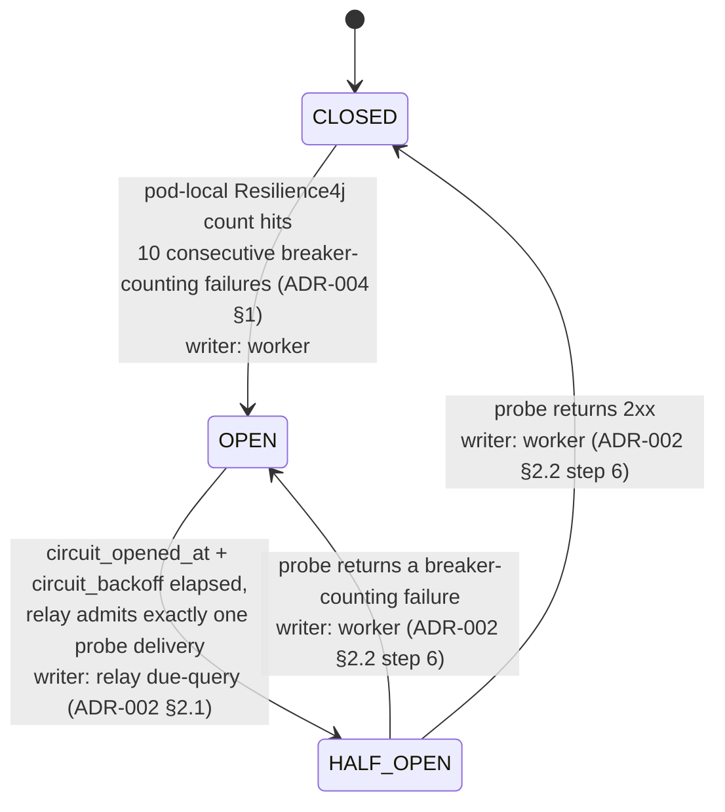

# ADR-006: Resilience Policies: Circuit Breaker, Bulkhead and Queue Configuration

## Status

Accepted <!-- change only by the user: Proposed | Accepted | Rejected | Superseded by ADR-NNN -->

## Context

See `docs/architecture-overview.md` for full context; this ADR covers the three resilience mechanisms that bound how much a single failing or slow destination can cost the platform, plus the queue settings they depend on.

## Decision

### 1. Resilience policies

Three distinct mechanisms, deliberately not merged into one:

| Mechanism | Granularity | Lives in | Triggered by |
| --- | --- | --- | --- |
| Exponential backoff + jitter | per delivery | `deliveries.next_attempt_at` | any retryable failure |
| Circuit breaker | per subscription | `subscriptions` (PostgreSQL) | consecutive failures |
| Bulkhead (concurrency limit) | per subscription | in-process semaphore | always active |
| Throttle | per subscription | `subscriptions.throttled_until` | HTTP 429 |

**Backoff** (ADR-004 §1): `5s -> 30s -> 2m -> 10m -> 1h -> 6h`, ±20% jitter. Jitter is mandatory: without it, ten thousand deliveries that failed together retry in the same instant and keep the client's endpoint down.

### 1.1 Queue configuration

These start from the whiteboard's numbers (`docs/challenge/proposal/Fase_2/Configs_High_Level.png`). `maxReceiveCount` is adopted verbatim; `VisibilityTimeout` is raised from the whiteboard's 10s to 30s for the reason in point 2 below. The dependent mechanisms are stated alongside them so the set holds together:

| Setting | Value | Source |
| --- | --- | --- |
| `VisibilityTimeout` | **30s** | raised from the whiteboard's 10s — see below |
| `maxReceiveCount` (redrive to `deliveries-dlq`) | **3** | whiteboard |
| `WaitTimeSeconds` (long poll) | 20s | ADR-002 §2.2, unchanged |
| Receive batch size | 10 | ADR-002 §2.2, unchanged |

`maxReceiveCount = 3` is the whiteboard's value and is adopted unchanged; it is tighter than what an earlier draft of this ADR proposed (50). Adopting it required one change elsewhere, which makes the design simpler rather than more complex. `VisibilityTimeout` is the one whiteboard number this ADR does not adopt verbatim, for the reason given in point 2.

**1. `ChangeMessageVisibility` is removed from the design entirely; deferral is delete-and-reschedule.** The old argument for `maxReceiveCount = 50` was that bulkhead-timeout deferrals returned the message to the queue via `ChangeMessageVisibility`, and `ApproximateReceiveCount` increments on every `ReceiveMessage` including such a redelivery — so a busy-but-healthy subscription could burn receives without a single attempt ever being made. That argument is fatal at 3: three deferrals in a row and a healthy delivery is in the DLQ and marked `FAILED`. Rather than raise the budget back up and lose the poison-detection signal, the deferral mechanism itself is replaced (ADR-002 §2.2 steps 3-4): the worker writes `next_attempt_at = now() + 10-20s jittered` on the row (conditionally, `WHERE status = 'QUEUED'`) and **deletes** the message. Re-dispatch then happens through the relay's due-query (ADR-002 §2.1), which publishes a *fresh* message whose receive count starts at zero.

This fits the existing design rather than fighting it. ADR-001 §1 already establishes that the row, not the message, is the source of truth, and ADR-002 §2.1 already establishes the relay as the single guaranteed dispatch path; routing deferrals through it is the consistent choice, whereas `ChangeMessageVisibility` was the one place the design relied on SQS redelivery for correctness. The cost is one extra single-row `UPDATE` per deferral, against the benefit of a deferral no longer being indistinguishable from a crash loop. It is also strictly more observable: a deferred row's `next_attempt_at` says when it will be retried, where an invisible in-flight message says nothing.

With this change every worker path ends in `DeleteMessage` (ADR-002 §2.2), so a second receive of one message can only mean the consumer died holding it. `maxReceiveCount = 3` is then exactly right: three consecutive consumer deaths on the same pointer is a crash loop, not bad luck.

**2. `VisibilityTimeout` is raised from the whiteboard's 10s to 30s, and the per-attempt budget is left alone.** A `VisibilityTimeout` shorter than the worst-case in-flight time means routine redelivery, which both costs receives and produces duplicate-claim churn. The budget (100ms claim + 2s bulkhead acquire + 2s connect + 5s read + 200ms outcome write) sums to ~9.3s, which does not fit under 10s with any usable margin. An earlier revision of this ADR resolved that by cutting the bulkhead acquire timeout from 2s to 500ms, bringing the worst case to ~7.8s and leaving ~2.2s of margin — about 28% of the worst case.

**That trade is reversed here, because the tightness bought nothing.** The question to ask of a shorter `VisibilityTimeout` is what in the design *uses* it, and the answer is nothing: DLQ correctness, `maxReceiveCount = 3`, and the delete-and-reschedule deferral mechanism (ADR-002 §2.2 steps 3-4, point 1 above) are all indifferent to the exact value — they depend only on it comfortably exceeding worst-case in-flight time, so that a message never reappears while its worker is still legitimately working. A tighter timeout does not make a poison message detected sooner (every non-crash path deletes the message immediately, point 1), does not change the receive budget, and does not speed up re-dispatch (that is the relay's 5s due-query, ADR-002 §2.1). It only shrinks the headroom. Paying real capability — a 500ms ceiling on semaphore wait, in a service whose whole concurrency story is cheap blocking virtual threads — for margin nothing consumes is the wrong side of the trade.

At **30s**, the bulkhead acquire timeout goes back to **2s** (§1.3), connect (2s) and read (5s) stay as they were, and the worst case is **~9.3s** (ADR-004 §1's budget table) against a 30s ceiling: **~20.7s of margin, 2.2x the worst case itself**, versus 28% before. Nothing else in the design moves.

**The margin is now genuinely generous, and that is the point.** A GC pause, a slow `deliveries` write, or DNS resolution at the top of the connect budget no longer comes anywhere near pushing an attempt past the ceiling. Should one somehow do so, the case remains *safe*: the message reappears, the second worker's conditional claim affects zero rows (ADR-002 §2.2 steps 1-2), and it deletes — no double POST, because the state-guarded claim, not the visibility timeout, is what prevents duplicate sends. The cost would be one receive out of three. Sustained occurrences would show up as a rise in zero-row claims, which is worth a dashboard line (ADR-002 §3) as the leading indicator that 30s needs revisiting — a signal that should now essentially never fire.

**What did not change.** `maxReceiveCount` stays at **3** and the delete-and-reschedule deferral (point 1) stays exactly as specified. Neither is a function of the `VisibilityTimeout` number; both depend only on the invariant that every worker path ends in `DeleteMessage` (ADR-002 §2.2), which a longer timeout strengthens rather than weakens. ADR-002 §2.1's 60s staleness reclaim also still sits above the `VisibilityTimeout` (60s > 30s), preserving its ordering with the conditional claim, though with less headroom than before — 60s remains a proposal, not a derived number.

### 1.2 Circuit breaker

**State in PostgreSQL, not Redis.** `circuit_state` must be shared across replicas — if each pod learned independently, a dead client would take up to N x the unnecessary traffic before any pod stopped sending to it, N being the replica count. PostgreSQL was chosen over Redis because the relay already reads `subscriptions` every claim cycle (ADR-002 §1, ADR-002 §2): the open-circuit filter is one extra column in a join it already does, not a new piece of infrastructure to run, monitor, and fail over.

To avoid turning `subscriptions` into a hot row, **only the state transition is written**, not a failure counter:
- The trip decision itself is made from an **in-memory** per-subscription failure count, held in each pod (one `Resilience4j CircuitBreaker` instance per `subscription_id`, per pod) — this is what `consecutive_failures` would have been as a column, and deliberately is not one, since writing it on every attempt is exactly the hot-row pattern being avoided.
- When a pod's local breaker trips, it issues one conditional write: `UPDATE subscriptions SET circuit_state = 'OPEN', circuit_opened_at = now(), circuit_backoff = <computed>, consecutive_opens = consecutive_opens + 1 WHERE subscription_id = ? AND circuit_state = 'CLOSED'` — first writer wins; a second pod tripping moments later affects zero rows and does nothing further. `<computed>` is the exponential cooldown (below), evaluated once at trip time and stored in `circuit_backoff` (ADR-003 §3) so the relay's due-query (ADR-002 §2.1) can read it directly rather than recomputing it on every poll.
- This means the **pre-trip** window is genuinely per-pod (each pod's local count is independent, so in the worst case a dead client absorbs traffic from every pod at once until the first one trips), but the **post-trip** state is immediately global: once `circuit_state = 'OPEN'` lands in PostgreSQL, every pod's relay excludes that subscription on its very next claim cycle (ADR-002 §2.1's due-query), regardless of which pod's local breaker was the one that tripped. The N x traffic exposure is bounded to that one pre-trip window, not sustained.
- `consecutive_opens` is the one counter that *is* persisted, because it must survive restarts and be shared to compute an escalating cooldown (ADR-003 §3) — a pod restarting should not reset a chronically dead client back to a short cooldown. `circuit_backoff = base_cooldown * 2 ^ (consecutive_opens - 1)`, capped, computed once at trip time and stored (proposal, not a derived number — same caveat as ADR-004's Q5 and Q7).
- Redis would be justified by a genuine need for a true sliding-window failure rate or an exact global concurrency count; neither is required here — the design tolerates the bounded, temporary over-count above.

**Recovery: the full four transitions.** An earlier draft defined only `CLOSED -> OPEN` and flagged "a circuit that trips never recovers" as an open gap. It is closed here. The governing constraint is unchanged: **only transitions are persisted, never a per-attempt counter**, so every write below is conditional, first-writer-wins, and happens at most once per state change — not once per delivery.

| Transition | Operation (Amendment B1) | Who writes it | Conditional `UPDATE subscriptions SET ... WHERE subscription_id = ? AND ...` |
| --- | --- | --- | --- |
| `CLOSED -> OPEN` | `tripCircuit` | worker, when its pod-local breaker trips | `circuit_state = 'OPEN', circuit_opened_at = now(), circuit_backoff = base * 2^consecutive_opens, consecutive_opens = consecutive_opens + 1` ... `AND circuit_state = 'CLOSED'` |
| `OPEN -> HALF_OPEN` | `promoteToHalfOpen` | relay, on the poll cycle where the cooldown has elapsed | `circuit_state = 'HALF_OPEN'` ... `AND circuit_state = 'OPEN' AND circuit_opened_at < now() - circuit_backoff` |
| `HALF_OPEN -> CLOSED` | `closeCircuit` | worker, in the probe's outcome transaction | `circuit_state = 'CLOSED', circuit_opened_at = NULL, circuit_backoff = NULL, consecutive_opens = 0` ... `AND circuit_state = 'HALF_OPEN'` |
| `HALF_OPEN -> OPEN` | `reopenCircuit` | worker, in the probe's outcome transaction | `circuit_state = 'OPEN', circuit_opened_at = now(), circuit_backoff = base * 2^consecutive_opens, consecutive_opens = consecutive_opens + 1` ... `AND circuit_state = 'HALF_OPEN'` |

> **Amendment B1 (2026-09-20, Tech Lead directive).** These four transitions are now four separately named port operations, replacing the single generic `transitionCircuitState(subscriptionId, expected, target, now)` the FEAT-003 contract exposed. That signature could write `circuit_state` and nothing else, so `circuit_opened_at`, `circuit_backoff` and `consecutive_opens` — every companion column the table above requires — were inexpressible. See `## Amendments` at the end of this ADR, which also states why `tripCircuit` and `reopenCircuit` are two operations and not one.

Design points behind those four rows:

- **`OPEN -> HALF_OPEN` needs no new component.** The relay's due-query (ADR-002 §2.1) already carries the predicate `circuit_state <> 'OPEN' OR circuit_opened_at < now() - circuit_backoff`, which is precisely "the cooldown has elapsed". The relay promotes the subscription and admits exactly one delivery for it in that batch. There is no reaper job and no timer: recovery rides the 5s poll cycle that has to run anyway. This is the same reasoning that made the relay the reclaim path in ADR-002 §2.1 instead of a separate lease-expiry mechanism.
- **`HALF_OPEN` admits exactly one delivery, not `max_concurrency` of them.** It reuses the per-subscription in-flight count check ADR-003 §3 already specifies for `max_concurrency`, with the effective cap taken from the circuit state: `0` when `OPEN`-and-cooling, `1` when `HALF_OPEN`, `max_concurrency` when `CLOSED`. One predicate, three values. A half-open probe is a single live delivery, so a still-dead endpoint absorbs one request, not ten.
- **One failed probe re-opens; there is no half-open failure threshold.** Requiring N failures in `HALF_OPEN` would mean deliberately sending N requests to an endpoint we already have strong evidence is down. The probe *is* the sample.
- **`consecutive_opens` resets to `0` on a successful close.** Without this the exponential cooldown (`circuit_backoff = base * 2^consecutive_opens`, capped) would escalate permanently for any client that fails occasionally over months, eventually parking healthy subscriptions behind a capped multi-hour cooldown. Resetting on close makes the escalation describe *the current outage*, which is what it is for. The counter is still persisted (and still survives restarts) so a client that is flapping *within* one outage keeps escalating.
- **The probe outcome is written in the same transaction as the delivery outcome** (ADR-002 §2.2 step 6), so a crash between "delivery recorded" and "circuit updated" is impossible. If the worker dies before that transaction commits, nothing moved: the subscription stays `HALF_OPEN`, the row stays `PROCESSING`, and ADR-002 §2.1's 60s staleness reclaim re-admits it as the next probe.
- **Two probes can be admitted concurrently** if two relay instances query in the same instant before either's `HALF_OPEN` write lands. The exposure is bounded (one extra request to a sick endpoint) and the outcomes converge: both workers write the same transition and the second affects zero rows thanks to the `AND circuit_state = 'HALF_OPEN'` guard. This is the same bounded-over-count tolerance already accepted above for the pre-trip window, and the same reason Redis is not needed.
- **Every worker resets its own local breaker when it sees `circuit_state = 'CLOSED'` on a subscription it still considers suspect — otherwise the non-tripping pods never learn the circuit recovered.** The pod that tripped does reset itself: Resilience4j clears its own instance's failure count when *that instance* transitions `HALF_OPEN -> CLOSED`. Every other pod never witnesses that transition, so its local count for the subscription stays frozen at whatever it had reached when the circuit opened. Concretely: `CLIENT002`'s endpoint goes down; pod A accumulates 10 breaker-counting failures and trips; pod B had reached 7 before the relay stopped enqueueing work for that subscription (ADR-002 §2.1). The global state then cycles `OPEN -> HALF_OPEN -> CLOSED` on pod A's probe and the `subscriptions` row is clean — but pod B is still sitting at 7. The next time that client fails, pod B trips after 3 more failures instead of 10. The trip threshold is silently degraded, permanently and invisibly, for every pod that did not run the probe, and the degradation compounds across outages. **The fix:** on each attempt the worker already loads the subscription row for the target URL and the secret reference (ADR-002 §2.2 step 1's territory — the message is a pointer, ADR-004 §1, so the row is read on every single attempt regardless), and that row already carries `circuit_state`. If it reads `CLOSED` while its own local Resilience4j instance for that `subscription_id` is not already closed-and-fresh, it calls `reset()` on that instance before proceeding. **This costs no new query and no new state** — the authoritative value is a column on a row the worker is loading anyway, and `reset()` is a local in-memory operation. It makes PostgreSQL the single source of truth for "is this destination considered healthy" in both directions, rather than only in the `OPEN` direction as the four transitions above did on their own.
- **A `CLOSED`-circuit delivery writes nothing to `subscriptions`.** Only the four transitions above touch that row. The hot-row avoidance this whole subsection is built around is therefore preserved unchanged by adding recovery: three new transitions, each at most once per outage, not once per attempt.
- **Observability (ADR-002 §3):** each transition emits a counter tagged by direction, and `circuit_state` per subscription is the operator-facing answer to "why is this client not receiving anything" — `OPEN` means we stopped calling them, which is materially different from a backlog.

### 1.3 Bulkhead

**A permit set per subscription, sized by `max_concurrency`** (default 10), implemented with Resilience4j so retry, breaker, and bulkhead compose as decorators around one call rather than as hand-rolled acquire/release bookkeeping scattered through `AttemptDeliveryUseCase`.
- Acquisition uses a **2s** timeout, which fits inside the 30s `VisibilityTimeout` budget with room to spare (§1.1, ADR-004 §1). Waiting up to 2s for a local semaphore is the right trade for a saturated-but-healthy subscription: the permit usually frees within that window as an in-flight attempt completes, so the delivery proceeds immediately instead of taking a 10-20s deferral round trip through the relay. Deferral stays cheap and explicit when the wait does time out, so 2s is an upper bound on patience, not a cost paid per attempt.
- **On acquisition failure the delivery is deferred, not attempted and not returned to the queue:** one conditional `UPDATE deliveries SET next_attempt_at = now() + <10-20s jittered> WHERE delivery_id = ? AND status = 'QUEUED'`, then `DeleteMessage` (ADR-002 §2.2 step 3). `attempt_count` does not move and no `delivery_attempts` row is written — no attempt occurred. The jitter matters for the same reason it does in ADR-004 §1: a saturated subscription defers many messages at once, and they must not all come back in the same instant.
- **This is the one state write that a "no attempt happened" path makes**, and it is deliberate. An earlier draft wrote nothing at all and used `ChangeMessageVisibility` instead; §1.1 explains why that is incompatible with `maxReceiveCount = 3` and why a scheduling-only write is the better trade. The invariant the old wording was protecting — that a deferral never looks like an attempt — is fully preserved: `attempt_count`, `delivery_attempts`, `last_error` and the breaker's failure count are all untouched.

**Breaker vs. bulkhead — different problems, not redundant:**
- The **bulkhead is preventive** and applies to a healthy-but-slow client: without it, virtual threads happily open thousands of concurrent connections against an endpoint sized for fifty, and this service becomes the cause of the very outage the breaker exists to detect.
- The **breaker is reactive** and applies once a client is already failing: it stops sending work at all, rather than merely bounding how much is in flight.
- Composition order per call: bulkhead permit first (bounds concurrency even while `CLOSED`), then breaker check (defer if `OPEN`-and-cooling; proceed as the probe if `HALF_OPEN` — both gates are enforced earlier too, at the relay's claim query, so an attempt should rarely reach this layer blocked), then the retry-classified HTTPS attempt itself, and finally the probe's circuit transition if one applies (§1.2).

### 2. Schema notes

The columns themselves are defined in ADR-003 §3; only the rationale for them lives here.

- `max_concurrency` bounds how many `deliveries` rows for this subscription the relay may have claimed (`QUEUED`/`PROCESSING`) at once — the claim query's `WHERE` includes a per-subscription in-flight count check. This is the direct answer to Q7 (below) (previously deferred as YAGNI, now adopted): a slow-but-healthy endpoint can no longer occupy an unbounded share of workers.
- `circuit_state` (`CLOSED | OPEN | HALF_OPEN`), `circuit_opened_at`, `consecutive_opens` implement a per-subscription circuit breaker, distinct from `max_concurrency` (which bounds parallelism regardless of outcome) and from per-delivery retry (ADR-004 §1, which governs one row's own backoff regardless of the endpoint's overall health). All three states are used: `CLOSED` (normal), `OPEN` (tripped, blocked until `circuit_opened_at + circuit_backoff`), `HALF_OPEN` (cooldown elapsed, one probe delivery admitted). `circuit_opened_at` and `circuit_backoff` are set to `NULL` and `consecutive_opens` reset to `0` when the circuit closes. Full mechanics — all four transitions, and why the failure *count* deliberately is **not** a persisted column — are in §1.2.
- `circuit_backoff` (on `subscriptions`, not `deliveries`) is the interval written at trip time alongside `circuit_opened_at`, computed as the exponential cooldown (§1) — stored rather than recomputed on every relay poll, since the due-query (ADR-002 §2.1) reads it directly in its `WHERE` clause.

## Assumptions

Carried from the master Q-list in `docs/architecture-overview.md`; this one is owned by this ADR.

- **Q7 — Per-subscription concurrency cap and circuit breaker (resolved; two numbers unvalidated).** Adopted, no longer deferred. `subscriptions.max_concurrency`, `circuit_state`, `circuit_opened_at`, `circuit_backoff`, `consecutive_opens` and `throttled_until` (ADR-003 §3, §1.2, §1.3) resolve this: a slow endpoint is bounded by `max_concurrency`, a sustained-failing one is not scheduled at all while its circuit is `OPEN`, and the circuit now has a complete recovery path (`OPEN -> HALF_OPEN -> CLOSED`, with `HALF_OPEN -> OPEN` on a failed probe, §1.2). The one remaining open detail is numeric, same caveat class as ADR-004's Q5: the trip threshold (Resilience4j, in-memory, per pod — proposed: **10 consecutive breaker-counting failures**, ADR-004 §1's classification column) and the cooldown shape (`circuit_backoff = base * 2^consecutive_opens`, capped, reset on close). Both are proposals, not derived numbers, and both are configuration rather than contract.

## Amendments

Post-acceptance correction to this ADR's contract-level text, made on **Tech Lead directive of 2026-09-20** while reviewing the FEAT-004 persistence-adapter plan. Recorded in place rather than as a new ADR: it reverses no decision, it names operations §1.2 already specified as SQL and adds the columns §1.2 already required. `Status` is unchanged and is not an agent's to change.

### B1. Four named circuit operations replace the generic `transitionCircuitState`

`SubscriptionRepositoryPort` exposed `transitionCircuitState(UUID, CircuitState expected, CircuitState target, Instant now)`, which could write `circuit_state` and `updated_at` only. §1.2's table requires `circuit_opened_at`, `circuit_backoff` and `consecutive_opens` to move in the **same statement** as a trip, and none of them fits that signature. The gap was logged in `docs/concerns.md` during the FEAT-004 breakdown and is closed here.

The four operations are named in §1.2's table above. Each remains one conditional, first-writer-wins `UPDATE`, at most once per state change, never once per delivery, returning whether exactly one row was affected.

### B2. `tripCircuit` and `reopenCircuit` are two operations, not one with a parameter

They write an identical `SET` clause and differ **only** in their guard, and that difference is the whole point:

| | `tripCircuit` | `reopenCircuit` |
| --- | --- | --- |
| Guard | `AND circuit_state = 'CLOSED'` | `AND circuit_state = 'HALF_OPEN'` |
| Means | a healthy destination has started failing | a probe against a recovering destination failed again |
| Caller | worker, pod-local breaker trip | worker, in the probe's outcome transaction (§1.2, ADR-002 §2.2 step 6) |

Collapsing them into one operation that takes the expected state as an argument is exactly the generic shape B1 removes, and it would let a caller pass the wrong precondition. Keeping them separate makes the two preconditions unforgeable at the call site: a failed probe **depends** on the `HALF_OPEN` guard, because a probe outcome applied to a `CLOSED` circuit would trip a destination that nothing is currently failing against, and a trip applied to a `HALF_OPEN` circuit would double-count a cooldown escalation. Both names appear in §1.2's table so the mapping is unambiguous.

`promoteToHalfOpen` likewise keeps §1.2's compound guard (`circuit_state = 'OPEN' AND circuit_opened_at < :as_of - circuit_backoff`), so the cooldown check is part of the atomic update rather than a read-then-write race, and takes the relay's `asOf` instant so one poll cycle evaluates against one clock.

### B3. The cooldown exponent uses the pre-update `consecutive_opens`

§1.2's prose says `circuit_backoff = base_cooldown * 2 ^ (consecutive_opens - 1)` while its table's SQL says `base * 2^consecutive_opens` in a statement that also does `consecutive_opens = consecutive_opens + 1`. **These agree and neither is a typo**, because a PostgreSQL `UPDATE`'s right-hand side reads the pre-update value: on a first trip the column is `0`, so `base * 2^0 = base`, and the prose's post-update reading (`1 - 1 = 0`) gives the same. Stated explicitly because writing `2^(consecutive_opens + 1)` in the adapter would silently double every cooldown, and that is not the kind of bug a test notices unless it is looking for it. The cap from §1.2 ("capped") is applied in the same expression.

## Downstream

All seven ADRs (ADR-001 through ADR-007) are now `Accepted`. Part of the `docs/features/FEAT-002-webhook-notification-delivery/` breakdown, ready for task generation. Amendments B1-B3 above are delivered by `docs/features/FEAT-004-outbound-persistence-adapters/`.
