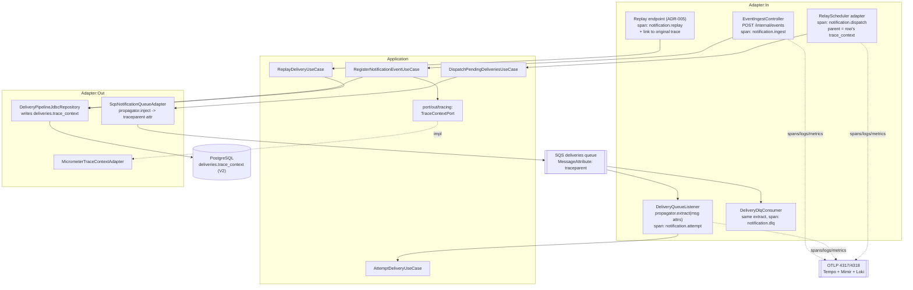

# ADR-008: Observability - End-to-End Trace Continuity Across the SQS Hop, OTLP Structured Logs, Metric Cardinality and Histogram Policy, and the Liveness/Readiness Split

## Status

Accepted <!-- change only by the user: Proposed | Accepted | Rejected | Superseded by ADR-NNN -->

## Context

ADR-002 §3 and §3.1 already decided the observability *shape* of this system: one trace per delivery lifecycle across the SQS hop, structured logs carrying `delivery_id`/`event_id`/`client_id`/trace id via MDC, percentile histograms rather than averages, `client_id` and `subscription_id` off every meter, `content` and `response_excerpt` off every log line and span, and a readiness probe that fails on Postgres while liveness does not. Those decisions are `Accepted` and this ADR **does not reopen any of them**.

What ADR-002 §3.1 did not do is say how each of them is wired, and the delivered code (FEAT-005 through FEAT-008) implements them partially and, in two places, incorrectly. This ADR is the implementation decision layer for §3.1: it names the mechanism, the exact meter names, the exact MDC keys, the exact configuration properties, and the enforcement point for each rule, so that the remaining work is three reviewable tasks rather than a standing intention.

### What already works, verified against the running system

Evidence: `bootRun` under the `local` profile on 2026-09-21, plus the source tree at commit `d117557`.

| Capability | State |
| --- | --- |
| Traces and metrics to the `grafana/otel-lgtm` stack | **Working, with no manual configuration.** `spring-boot-starter-opentelemetry` is on the classpath (`build.gradle`) and `spring-boot-docker-compose` service-connects the OTLP exporter to the running `grafana-lgtm` container on 4317/4318. The boot log confirms `Publishing metrics for OtlpMeterRegistry every 1m to http://127.0.0.1:<mapped-port>/v1/metrics`. Testcontainers wires the same connection through `LgtmStackContainer`. **This ADR does not re-decide the transport.** |
| `deliveries.trace_context` column | **Already exists**, created by `V2__deliveries.sql` (`trace_context text`, nullable), and is a component of the `Delivery` domain record per ADR-003 Amendment A3. **No migration is needed and none is proposed here.** This corrects an assumption in the request that framed the column as new. |
| `TraceContextPort` and its Micrometer adapter | Already exist (`application/port/out/tracing/TraceContextPort`, `adapter/out/tracing/MicrometerTraceContextAdapter`), added by ADR-002 Amendment C3. Ingest writes the current traceparent onto the delivery row. |
| `traceparent` SQS message attribute | Already written on publish (`SqsNotificationQueueAdapter`, constant `TRACEPARENT_ATTRIBUTE`). |
| Counters | Nine meters exist, listed in §4 below. |

### What is missing or wrong, verified the same way

1. **There is no trace continuity, only trace correlation.** No code anywhere calls a `TextMapPropagator`/`Propagator` `extract`. `AttemptDeliveryUseCaseImpl:181` takes the traceparent (from the message attribute, falling back to `deliveries.trace_context`) and puts the **whole traceparent string** into MDC under the key `trace_id`:

   > `command.traceparent().or(delivery::traceContext).ifPresent(traceId -> MDC.put(MDC_TRACE_ID, traceId));`

   That is wrong on two counts. First, a traceparent is `00-<32 hex trace id>-<16 hex span id>-<flags>`, so the value logged as `trace_id` is not a trace id and will not match anything Tempo shows. Second, the OpenTelemetry context is never activated, so the worker's own spans (whatever auto-instrumentation produces) belong to a **different trace**. The result is exactly the "three correlated-but-separate traces stitched together after the fact" outcome ADR-002 §3.1 explicitly said this design was not.

2. **The relay merges unrelated business flows into one trace.** `DispatchPendingDeliveriesUseCaseImpl:67-72` computes `currentTraceparent.or(delivery::traceContext)`, so the **scheduler's** traceparent wins over each row's persisted one. The relay is a `fixedDelay` job with no inbound request, so every delivery published in one poll cycle is stamped with that poll's context: a batch of up to 500 unrelated deliveries (`challenge.relay.batch-limit`) collapses into a single trace, and each delivery's own ingest trace is discarded. Precedence is inverted.

3. **A replayed delivery carries no trace context at all.** `ReplayDeliveryUseCaseImpl:58-71` constructs the replay row with `Optional.empty()` in the `traceContext` position. ADR-005's replay endpoint therefore produces a delivery with no link, forward or backward, to anything. This is the concrete case the request names.

4. **The three named spans do not exist.** ADR-002 §3 names `notification.ingest`, `notification.dispatch` and `notification.attempt`. Grep finds no `Observation`, no `@Observed`, no `nextSpan`, and no `Tracer` usage outside `MicrometerTraceContextAdapter`, which only *reads*. Only auto-instrumented spans exist (HTTP server, JDBC, SQS SDK where instrumented).

5. **Logs never leave the process.** No `logback-spring.xml`, no `logging.structured.*`, no `management.otlp.logging.*` anywhere in `application*.yaml`. Application logs are plain text on stdout. Loki receives nothing.

6. **MDC is set in one place only, and it clears keys it does not own.** `AttemptDeliveryUseCaseImpl` sets `delivery_id`, `subscription_id`, `attempt_number`, `status_class`, `trace_id` and calls `MDC.clear()` in its `finally`. Ingest and relay set nothing. `event_id` and `client_id`, both required by ADR-002 §3, are never in MDC anywhere.

7. **No latency meter of any kind exists.** No `Timer`, no `DistributionSummary`, no `Gauge`. ADR-002 §3's "attempt latency (timer)" and the monitoring surface's "p99 attempt latency" have nothing behind them, so there is nothing for a percentile histogram to be enabled *on*.

8. **No actuator health configuration exists.** `management.*` appears nowhere in `application.yaml`, so `management.endpoint.health.probes.enabled` is unset, the liveness and readiness endpoints are not exposed, and the group membership ADR-002 §3.1 specifies is unconfigured. Setting the property explicitly is the whole of the fix.

9. **One meter breaks the naming convention.** `delivery.dlq.arrival` (`DeliveryDlqConsumer:53`) is the only meter not under the `notification.` prefix.

### Constraints

- Java 21, Spring Boot 4.1.1, Spring MVC on virtual threads. No WebFlux, no reactive types.
- Hexagonal: `domain/model` is framework-free, and ADR-002 Amendment C3 set the precedent that a use case reaches observability infrastructure through a narrow `port/out` rather than by importing Micrometer.
- `grafana/otel-lgtm` via Compose locally, `LgtmStackContainer` in tests. No new observability infrastructure (ADR-002 §3).
- One developer. The enforcement mechanisms chosen have to be ones a single person can implement and keep honest.

### Confidence note on Spring Boot property names

The OTLP **logging** exporter property spelling in Spring Boot 4.1.1 is the one factual claim in this ADR I cannot verify from the repository. In Boot 3.4/3.5 it is `management.otlp.logging.export.enabled` plus `management.otlp.logging.endpoint`; Boot 4 reorganized parts of the OpenTelemetry configuration namespace under `management.opentelemetry.*`. The **mechanism** decided below (the OpenTelemetry Logback appender autoconfigured by `spring-boot-starter-opentelemetry`, exporting log records over the same OTLP connection already used for traces and metrics) is not in doubt; the exact property key is. The implementing task must confirm it against the Boot 4.1.1 reference documentation before writing it, and treat a property that silently does nothing as a failing acceptance criterion, not a cosmetic one.

## Options Considered

Four independent decisions: how trace context crosses the SQS hop (C), how a replay relates to the original trace (R), how logs reach Loki (L), and how the metric cardinality rule is enforced (M). The histogram and health-probe decisions follow directly from ADR-002 §3.1 and are recorded in the Decision section rather than as competing options.

### C-A: Correlation only, the current implementation (rejected)

Carry the traceparent as a string, log it as a field, and let an operator pivot by trace id in Grafana.

- Pros:
  - Already written. Zero work.
  - No OpenTelemetry context API in the codebase at all.
- Cons:
  - It does not satisfy the requirement: ingest, dispatch and attempt remain three separate traces, and Tempo will not render the flow as one waterfall. "One trace per business flow regardless of which pod handles which stage" is exactly what this fails to produce.
  - It is currently broken anyway (the value put in MDC as `trace_id` is a traceparent, not a trace id), so the pivot it promises does not work either.

### C-B: Extract the remote context and continue the trace (chosen)

At every point where a delivery re-enters the process (SQS receive, DLQ receive), extract the W3C context with the configured propagator and open a span whose parent is the remote span, using the persisted `deliveries.trace_context` as the fallback carrier when the message attribute is absent.

- Pros:
  - This is what ADR-002 §3.1 already decided, stated in its own words: "OpenTelemetry's context propagation API (`TextMapPropagator`) reads/writes the SQS message attribute the same way it would an HTTP header". C-B is that sentence implemented.
  - Produces one continuous trace across processes, which is the stated requirement, and does so without bespoke correlation logic.
  - The fallback to the persisted column makes the mechanism survive a relay re-publish long after the original span ended, which is the case a message-attribute-only design loses.
- Cons:
  - Span lifecycle becomes the adapter's responsibility: a scope opened must be closed on the same thread, in a `finally`. On virtual threads this is correct but unforgiving, and a leaked scope corrupts subsequent spans on that carrier.
  - A very long-lived business flow (a delivery that dies after six retries over hours, ADR-004 §1) produces a trace with a wall-clock span of hours. Tempo tolerates this, but the trace is only readable once complete and the parent span has long since been exported. Accepted: the alternative is losing the continuity that is the point of the exercise.

### C-C: Baggage-carried correlation id plus separate traces per stage

Propagate a business correlation id (the `delivery_id`) as OTel baggage and keep each stage its own trace.

- Pros:
  - Short, self-contained traces, each cheap to sample and to render.
  - Avoids the hours-long trace of C-B.
- Cons:
  - `delivery_id` is already on every log line and every span attribute, so baggage adds a second mechanism to carry a value that is not missing.
  - Grafana still cannot render the flow as one waterfall; the operator does the joining by hand, which is the C-A failure mode with more machinery.

### R-A: A replay rejoins the original trace

Reuse the original `trace_context` verbatim as the replay row's own, so the replay's spans attach as children of the original ingest span.

- Pros:
  - Literally "one trace per business flow", including the replay.
  - Simplest possible code: copy one field.
- Cons:
  - The parent span ended, and was exported, potentially days earlier. Appending children to a completed and flushed trace produces spans whose parent id resolves to nothing in Tempo's retention window, or attaches them to a trace an operator considers closed.
  - It inherits a stale sampling decision. A trace sampled out at ingest silently drops the replay too, which is precisely the flow an operator is most likely to be investigating.
  - A replay is a **new** business action, initiated by a different actor (a client calling ADR-005's endpoint) at a different time. Modelling it as a continuation of the original misrepresents what happened.

### R-B: A new trace, linked to the original (chosen)

The replay row's `trace_context` is the traceparent of the **replay request**, and the original delivery's trace is attached as a span link plus a span attribute, with the existing `replaced_delivery_id` column carrying the durable join.

- Pros:
  - Correct causality: a new operation that references a prior one, which is exactly what a span link is for.
  - Fresh sampling decision, live parent, and the replay is investigable on its own terms.
  - Satisfies the requirement's own fallback wording ("or at minimum be correlated back to it") with a real, queryable link rather than a manual join.
- Cons:
  - An operator following a replay backwards takes one hop instead of zero.
  - Span links are less familiar than parent-child and render less prominently in Grafana.

### L-A: JSON on stdout plus a log shipper (rejected by the user's scope, and on merit)

`logging.structured.format.console=ecs` (or logstash), collected by Promtail/Alloy into Loki.

- Pros:
  - Zero application-side network dependency: if the collector is down, logs still land in the container's stdout and in `docker logs`.
  - The standard Kubernetes pattern, and the one most operators expect.
- Cons:
  - A second pipeline to deploy, configure and keep alive (Promtail or Alloy), which is new infrastructure and directly contradicts ADR-002 §3's "no new observability infrastructure".
  - Trace correlation has to be reconstructed at parse time from a logged field, rather than being carried on the log record itself.
  - Explicitly out of scope per the user's decision.

### L-B: OTLP log export via the OpenTelemetry Logback appender (chosen)

`spring-boot-starter-opentelemetry` autoconfigures an OpenTelemetry Logback appender; enabling log export sends log records over the OTLP connection already service-connected for traces and metrics.

- Pros:
  - One protocol, one endpoint, one credential, one failure mode for all three signals. Nothing new in `compose.yaml` and nothing new in `TestcontainersConfiguration`.
  - The active span context is attached to each log record **by the appender**, from the live OTel context, so trace-to-log navigation in Grafana works without a logged trace-id field and without the hand-set MDC key that is currently wrong (Context item 1).
  - MDC entries ride along as structured log attributes, which is what makes §3's `delivery_id`/`event_id`/`client_id` requirement a query dimension in Loki rather than a substring in a message.
- Cons:
  - The exporter is in-process. If the collector is unreachable, records queue in a bounded batch processor and are **dropped** on overflow. Logs are not durable on this path.
  - Anything logged before the OTel SDK is initialized, and anything logged during shutdown after it closes, does not reach the collector.
  - Both are mitigated, not solved, by keeping the plain console appender enabled (below). Accepted knowingly.

### M-A: Code review only (the ADR-002 §3.1 position)

ADR-002 §3.1 says the `client_id`-off-metrics rule is "enforced by code review rather than a runtime filter", on the reasoning that a `MeterFilter` stripping the tag after the fact has already paid the in-process cardinality cost.

- Pros:
  - No mechanism, and the reasoning about when the cost is paid is correct.
- Cons:
  - It is the same class of control ADR-007 §5 rejected for the tenant predicate: a rule enforced by whoever remembers it, with a silent failure mode. A high-cardinality label does not fail a test, it degrades Mimir weeks later.
  - There is one reviewer on this project.

### M-B: A denying `MeterFilter` plus a build-failing test (chosen)

A `MeterFilter` that **denies** (does not strip) any meter carrying a `client_id` or `subscription_id` tag key, plus a test that fails the build if any meter registered during an integration run carries one.

- Pros:
  - The test is the real control, and it runs on every build rather than on every reviewer's attention.
  - `deny` rather than `.replaceTagValues`/strip is deliberate: a dropped meter is loud (a missing panel) where a silently stripped tag is a merge of series nobody notices.
  - ADR-002 §3.1's cost argument still holds and is not contradicted: the filter is a backstop for production, the test is what prevents the tag from ever being written.
- Cons:
  - Two mechanisms for one rule.
  - The filter can, in principle, drop a meter someone intended to keep. That is the intended behavior, and the test is what makes it discoverable before deployment rather than after.

## Decision

**Adopt C-B, R-B, L-B and M-B.** Trace context is extracted and continued across the SQS hop with the configured W3C propagator, with the persisted `deliveries.trace_context` column as the fallback carrier; a replay starts a new trace linked to the original; logs reach Loki as OTLP log records through the OpenTelemetry Logback appender on the existing OTLP connection; and the metric cardinality rule is enforced by a denying `MeterFilter` plus a build-failing test.

### 1. Signal flow



### 2. Trace continuity

#### 2.1 The propagator is the only formatter

`MicrometerTraceContextAdapter` currently hand-formats `"00-" + traceId + "-" + spanId + "-" + flags`. That string is correct today and will stay correct, but it is a private reimplementation of a wire format the SDK already owns.

**Decision: injection and extraction both go through the configured Micrometer `Propagator` (W3C `traceparent`, the Boot default).** `TraceContextPort.currentTraceparent()` keeps its signature (the ingest use case writes one string to one nullable column, and that is the whole contract), but its adapter obtains the value by injecting into a single-entry carrier rather than by concatenating fields. One format, one place, and `tracestate` is carried automatically if it is ever enabled.

#### 2.2 Publish side

`SqsNotificationQueueAdapter` already sets the `traceparent` message attribute. **What changes is the value's provenance, not the attribute.** The pointer's traceparent is whatever `DeliveryPointer` carries, and §2.3 fixes which context that is.

The attribute name stays `traceparent`, lowercase, matching W3C and ADR-002 §3.1 and ADR-004 §1's envelope field. The JSON body keeps its `traceparent` field as well (ADR-004 §1's four-field envelope is unchanged); the message attribute is the one the extractor reads, and the body field is redundant-but-harmless documentation of the same value. **Neither is a new field and neither is removed.**

#### 2.3 Relay precedence is inverted from the current implementation

**Decision: the persisted `deliveries.trace_context` is authoritative for a delivery's pointer, and the relay's own scheduling context is not.**

```
pointer.traceparent = delivery.traceContext()          // the row's own, from ingest or replay
                          .or(traceContextPort::currentTraceparent)   // only when the row has none
```

This is the exact reverse of `DispatchPendingDeliveriesUseCaseImpl:67-72` and it is the single change that makes "one trace per business flow" true. With the current precedence, one poll cycle's context is stamped onto every row in a batch of up to 500, merging unrelated flows; with this precedence, each delivery carries its own flow's context and the relay poll is merely the machinery that moved it.

The relay's own `notification.dispatch` span is created **per delivery**, as a child of that delivery's extracted context, inside the relay adapter. The poll cycle itself gets a separate span (`notification.relay.poll`) that is the parent of nothing in the business flow; it exists so a poll with zero claims is still visible. A batch therefore produces one poll span plus N per-delivery spans in N different traces, which is the correct shape.

#### 2.4 Consume side

`DeliveryQueueListener` (and `DeliveryDlqConsumer`) extract the remote context from the message attributes with the propagator, open `notification.attempt` (respectively `notification.dlq`) as a child of it, and run the use case inside that scope. The scope is closed in a `finally` on the same virtual thread that opened it.

**The fallback order stated in ADR-002 §3.1 is unchanged and is now actually implemented:** message attribute first, `deliveries.trace_context` second. The fallback matters because the column survives a re-publish long after the original span ended, and because the DLQ path may receive a message whose attributes were reshaped.

When neither is present, or either is malformed, the listener starts a **new root trace** and logs nothing above `DEBUG` about it. An unparseable traceparent must never fail a delivery (OWASP A10): observability is a read-side concern and has no business failing a write-side operation. This mirrors the existing `MicrometerTraceContextAdapter` contract, which already swallows and returns empty.

**`AttemptDeliveryUseCaseImpl:181` is deleted.** The use case stops hand-setting `trace_id` in MDC; the span scope opened by the adapter is what carries the trace, and the log record picks it up from the live context (§3.2). `AttemptDeliveryCommand.traceparent()` stays on the command (the use case still needs the value for the fallback decision when it loads the row), but the use case no longer interprets it as a trace id.

#### 2.5 Replay (R-B), and what it means for ADR-005

`ReplayDeliveryUseCaseImpl` currently writes `Optional.empty()` for `traceContext`. **Decision:**

| Field | Value on a replay row |
| --- | --- |
| `deliveries.trace_context` | The **replay request's** current traceparent, from `TraceContextPort`. The replayed delivery is a new business flow and traces as one, from the client's HTTP call through relay and worker. |
| `deliveries.replaced_delivery_id` | Unchanged: the original delivery id (ADR-003 §3). This is the durable, queryable backward join and it already exists. |
| Span link on `notification.replay` | The original delivery's trace, reconstructed from the target row's `trace_context`, attached as an OpenTelemetry span link with attribute `notification.replay_of_delivery_id`. |

The link is best-effort: an original row whose `trace_context` is null (ingested before this ADR lands, or ingested with no active span) produces a replay span with no link and with the attribute only. That is a degradation to correlation, which is what the requirement's own fallback wording permits, and it fails silently by design rather than failing the replay.

#### 2.6 Named spans and where they are created

| Span | Created in | Notes |
| --- | --- | --- |
| `notification.ingest` | `adapter/in/web/ingest` | The auto-instrumented HTTP server span for `POST /internal/events` already exists and is the ingest span's parent. `notification.ingest` is created as its child around the use-case call so the business operation is distinguishable from the HTTP frame. |
| `notification.dispatch` | relay adapter, per delivery (§2.3) | Child of the delivery's own extracted context. |
| `notification.relay.poll` | relay adapter, per poll cycle | Root of its own trace. Not part of any business flow. |
| `notification.attempt` | `DeliveryQueueListener` | Child of the extracted context. Attributes: `http.response.status_code`, attempt number, outcome, `delivery_id`, `event_id`, `client_id`, `subscription_id`. **Never** the target URL, the request body or the response body (§3.3). |
| `notification.dlq` | `DeliveryDlqConsumer` | Child of the extracted context. |
| `notification.replay` | replay endpoint path | Child of the HTTP server span, linked per §2.5. |

**Span creation lives in adapters, not in use cases.** ADR-002 Amendment C3 established that a use case reaches tracing only through a narrow `port/out`, because a use case in this codebase carries no framework type but `@Transactional`. Creating a span requires a `Tracer`, a scope and a `finally`, which is framework lifecycle management and belongs on the adapter side of the boundary. `TraceContextPort` stays a one-method read port and does **not** grow span-creation methods (YAGNI, and Effective Java Item 64: small interfaces).

**Virtual-thread note.** Every scope opened here is opened and closed on the same virtual thread, one per message or request, in a `finally`. No `synchronized` guards any of it, and nothing holds a scope across a blocking call it did not itself initiate. A leaked scope is the one real hazard of C-B and is the reason the `finally` is an acceptance criterion rather than a style preference.

### 3. Structured logs over OTLP

#### 3.1 Transport

Log records are exported over OTLP to the same collector endpoint already service-connected for traces and metrics, via the OpenTelemetry Logback appender autoconfigured by `spring-boot-starter-opentelemetry`. No `logback-spring.xml` is introduced unless the appender genuinely cannot be enabled by property alone; if one is needed it is minimal and does not redefine the console appender.

**The plain console appender stays enabled** alongside OTLP export, in every profile. It is the only thing that works before the SDK initializes, after it shuts down, and when the collector is unreachable, and it costs nothing.

Property spelling: see the confidence note in Context. The implementing task confirms the Boot 4.1.1 key (starting from `management.otlp.logging.export.enabled` / `management.otlp.logging.endpoint`) and **verifies log records actually arrive in the LGTM stack** before marking the task ready. A property that parses and does nothing is the expected failure mode here.

**Failure behavior (A10).** The appender's batch processor is bounded and drops on overflow. It must never block the calling thread and must never propagate an exception into application code. A logging backend that can fail a delivery is a worse outcome than a lost log line.

#### 3.2 MDC keys and their ownership

| Key | Set by | Notes |
| --- | --- | --- |
| `delivery_id` | adapter/in, at the boundary | Present on ingest, dispatch, attempt, DLQ and replay paths. |
| `event_id` | the use case, once the row is loaded | Not known at the adapter boundary on the attempt path; the listener has only the pointer. |
| `client_id` | the use case, once the row is loaded | Same. **This is the field ADR-002 §3 requires and the current code never sets.** |
| `subscription_id` | adapter/in where known, use case otherwise | Already set today on the attempt path. |
| `attempt_number`, `status_class` | the use case | Already set today. Kept. |
| `trace_id`, `span_id` | **nobody** | Attached to the log record by the appender from the live OTel context. **Hand-setting either is forbidden**; that is the bug in Context item 1. |

**Ownership rule: the outermost adapter opens the MDC scope and is the only thing that closes it.** A use case may `put` additional keys inside that scope and must never call `MDC.clear()` or `MDC.remove()` on a key it did not set. `AttemptDeliveryUseCaseImpl`'s current `MDC.clear()` in its `finally` violates this the moment the listener sets anything, so it moves to the listener's `finally` along with the span scope. One `finally`, two resources, same lifetime.

MDC is a `ThreadLocal`. With one virtual thread per message or request and an adapter-level `finally`, that is correct and carries no pinning risk. It is also exactly why the clear has to be unconditional: a virtual thread's carrier is reused, and a thread-local surviving a request would attribute one delivery's id to another's log line.

`org.slf4j.MDC` in the application layer is permitted, as `org.slf4j.Logger` already is: SLF4J is a facade, not a framework binding, and it is already imported throughout `application/usecase`. The hexagonal line drawn here is about **lifecycle**, not about the import.

#### 3.3 Redaction: `content` and `response_excerpt`

ADR-002 §3.1 already states these two fields are the PII layer and never reach a log line, an MDC entry or a span attribute. This ADR decides **how that is enforced** and **what is logged instead**.

| Field | In logs |
| --- | --- |
| `notification_events.content` | **Omitted entirely.** Not truncated, not hashed. |
| `delivery_attempts.response_excerpt` | **Omitted entirely.** The 1024-character truncation (`challenge.worker.response-excerpt-limit`) is a database-column bound and is not a licence to log the truncated value: a 1024-character prefix of a client's response body is still the client's payload. |
| Substituted diagnostics | `content_length` (bytes) and `response_body_length` (bytes) as integers, plus the HTTP status code and the classified outcome, all of which are already available. |

**Correlation identifiers are explicitly exempt from redaction and are logged in full.** `event_id`, `delivery_id`, `client_id`, `subscription_id`, `event_type`, `trace_id` and `span_id` are logged unredacted, untruncated and unhashed, on every line that has them. They are opaque identifiers and the whole point of §3.2; redacting or partially masking any of them would destroy the correlation this ADR exists to create. The redaction rule in this section applies to **`content` and `response_excerpt` only**, and to nothing else. There is no ambiguity here: if a field is an identifier, it is logged in full.

**No hashing.** A hash of a low-entropy payload (a status enum, a short JSON document with a known schema) is reversible by enumeration, so it carries the disclosure risk of the plaintext while providing none of its diagnostic value. Length plus status answers every operational question a hash would ("did the body change", "was it empty", "was it enormous") without the risk.

**Enforcement, three layers:**

1. **`toString()` redaction.** Every type holding either field (`NotificationEvent`, the attempt/outcome records, the inbound and outbound DTOs that carry them) overrides `toString()` to print a redaction marker and the length in place of the value. This is the layer that catches the realistic accident, which is not `log.info(content)` but `log.info("processing {}", event)`.
2. **Unit tests** asserting that each such `toString()` contains neither the value nor any prefix of it.
3. **The review rule**, stated here so it is citable: no logger call anywhere takes `content` or `response_excerpt`, or any substring of either, as an argument, at any level including `DEBUG` and `TRACE`. A `DEBUG` line is still a line in Loki.

#### 3.4 Exception and error logging

**Exceptions are logged in full by default.** Exception class, exception message and the complete stack trace are logged, at the level the handling site chooses, and are **not** subject to the `content`/`response_excerpt` omission rule in §3.3. Truncating stack traces or dropping exception messages to satisfy a redaction rule would remove the single most useful diagnostic this system produces, and an exception type and frame list carry no client payload.

**The one exception to that exception: an exception message that embeds raw input or a raw response body must have the embedded content stripped before the exception is logged.** The stack-trace path is otherwise a direct bypass around §3.3: a parser can put the very bytes §3.3 forbids into a message that §3.4 then logs verbatim. Concretely, `JsonParseException: Unexpected token at "...raw content..."` writes client payload into Loki no less than `log.info(content)` does, and is harder to notice in review because the logging call itself looks innocuous.

The exception types to check for are, at minimum:

| Category | Examples in this system's scope |
| --- | --- |
| JSON parse errors | Jackson `JsonParseException`, `JsonMappingException` and subtypes, which quote the offending input and report its location. |
| Deserialization / binding errors | `HttpMessageNotReadableException` (which wraps and re-reports the Jackson message), and any `MismatchedInputException` variant. |
| Any exception type that echoes its input in its message | Validation and conversion failures that include the rejected value, HTTP client exceptions that include the response body, and `IllegalArgumentException`s constructed with the offending value interpolated into the message. |

**Rule for implementers: at every exception-handling site introduced or touched by this feature, determine whether the exception type can echo request content or response body in its message, and if it can, log a sanitized message** (exception class, error location/offset, length of the offending input) **rather than `ex.getMessage()` verbatim.** The stack trace itself is logged unchanged. Where a wrapping exception is constructed by application code, its message is built from metadata only and never by interpolating the raw value.

This is a per-site judgement, not a global filter, and it is called out here so it appears in the acceptance criteria of every task that adds or changes a `catch` block in this feature's scope. Silent failure mode: nothing breaks, the payload simply appears in the log store.

### 4. Metrics

#### 4.1 The meters this system emits

Existing, unchanged except where noted:

| Meter | Type | Tags | Source |
| --- | --- | --- | --- |
| `notification.ingest.publish.failed` | counter | none | `IngestPublishDispatcher` |
| `notification.relay.claimed` | counter | none | `DispatchPendingDeliveriesUseCaseImpl` |
| `notification.relay.published` | counter | none | same |
| `notification.relay.publish.failed` | counter | none | same |
| `notification.circuit.transition` | counter | `direction` | relay and worker |
| `notification.delivery.claim.lost` | counter | none | `AttemptDeliveryUseCaseImpl` |
| `notification.delivery.bulkhead.deferred` | counter | none | same |
| `notification.delivery.circuit.deferred` | counter | none | same |
| `notification.delivery.attempt` | counter | `outcome` | same |
| `notification.webhook.egress.rejected` | counter | none | same |
| `delivery.dlq.arrival` | counter | none | `DeliveryDlqConsumer`. **Renamed to `notification.delivery.dlq.arrival`** for prefix consistency; nothing consumes it yet, so the rename costs nothing and will cost a dashboard later. |

New, and the reason percentile histograms have anything to apply to:

| Meter | Type | Tags | Semantics |
| --- | --- | --- | --- |
| `http.server.requests` | timer | `uri`, `method`, `status`, `outcome` (Boot defaults) | **Ingest latency.** Auto-instrumented and already present. No bespoke ingest timer is added: a second meter measuring the same wall clock as an existing one is duplication, and the `uri` tag already separates `/internal/events` from the self-service endpoints. This also keeps `client_id` off it by construction. |
| `notification.delivery.attempt.latency` | timer | `outcome`, `status_class` | **Delivery attempt latency**: the outbound webhook POST, measured around the HTTP call in the webhook client adapter, covering connect plus read. This is ADR-002 §3's "attempt latency (timer)" and the monitoring surface's "p99 attempt latency". |
| `notification.relay.dispatch.latency` | timer | none | **Relay processing latency**: one poll cycle, from claim query to the last publish returning. Its p99 against `challenge.relay.poll-interval` (5s) is what says whether the relay is keeping up. |
| `notification.delivery.dlq.depth` | gauge | none | **DLQ depth**, in scope for this ADR. See §4.1.1. |

##### 4.1.1 DLQ depth, and why it has to be instrumented by hand

`notification.delivery.dlq.arrival` counts messages *as they arrive*. It answers "did anything land in the DLQ" but not "how much is sitting in the DLQ right now", which is the question an operator actually asks, and it is reset by a process restart while the queue is not.

**LocalStack SQS exposes no CloudWatch-style queue-depth metric**, so unlike a real AWS deployment there is nothing to scrape and nothing to import. The depth has to be produced by the application.

**Decision: a scheduled poll of `GetQueueAttributes` against the DLQ queue URL, reading `ApproximateNumberOfMessages`, published as a Micrometer gauge named `notification.delivery.dlq.depth`.**

- **Interval:** a fixed delay on the order of the relay poll interval or slower. `GetQueueAttributes` is a billed API call in real AWS and a queue depth that is minutes stale is still actionable; a sub-second gauge is not worth the call volume.
- **Attributes read:** `ApproximateNumberOfMessages` for the gauge. `ApproximateNumberOfMessagesNotVisible` may be read alongside it, but only one gauge is decided here (YAGNI); a second meter is a follow-up if the in-flight count turns out to matter.
- **Tags:** none. The queue is fixed and singular; a `queue` tag would be a constant label.
- **Placement:** the poll and the SDK call live in the **adapter/out** layer beside the existing SQS adapters, next to `DeliveryDlqConsumer`'s queue configuration. No use case is involved and no new port is introduced: this reads infrastructure state and reports it to infrastructure, and never crosses into the application layer. Adding a `port/out` for it would be a port with one adapter and no domain caller, which the hexagonal rule does not require and YAGNI forbids.
- **Failure behavior (A10):** an SDK failure or a timeout on the attributes call **must not** throw out of the scheduled method, must not disturb the DLQ consumer, and must be logged at `WARN` with the exception handled per §3.4. The gauge then keeps reporting its last known value, or `NaN` if it has never succeeded. A broken metric must never become a broken service.
- **Virtual-thread note:** this is a blocking SDK call on a scheduled thread. Nothing is `synchronized` and the gauge's backing value is a plain `AtomicLong`/`AtomicDouble` read by the meter registry, so there is no pinning risk and no lock shared with the delivery path.

Out of scope here and explicitly not added: the gauges ADR-002 §3 names (outbox depth by state, age of the oldest `PENDING` row) and the retry-count distribution. These are **Postgres** queries against `deliveries` and are unrelated to the SQS DLQ depth decided above. They are the most valuable alerting signals in that list and they are missing, but each needs a repository query behind it and they are not latency-shaped, so folding them into this ADR's three-task budget would either oversize a task or crowd out the trace work. Logged as unblocked follow-up work in Consequences.

#### 4.2 Percentile histograms

Enabled per meter, not globally. A global `management.metrics.distribution.percentiles-histogram.all=true` would attach a full bucket set to every timer in the process, including every Boot-internal one, which is a cardinality cost paid for meters nobody queries.

| Meter | Histogram | SLO buckets |
| --- | --- | --- |
| `notification.delivery.attempt.latency` | yes | Aligned to ADR-004 §1's per-attempt budget (2s connect, 5s read, ~9.3s worst case): 100ms, 250ms, 500ms, 1s, 2s, 5s, 7s, 10s. The buckets straddle the timeout boundaries so "slow but inside budget" and "timed out" are distinguishable in the histogram itself. |
| `notification.relay.dispatch.latency` | yes | Aligned to the 5s poll interval: 50ms, 100ms, 250ms, 500ms, 1s, 2s, 5s. A cycle above the poll interval is the signal. |
| `http.server.requests` | yes, scoped to this application's URIs | Boot defaults plus an explicit maximum-expected-value; ingest is meant to be fast (ADR-002 §1.1: insert and return, the publish is best-effort). |

Percentiles are **not** client-side-precomputed (`percentiles=...`), only histogram buckets are published, so Mimir and Grafana compute arbitrary quantiles at query time. This is ADR-002 §3.1's stated position and it is restated here because the two properties are one character apart in the configuration and produce different, non-interchangeable results.

#### 4.3 The cardinality rule, and how it is enforced

**Rule, applying to every meter now and in future, with no exception:** `client_id` and `subscription_id` are never a tag, label or attribute on any counter, gauge, timer or distribution summary. They are trace and log dimensions only. Any other unbounded-cardinality value (`delivery_id`, `event_id`, a URL, an error message, a raw HTTP status as opposed to its class) is covered by the same rule for the same reason.

This restates ADR-002 §3's Q8 resolution and §3.1's confirmation. What is new is M-B's enforcement:

1. **A `MeterFilter` bean, in every profile, that denies any meter whose id carries a `client_id` or `subscription_id` tag key.** Deny, not strip: a missing panel is noticed, a silently merged series is not. ADR-002 §3.1's objection stands and is acknowledged (the in-process cardinality cost is paid before the filter runs), which is exactly why the filter is the backstop and not the control.
2. **A test that fails the build** if any meter registered during the pipeline integration run carries either tag key. This is the actual control: it runs every build, it catches the tag at the moment it is written, and it does not depend on a reviewer.
3. The rule is restated in every observability task's acceptance criteria so it is in front of whoever adds the next meter.

Per-client drill-down remains a Loki/Tempo operation against the `client_id` field that §3.2 puts on every log line, at no cardinality cost. If a standing per-client dashboard is ever genuinely required, the path is a log-derived recording rule, never a metric label. That is ADR-002 §3's position, unchanged.

### 5. Health probes

Actuator's built-in group mechanism, configured explicitly.

**This is a local-only deployment** (Docker Compose dev services, Testcontainers in tests; there is no Kubernetes anywhere in this project). The requirement is therefore simple and carries no orchestrator-specific caveat: set `management.endpoint.health.probes.enabled=true` in `application.yaml`, define a readiness group that includes `db` and a liveness group that does not, and expose both locally through actuator. Nothing here is blocked by, or conditional on, environment auto-detection.

**Property key, verified:** `management.endpoint.health.probes.enabled` is the correct spelling in Spring Boot 4.1.1, confirmed against `META-INF/spring-configuration-metadata.json` in `spring-boot-health-4.1.1.jar` on this project's Gradle cache (the same file also declares `management.endpoint.health.probes.add-additional-paths` and `management.health.probes.enabled`). Unlike the OTLP logging key in §3.1, this one needs no further confirmation by the implementer.

| Endpoint | Group members | Fails when |
| --- | --- | --- |
| `/actuator/health/liveness` | `livenessState` only | The application context is broken or shutting down. **Never** because of Postgres, SQS, or any other external dependency. |
| `/actuator/health/readiness` | `readinessState`, `db` | Postgres is unreachable, or the context is not ready to serve. |
| `/actuator/health` | aggregate | Operator surface. |

**Why `db` is on readiness.** A Postgres outage means this instance cannot durably accept an event (ADR-002 §1.1) and cannot claim or write a `deliveries` row (§2.2). It should stop receiving traffic, which is what a failed readiness probe causes.

**Why `db` is not on liveness.** Liveness answers "restart me if I am broken". Restarting every pod because a shared database is down fixes nothing, turns a dependency outage into a restart storm, and destroys the in-flight work and the warm connection pools that would otherwise recover the moment the database returns.

**SQS is deliberately on neither.** ADR-001 §1 makes the database the source of truth and the relay the guaranteed dispatch path; a queue outage delays delivery and loses nothing, because rows stay `PENDING` and the relay re-publishes when SQS returns. Failing readiness on SQS would pull every instance out of rotation, including the ingest path that does not need SQS to be correct, converting a recoverable degradation into a full outage. If any SQS check is ever wanted it belongs in the `/actuator/health` aggregate as an informational indicator, never in a probe group.

`management.endpoint.health.show-details` stays `never` for unauthenticated callers, per ADR-007 §2 chain 1, which already permits the three health paths and authenticates every other actuator endpoint behind the `ops` authority. **This ADR changes no security configuration**; it only populates groups behind paths ADR-007 already opened. The implementing task must confirm the probe paths are actually permitted by the delivered chain (TASK-008-21) rather than assuming it.

### 6. What this ADR does not decide

- **The outbox-depth-by-state, oldest-pending-age and retry-distribution gauges** (ADR-002 §3), all of which are Postgres queries against `deliveries`. Named as missing, deferred to a follow-up, for the task-budget reason in §4.1. **The SQS DLQ depth gauge is not among these and is in scope** (§4.1.1).
- **Alert rules and dashboards.** ADR-002 §3 lists the suggested alerts; provisioning them in Grafana is devops work with no architectural content.
- **Sampling.** Everything is sampled at 100% today, which is correct at this volume and for a demo. A production sampling policy, and in particular whether an errored delivery forces a sampling decision, is a follow-up.
- **Log retention, Loki tenancy, or any collector-side configuration.**
- **Whether traces and logs from the `local` profile should be separable from a deployed environment's** (a `service.namespace`/`deployment.environment` resource attribute question).

## Consequences

**Becomes easier**

- One trace per business flow becomes true rather than intended: ingest, dispatch and attempt render as a single waterfall in Tempo, across instances, and a replay is one link away from the delivery it replaces.
- "What happened to client X's event Y" is answerable in Loki, because `client_id` and `event_id` are finally on every line, and every line carries the trace id the appender attaches, so the log-to-trace pivot works without a hand-maintained field.
- p99 latency questions become answerable at all: three latency meters exist where there were zero.
- A future meter carrying a forbidden tag fails the build rather than degrading Mimir silently.
- A caller can finally distinguish "do not route to me" from "restart me", which is the difference between a degraded dependency and a restart storm. Locally this is an operator and a smoke test rather than an orchestrator, and the probes are exposed through actuator with no extra machinery.
- **DLQ depth becomes observable.** It is currently invisible: LocalStack SQS publishes no CloudWatch queue-depth metric, so today the only way to know the DLQ is filling is to look at it by hand.

**Becomes harder / debt created**

- **Span scope lifecycle is now application code's responsibility** at three adapter boundaries. A leaked scope corrupts subsequent spans on the same carrier thread and is not caught by any test that does not look for it. This is the main new hazard and it is why the `finally` is an acceptance criterion.
- **Logs are not durable on the OTLP path.** A collector outage drops records, bounded by the batch processor's queue. The console appender is the only fallback, and anything logged before SDK init or after shutdown never leaves the process.
- **A trace can now span hours** (a delivery retried across ADR-004's full backoff schedule). It is only fully readable once complete, and the parent span was exported long before the children.
- **Redaction by `toString()` is a convention with a test behind it**, not a compiler guarantee. A logger call that reaches directly for the field still compiles.
- **The exception path is a standing bypass around redaction** (§3.4). Exceptions are logged in full by design, so any exception type that echoes raw input in its message can put payload into Loki through a `catch` block that looks harmless. This is a per-site check at every exception-handling site in scope, with no automated control behind it, and it is the weakest link in §3.3's enforcement.
- **A new scheduled SDK call** for the DLQ depth gauge (§4.1.1): one more background task, one more thing that can fail quietly, and in real AWS one more billed API call on a fixed interval.
- **`delivery.dlq.arrival` is renamed.** Nothing consumes it today, which is exactly why now is the only cheap moment.
- **One more property whose spelling must be verified**, not assumed, in the Boot 4.1.1 reference documentation.

**Blocks / unblocks**

- Unblocks: the trace-propagation, log-wiring and metrics/probes tasks of FEAT-009; any Grafana dashboard or alert work, which has nothing to render until these three land.
- Blocked by: ADR-002, ADR-003, ADR-004, ADR-005, ADR-006, ADR-007, all `Accepted`.
- Follow-ups: the pipeline gauges (§6), a sampling policy, alert and dashboard provisioning.

**Process note, recorded at the user's explicit direction**

Task granularity for FEAT-009 is **deliberately compressed to three tasks** at the user's request, overriding the ~3-files/one-concern sizing rule in `docs/README.md`. Task 1 in particular touches roughly five files. The compensating control is a single build and test pass at the **end** of the feature rather than per task, and reviewers should expect a correspondingly larger diff per task. This is a one-off exception for this feature, granted by the Tech Lead, and it is not a precedent for later features.

## OWASP / Security Impact

| OWASP Top 10:2025 | How this decision addresses it |
| --- | --- |
| **A01 Broken Access Control** | Unchanged. This ADR adds no endpoint and no authorization rule. It populates health groups behind paths ADR-007 §2 already opened (three health paths unauthenticated, every other actuator endpoint behind the `ops` authority) and changes no filter chain. `show-details: never` stays, so a probe response still names no internal dependency. |
| **A02 Security Misconfiguration** | A probe endpoint that does not exist because nobody configured it is a misconfiguration in itself, and §5 states the property explicitly. The OTLP endpoint is the one already service-connected; no new listener, port or credential is introduced. |
| **A03 Software Supply Chain Failures** | **No new dependency.** The appender, the propagator, the meter filter and the health groups all come from `spring-boot-starter-opentelemetry` and `spring-boot-starter-actuator`, both already on the classpath. This was a factor in choosing L-B over L-A, which would have added a collector agent to deploy and patch. |
| **A04 Cryptographic Failures** | None directly. No signing key, no secret and no token is read, logged or exported by anything in this ADR. §3.3's redaction rule covers payloads, and ADR-004 §2's signature headers and ADR-007 §7's key material remain never-logged under the existing rules. |
| **A05 Injection** | Log records and span attributes carry values that originate with a client (`client_id`, `event_id`). None reaches SQL or a shell; all are structured attributes on a record, not concatenated into a query. Log-forging is bounded by the same structure: a newline in an attribute value is an attribute value, not a new log record, once records are structured rather than line-oriented, which is a real (if secondary) gain of L-B over line-based console logging. |
| **A06 Insecure Design** | §4.3's enforcement premise is ADR-007 §5's premise applied to metrics: a cardinality rule that depends on a reviewer remembering it is not a control. The build-failing test is. §3.3 applies the same reasoning to redaction, with the honest admission that `toString()` redaction is weaker than a type-system guarantee. |
| **A07 Authentication Failures** | Unchanged. No authentication path is touched. ADR-007 §9's requirement that authentication failures, authorization denials and rate-limit rejections be logged structurally with `client_id`, `sub`, trace id and outcome is **made operational** by this ADR: before it, those lines never left the process. |
| **A08 Software/Data Integrity Failures** | None. Observability is read-only with respect to business state. The one write this ADR adds (`trace_context` on a replay row, §2.5) is an existing nullable column in an existing insert, and a null there is already a supported value. |
| **A09 Logging & Alerting Failures** | The primary category. Logs reach a queryable store for the first time (§3.1), with the fields needed to answer a per-client question (§3.2). `content` and `response_excerpt` are omitted entirely rather than truncated or hashed (§3.3), so the log store never holds client payload, while correlation identifiers are logged in full so the store is still queryable. Exceptions are logged in full including stack traces (§3.4), with the one carve-out that an exception message embedding raw input is sanitized first, closing the bypass that would otherwise defeat §3.3. DLQ depth becomes an alertable signal instead of an invisible one (§4.1.1). Trace-log-metric correlation works from the record itself. The honest limitations are stated rather than glossed: OTLP log export is lossy under collector failure with the console appender as the only fallback, and §3.4's sanitization is a per-site review obligation with no automated control behind it. |
| **A10 Mishandling of Exceptional Conditions** | Every failure path in this design fails open **toward the business operation** and closed toward the signal, which is the correct direction for observability. A malformed or absent traceparent starts a new root trace instead of failing a delivery (§2.4). A missing original `trace_context` on replay yields no span link instead of a rejected replay (§2.5). The log appender drops on overflow and never blocks or throws into application code (§3.1). A denied meter loses a series and never fails a request (§4.3). A failed `GetQueueAttributes` poll leaves the DLQ depth gauge stale and never disturbs the DLQ consumer (§4.1.1). None of these is allowed to fail a write. The counterweight is §3.4: exception handling must stay informative, so nothing here permits swallowing an exception silently to keep a path open. |

## Downstream

Once Accepted, the feature/task breakdown for this ADR lives at `docs/features/FEAT-009-observability-instrumentation/`.

Task split, at three tasks by explicit user direction (see the process note in Consequences):

1. **Trace propagation and replay linkage** (backend-engineer): §2 in full, including the propagator-based inject/extract, the inverted relay precedence, the named spans and the replay span link.
2. **Log context, redaction and latency meter emission** (backend-engineer): §3.2's MDC ownership, §3.3's redaction including the explicit identifier exemption, §3.4's exception-message sanitization at every exception-handling site in scope, and the two new latency timers.
3. **The observability configuration surface and the DLQ depth gauge** (devops-engineer, with the backend-engineer boundary noted below): OTLP log export wiring, the per-meter histogram and SLO properties, the `delivery.dlq.arrival` rename, the cardinality `MeterFilter` and its build-failing test, the health probe groups per §5, **and the DLQ depth gauge of §4.1.1**.

**Boundary note on task 3.** The DLQ depth gauge spans both roles the same way the rest of task 3 does: the scheduled `GetQueueAttributes` poll and its gauge registration are Java in `adapter/out`, which is backend-engineer work, while the interval and any enabling property are configuration, which is devops-engineer work. It is assigned to task 3 as a single unit rather than split across tasks, because splitting a gauge from the property that schedules it produces two tasks neither of which is independently verifiable. The task file names both roles explicitly, as task 3 already does for the meter filter and its test.
