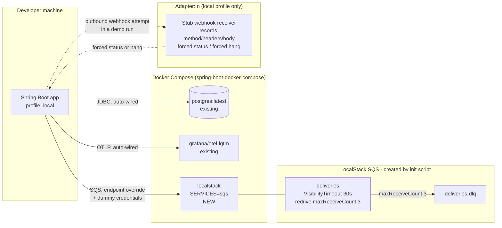

# FEAT-001: Local development environment

## Source ADR

This feature is derived from three `Accepted` ADRs, each verified before this file was written:

| ADR | Status | What this feature takes from it |
|-----|--------|---------------------------------|
| ADR-006 Resilience policies | Accepted | §1.1 queue configuration: `VisibilityTimeout` 30s, `maxReceiveCount` 3 with redrive to `deliveries-dlq`, `WaitTimeSeconds` 20s, receive batch size 10 |
| ADR-004 Retry strategy and webhook signing | Accepted | §1 production backoff schedule `5s -> 30s -> 2m -> 10m -> 1h -> 6h` (±20% jitter), which the `local` profile intentionally overrides |
| ADR-002 Delivery pipeline execution | Accepted | §2.1 relay poll cycle of 5s, which the `local` profile intentionally overrides |

This feature introduces no new architectural decision. It is the environment in which the decisions above get exercised, so it carries no ADR of its own.

## Scope (MVP / Post-MVP)

### In scope

1. `compose.yaml` gains a **LocalStack** service running **SQS only**, plus an init script that creates the delivery queue and its DLQ with the redrive policy and ADR-006 §1.1 settings (`VisibilityTimeout` 30s, `maxReceiveCount` 3).
2. The `spring-boot-docker-compose` integration so the stack starts with the app and connection properties are wired automatically. **`developmentOnly 'org.springframework.boot:spring-boot-docker-compose'` is already present at `build.gradle:28`** — verified against the working tree; it is not re-added. A `local` Spring profile is added with the SQS endpoint override and dummy credentials LocalStack requires.
3. A **stub webhook receiver**, active behind the `local` profile only, that records what it receives (method, headers, body) and can be forced to return an arbitrary status code or to hang. Consumed by both the live demo and later worker tests.
4. **Compressed timings in the `local` profile only**, so a full retry cycle fits inside a live demo:
   - backoff `2s -> 5s -> 10s` (overrides ADR-004 §1's production schedule, `local` profile only)
   - relay poll every `2s` (overrides ADR-002 §2.1's 5s poll, `local` profile only)

### Explicitly out of scope (deferred)

- Any production/staging profile, any `application.yaml` change that affects the default profile. The ADR-004/ADR-002 production numbers stay authoritative outside `local`.
- Any application code implementing the relay, the worker, the retry policy, or the queue adapter. None of it exists yet. This feature only declares the configuration keys those components will later bind to (see "Forward-declared configuration keys" below).
- Any Spring Security configuration. `SecurityConfig` does not exist yet (ADR-007 owns it). See "Security Impact".
- LocalStack services other than SQS. The user's requirement is "add SQS only".
- Testcontainers wiring for SQS. Tests use `TestcontainersConfiguration`, a separate path from compose (CLAUDE.md); adding an SQS container there is a distinct unit of work and is not part of this feature.
- Removing or changing the existing `postgres` and `grafana-lgtm` compose services.

## Architecture

This feature adds no `port/in` or `port/out` and no domain type. Its only production-code artifact, the stub webhook receiver, is an `adapter/in/web` component with no downstream dependency — deliberately, since it exists to terminate outbound HTTPS attempts, not to participate in the delivery pipeline.

Boundary note: the stub receiver sits in `Adapter:In` and touches neither `Application` nor `Domain`. It must not be reachable from any use case, and no domain or application type may reference it.

## Port Contracts

**None.** This feature introduces and changes no `port/in` or `port/out` interface. The stub receiver is a leaf adapter with no port behind it — giving it one would be a YAGNI violation, since nothing in the application layer calls it.

## Data Model Impact

**None.** No table, column, index, or migration. Postgres is present in the compose stack unchanged; the `deliveries` and `notification_events` schema is owned by ADR-003 and belongs to a later feature and a later DBA task.

## Security Impact

**Authn/authz for this feature: none configured, and that is itself the exposure to control.** The app currently has `spring-boot-starter-security` on the classpath with no `SecurityConfig`, so Spring Boot's default HTTP Basic + generated password applies. This feature must not weaken that.

| OWASP Top 10:2025 | Exposure introduced by this feature | Control |
|---|---|---|
| A01 Broken Access Control | The stub receiver accepts arbitrary requests and replays attacker-chosen status codes. If it ever shipped outside `local`, it would be an unauthenticated open endpoint inside the service. | Hard profile gate (`@Profile("local")`) on the bean itself, not a config flag. The component must not exist in the context under any other profile. This is a task acceptance criterion, not a recommendation. |
| A04 Cryptographic Failures | Dummy AWS credentials are written into a checked-in config file. | They are LocalStack placeholders that authenticate to nothing (`test`/`test` is LocalStack's documented no-op pair). They live in `application-local.yaml` only, never in `application.yaml`, and no real credential may be added to either file. |
| A09 Logging & Alerting Failures | The stub records full request headers and bodies, which in a real run would include the webhook signature header and event payloads (ADR-004 §1.1). | Recorded data stays in memory, bounded, and is never written to the application log at INFO or above. The stub is `local`-only, so no real client payload can reach it. |
| A10 Mishandling of Exceptional Conditions | The forced-hang behavior can hold a request thread indefinitely. | On virtual threads a parked request is cheap and does not pin a carrier thread — provided the hang is implemented as a plain `Thread.sleep`/park and **not** inside a `synchronized` block. Called out explicitly in TASK-001-03. |

**Follow-up flagged, not scheduled here:** when ADR-007's `SecurityConfig` lands, whoever writes it must ensure the stub's path is permitted under `local` only and is not accidentally added to a global permit-all matcher. That belongs to the security-engineer task in the ADR-007 feature, not to this one.

## Virtual-thread pinning risk

One risk point, in TASK-001-03: the forced-hang behavior. Implemented as `Thread.sleep(...)` or `LockSupport.park`, a virtual thread unmounts and costs nothing. Implemented inside a `synchronized` block, or as a spin loop, it pins a carrier thread and a handful of concurrent hangs will starve the demo. The task states this as an acceptance criterion.

## Forward-declared configuration keys

The compressed timings in point 4 are properties that **no code binds yet** — the relay and the retry policy do not exist. TASK-001-02 declares the keys so later implementers bind to a name already agreed, rather than inventing one and forcing a rename. These key names are proposed by this feature, not taken from any ADR:

| Key | `local` value | Production source of truth |
|---|---|---|
| `challenge.retry.backoff` | `2s, 5s, 10s` | ADR-004 §1: `5s, 30s, 2m, 10m, 1h, 6h`, ±20% jitter |
| `challenge.relay.poll-interval` | `2s` | ADR-002 §2.1: `5s` |

ADR-004 §1 already states the schedule is bound as a Spring `@ConfigurationProperties` value read once at startup and passed into the framework-free `RetryPolicy` at construction. Overriding it per profile is therefore the mechanism the ADR already anticipated, not a divergence from it. The jitter percentage is not overridden; only the interval list is.

## Task Breakdown

| # | Task | Agent | Depends on |
|---|------|-------|------------|
| 01 | [LocalStack SQS service in compose.yaml + queue init script](tasks/TASK-001-01-localstack-sqs-compose.md) | devops-engineer | - |
| 02 | [`local` Spring profile: SQS endpoint, dummy credentials, compressed timings](tasks/TASK-001-02-local-profile-config.md) | devops-engineer | 01 |
| 03 | [Stub webhook receiver behind the `local` profile](tasks/TASK-001-03-stub-webhook-receiver.md) | backend-engineer | 02 |

## Status

Planned <!-- Planned | In Progress | Done -->
