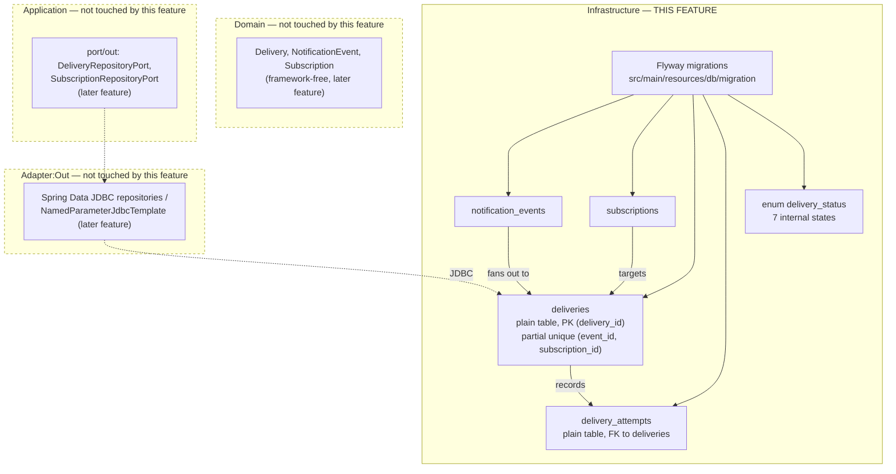

# FEAT-002: Webhook notification delivery — persistence schema

## Feature numbering note

ADR-003's "Downstream" section (and the identical line in ADR-001, ADR-002, ADR-004, ADR-005, ADR-006, ADR-007) says this work is "part of `docs/features/FEAT-001-webhook-notification-delivery/`". That number is already taken by `docs/features/FEAT-001-local-dev-environment/`, an unrelated, committed feature. This breakdown therefore lives under **FEAT-002**. FEAT-001 is not renumbered and not touched. The ADRs' `Downstream` lines are stale on the number only; nothing else in them changes.

## Source ADR

Every ADR this feature draws from was verified `Accepted` before this file was written (`Status:` field read directly from each file).

| ADR | Status | What this feature takes from it |
|-----|--------|---------------------------------|
| ADR-003 Delivery data model, state machine, idempotency | Accepted | §3 the four-table data model and its index list; §1 the seven internal delivery states; §2 the partial-unique idempotency guard, implemented as a native partial unique index directly on `deliveries`; §3's deferral of partitioning (see below) |
| ADR-002 Delivery pipeline execution | Accepted | §2.1 the relay due-query and the **authoritative** `idx_deliveries_due` definition, which explicitly *supersedes* the narrower version described in ADR-003 §3 |
| ADR-006 Resilience policies | Accepted | §1.2 circuit-breaker columns (`circuit_state`, `circuit_opened_at`, `circuit_backoff`, `consecutive_opens`) and §1.3 bulkhead column (`max_concurrency`), plus §2's statement that the per-subscription in-flight count is read as `(subscription_id, status)` |
| ADR-005 Self-service API, replay, verification | Accepted | §1 `origin` / `replayed_from` semantics; §2 `verification_state` / `verified_at` |

## Scope (MVP / Post-MVP)

### In scope

1. **Flyway** added to the build and wired into the app, with a migration directory. It is not on the classpath today (`build.gradle` has no `flyway-core`), so the schema cannot be delivered without this first.
2. Versioned migrations creating the **four tables** of ADR-003 §3: `notification_events`, `subscriptions`, `deliveries`, `delivery_attempts`.
3. The **`delivery_status` database enum**, holding the **seven internal states** of ADR-003 §1 — `PENDING, QUEUED, PROCESSING, RETRYING, DELIVERED, DEAD, FAILED`. See "The two `delivery_status` vocabularies" below; this is the single most confusable point in the whole breakdown.
4. **All indexes listed in ADR-003 §3**, with `idx_deliveries_due` taken from **ADR-002 §2.1**, not from ADR-003 §3.
5. The **partial unique index** on `deliveries (event_id, subscription_id)` filtered to non-terminal statuses (ADR-003 §2) — defined **natively and directly on `deliveries`**, which is plain SQL now that neither table is partitioned.
6. **Testcontainers-Postgres tests** asserting the two behaviors that carry the correctness of the design (partial-unique rejects a second live row, allows one after the first is terminal) and that the relay's due-query actually uses `idx_deliveries_due`.
7. **Removal of the partition-maintenance artefacts** already written against the superseded scope (TASK-002-07).

### Explicitly out of scope (deferred)

- **Any Java domain, port, use case, adapter, or repository code.** No `domain/model`, no `application/port/*`, no `adapter/out/persistence`. This feature delivers schema only; the persistence adapters that bind to it are a later feature.
- **Subscription CRUD API.** ADR-003 §3 states "subscription CRUD API itself still out of scope for this ADR". The `subscriptions` *table* is in scope; no endpoint, use case, or validation for managing it is.
- **The self-service read/replay API** (ADR-005 §1) and its controllers. Only the indexes that will serve them are created.
- **Spring Security / authn / authz.** ADR-007 owns it and no task here touches `SecurityConfig`.
- **Seed or reference data.** No rows are inserted by any migration, including no sample `subscriptions`. `docs/challenge/notification_events.json` is sample input data for a later demo, not a migration.
- **Secret storage.** `subscriptions.secret_ref` is a *reference*, not a secret (ADR-004 §2). No secret value is ever stored in these tables, and no task here decides where the referenced secret lives.
- **Changing `application-local.yaml`'s existing LocalStack/timing keys** (FEAT-001). Flyway config is additive.
- **Partitioning of `deliveries` / `delivery_attempts`, and any retention or archival mechanism.** Deferred by user decision, recorded in ADR-003 §3 as a future performance/scalability improvement. See the section below.

## The two `delivery_status` vocabularies — read this before writing any DDL

ADR-003 uses the name `delivery_status` for two different things, and conflating them would corrupt the schema:

| | Internal delivery state (**this is the DB enum**) | Public API `delivery_status` (**never stored**) |
|---|---|---|
| Source | ADR-003 §1, state machine | ADR-003 §1.1, mapping table + Q4 |
| Values | `PENDING`, `QUEUED`, `PROCESSING`, `RETRYING`, `DELIVERED`, `DEAD`, `FAILED` | `pending`, `completed`, `failed` |
| Where it lives | `deliveries.status`, a Postgres type | The controller's response mapping step, in Java, later |
| Cardinality | 7 | 3 |

The mapping (`PENDING`/`QUEUED`/`PROCESSING`/`RETRYING` -> `pending`; `DELIVERED` -> `completed`; `DEAD`/`FAILED` -> `failed`) is a **controller concern** and ADR-003 §1.1 says explicitly it must never leak the domain enum. **No migration in this feature may store, default to, or constrain against the three-value public vocabulary.** The DB enum type may be named `delivery_status` (ADR-003 §3 calls it that), but it carries the seven internal values and nothing else.

Terminal states, used by the partial unique index's filter, are exactly `DELIVERED`, `DEAD`, `FAILED` (ADR-003 §1).

## Partitioning — deferred, and why that simplifies this feature

An earlier version of this breakdown treated monthly range partitioning of `deliveries` and `delivery_attempts` as settled in-scope work, and asked the DBA to resolve the collision it creates with the idempotency invariant. That is no longer the case. **Partitioning is deferred entirely**, by user decision, recorded in ADR-003 §3 as a future performance/scalability improvement to revisit when data volume or retention pressure justifies it.

The collision is worth keeping on record, because it is what settled the decision. PostgreSQL requires any unique index or primary key on a partitioned table to **include every column of the partition key**. Partitioning `deliveries` on `created_at` therefore means:

1. `PRIMARY KEY (delivery_id)` is rejected; `PRIMARY KEY (delivery_id, created_at)` is the mechanical fix, and `delivery_id` — the public API identifier (ADR-003 §3) — loses its database-level uniqueness guarantee.
2. The partial unique index on `(event_id, subscription_id)` cannot be created as written. Adding `created_at` to it destroys the ADR-003 §2 invariant outright, since two live rows for the same pair with different timestamps would both be accepted.
3. `replayed_from -> deliveries(delivery_id)` and `delivery_attempts.delivery_id -> deliveries(delivery_id)` both become un-creatable once the PK is composite.

The implemented workaround preserved the invariant with a side table (`deliveries_live_index`) plus a maintenance trigger (`trg_deliveries_live_index`). It was correct, and it was judged more complexity than the current data volume warrants. **Unpartitioned, all three problems vanish:** a single-column `PRIMARY KEY (delivery_id)`, a native partial unique index directly on `deliveries`, and all three foreign keys restored — no side table, no trigger, no application-level substitute for a database guarantee.

What is given up, stated rather than glossed: retention-by-partition-drop, and partition pruning on time-ranged queries. Neither has a caller today. Both come back with partitioning, through a superseding ADR.

## Known ADR ambiguities this feature resolves (and how)

| Ambiguity | Resolution used by the tasks |
|---|---|
| ADR-003 §1.1 names a `recovered_from` column for the `RECOVERED` origin; ADR-003 §3 and **ADR-005 §1 (line 65)** say the same column `replayed_from` is reused for both `REPLAY` and `RECOVERED`, disambiguated by `origin`. | **No `recovered_from` column.** ADR-005 §1 is explicit and argues the point; ADR-003 §1.1's mention is a slip. Recorded here so the DBA does not have to arbitrate mid-task. |
| ADR-003 §3's ER diagram types `deliveries.status` as `text`, while the same section and the user's request call it an enum. | A native Postgres **enum type** is used. The ER diagram's `text` is Mermaid-ER shorthand, not a storage decision. Same for `origin`, `circuit_state`, `verification_state` — TASK-002-02/03 name which get enum types and which stay `text`. |
| ADR-003 §3 and ADR-002 §2.1 both define `idx_deliveries_due`. | **ADR-002 §2.1's version is authoritative**; it says so in its own text ("supersedes the earlier, narrower version in ADR-003 §3"). ADR-003 §3 agrees ("Defined once, in ADR-002 §2.1 ... not repeated here"). |
| ADR-003 §3 previously deferred the retention period to "the DBA task". | **Moot.** Retention was specified as retention-by-partition-drop; with partitioning deferred (ADR-003 §3) there is no retention mechanism in this feature and no number to propose. TASK-002-06 is marked `Deferred` and kept as the historical record. |

## Architecture

This feature adds **no** `port/in`, no `port/out`, no use case and no domain type. It is the outermost ring of the hexagon only — the physical store that a later `adapter/out/persistence` will sit on top of.

Boundary note: nothing in this feature may introduce a Java type under `com.cobre.challenge.domain` or `com.cobre.challenge.application`. If a task finds itself wanting one, it is out of scope and belongs to the persistence-adapter feature.

## Port Contracts

**None.** No `port/in` or `port/out` interface is introduced or changed. Declaring ports now, ahead of the use cases that would consume them, would be a YAGNI violation and would fix contracts before their callers exist.

## Data Model Impact

All four tables of ADR-003 §3 are created by this feature. Column-level detail lives in the task files; the split is:

| Table | Partitioned | Created by | Notes |
|---|---|---|---|
| `notification_events` | no | TASK-002-02 | Append-only; PK is the platform's `event_id` (text, e.g. `EVT001`), which is what makes the gateway's `ON CONFLICT (event_id) DO NOTHING` idempotent (ADR-002 §1.1 step 3). |
| `subscriptions` | no | TASK-002-02 | Carries circuit-breaker (ADR-006 §1.2), bulkhead (ADR-006 §1.3), throttle (ADR-004 §1) and verification (ADR-005 §2) state. Deliberately low-write: ADR-006 §1.2 persists only circuit *transitions*, never a failure counter. |
| `deliveries` | no (deferred, ADR-003 §3) | TASK-002-03 | The outbox and sole source of truth. Write-hot. Single-column `PRIMARY KEY (delivery_id)`. Carries every index in ADR-003 §3 plus ADR-002 §2.1's `idx_deliveries_due` and the native partial unique idempotency index. |
| `delivery_attempts` | no (deferred, ADR-003 §3) | TASK-002-04 | Append-only attempt history. Single-column PK, plain FK to `deliveries(delivery_id)`. |

Columns deliberately **absent**, each because an ADR argues against them — none of these may be added "for completeness":

- `deliveries.sequence_number` (ADR-003 §3: dropped, not replaced; ordering is `notification_events.created_at` + `event_id`)
- `deliveries.lease_owner` / `lease_expires_at` (ADR-003 §3, ADR-002 §2.1: reclaim is the due-query, there is no lease concept)
- `deliveries.replay_count` / `last_replayed_at` (ADR-003 §3: replay never touches the original row)
- `deliveries.recovered_from` (see the ambiguity table above)
- an idempotency-key / hash column on `deliveries` (ADR-003 §3: the partial unique index *is* the guarantee)
- `subscriptions.consecutive_failures` (ADR-006 §1.2: deliberately in-memory per pod, to keep the row cold)
- `delivery_attempts.outcome` (ADR-003 §3: derived from `http_status`/`error`, not stored redundantly)

## Security Impact

**Authn/authz for this feature: none.** No endpoint, no Spring Security wiring, no caller. The exposure is entirely in what the schema makes possible or prevents for the code that will sit on it.

| OWASP Top 10:2025 | Exposure | Control in this feature |
|---|---|---|
| **A01 Broken Access Control (IDOR)** | Every row in all four tables is tenant-scoped. If `deliveries` had no `client_id` of its own, every later API query would have to join through `subscriptions` to filter by tenant, and a forgotten join is a cross-tenant read. | `deliveries.client_id` is a real, `NOT NULL` column (ADR-003 §3's ER diagram) and the `(client_id, created_at)` / `(client_id, status)` indexes exist precisely so that a tenant-filtered query is the *fast* path, making the correct query also the natural one. Enforcement itself is in the query (ADR-002 §1.1), a later feature. |
| **A05 Injection** | Migrations are static SQL, so this feature introduces no injection surface of its own. The risk it *creates* is for later code: a `text` status column invites string concatenation into predicates. | The enum type constrains the value set at the database boundary; the later adapter binds parameters, never concatenates. Flagged to backend-engineer/dba in the persistence-adapter feature, not enforceable here. |
| **A06 Insecure Design** | `subscriptions.verification_state` is what stops the service from POSTing to a URL whose operator never consented (ADR-005 §2, the SSRF/amplification control). A schema that let it default to `VERIFIED` would silently disable the control. | TASK-002-02 requires `verification_state` `NOT NULL DEFAULT 'PENDING_VERIFICATION'`. A subscription is never born verified. |
| **A04 Cryptographic Failures** | `secret_ref` / `previous_secret_ref` sit next to columns that will be read on every attempt. | They are *references*, never secret material (ADR-004 §2). TASK-002-02 states this as a hard constraint: no column in these tables holds a key, and none is added later without a security-engineer review. |
| **A09 Logging & Alerting Failures** | `notification_events.content` and `delivery_attempts.response_excerpt` are the PII layer (ADR-002 §3.1) — payload the platform does not control. | `response_excerpt` is length-bounded at the schema level (TASK-002-04), so a truncation bug in application code cannot store an unbounded client response. ADR-002 §3.1's "never logged, never on a span, never in MDC" rule is restated in the task as a constraint on the later adapter. |
| **A10 Mishandling of Exceptional Conditions** | The partial unique index is an error path by design: the gateway *expects* to violate it on a duplicate ingest and treat that as success (ADR-003 §2). If the index were missing or wrongly filtered, that path would fail open — duplicate live deliveries, duplicate webhooks. | TASK-002-05's tests assert both directions of the invariant (rejects a second live row; permits one once the first is terminal), so a silently-wrong predicate fails the build rather than production. |

**Handed to security-engineer? No — not at this stage.** Nothing here is a security *mechanism*; the controls above are structural properties of the schema. The security-engineer review belongs to the features that add the ingest path (tenant isolation in the query, ADR-002 §1.1) and the self-service API (ADR-007). Flagged, not scheduled.

## Virtual-thread pinning risk

**None in this feature.** No Java code is written, and Flyway runs once at startup on the boot thread before any request is served. The pinning constraints of ADR-002 §2 apply to the persistence adapters in a later feature, not here.

## Task Breakdown

Numbered so no task depends on a higher number.

| # | Task | Agent | Depends on |
|---|------|-------|------------|
| 01 | [Add Flyway to the build and wire the migration location](tasks/TASK-002-01-flyway-bootstrap.md) | devops-engineer | - |
| 02 | [V1 migration: enum types, `notification_events`, `subscriptions`](tasks/TASK-002-02-v1-events-and-subscriptions.md) | dba | 01 |
| 03 | [V2 migration: `deliveries`, its indexes, and the partial unique index](tasks/TASK-002-03-v2-deliveries.md) | dba | 02 |
| 04 | [V3 migration: `delivery_attempts`](tasks/TASK-002-04-v3-delivery-attempts.md) | dba | 03 |
| 05 | [Testcontainers-Postgres tests: idempotency invariant and due-query index usage](tasks/TASK-002-05-schema-invariant-tests.md) | dba | 04 |
| 06 | [Partition provisioning and retention-by-drop](tasks/TASK-002-06-partition-retention.md) — **`Deferred`, no work expected** | dba | 04 |
| 07 | [Remove the partition-maintenance migration and its test](tasks/TASK-002-07-remove-partition-maintenance-artefacts.md) | dba | - |

Tasks 03, 04 and 05 were implemented once against the earlier partitioned scope and are **reset to `Not Started`** — they are re-implementations, not incremental edits (each task file states what it supersedes). Task 07 is a cleanup of the already-written partition-maintenance artefacts. It depends on nothing, but it must be **executed first** in the dba dispatch, before 03 rewrites `V2` — `V4`'s functions operate on partitioned parents that will no longer exist. That is an execution-ordering instruction, not a `depends_on` edge; it is numbered 07 only because the lower numbers are already spent, and no task's `depends_on` names a higher number.

Why 01 is `devops-engineer` and the rest are `dba`: CLAUDE.md's roster gives Gradle build configuration to `devops-engineer` (Harbor) and schema/migrations/query optimization to `dba` (Vault). TASK-002-01 changes `build.gradle` and `application.yaml` and writes no SQL, so it is Harbor's by that roster. Everything that touches a migration, an index, or a schema-level test is Vault's. TASK-002-05's tests assert index and constraint behavior in PostgreSQL — that is query/schema verification, not application logic, so it stays with `dba` rather than going to `backend-engineer`.

## Status

Planned <!-- Planned | In Progress | Done -->
