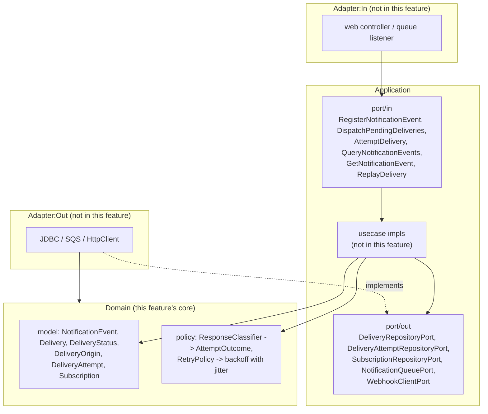

# FEAT-003: Delivery Domain Model, Pure Policy Functions and Hexagonal Ports

## Source ADR

- **ADR-003** (`Accepted`) §1 — delivery state machine, seven internal states, terminal states, who writes what.
- **ADR-004** (`Accepted`) §1 — HTTP response classification table, retry schedule `5s -> 30s -> 2m -> 10m -> 1h -> 6h` with +/-20% jitter, exhaustion to `DEAD`.
- **ADR-005** (`Accepted`) §1 — `port/in`, `port/out` and `domain/model` shapes.
- **ADR-006** (`Accepted`) §1 — confirms the same backoff schedule and the breaker-counting classification split.

All four are `Status: Accepted`, verified in their front matter and `## Status` sections before this file was written.

## Scope (MVP / Post-MVP)

**In scope (this feature).** The framework-free layer only: `domain/model`, the two pure policy functions (response classification, backoff schedule), and the `port/in` / `port/out` interfaces. Everything here compiles with zero Spring, JDBC, HTTP-client or AWS imports and is tested with plain JUnit and no Spring context.

**Explicitly deferred (not this feature).**
- Any implementation of a `port/in` use case (`application/usecase`) — no `@Transactional` class is written here.
- Any adapter: `adapter/in/web` controllers, `adapter/out/persistence`, `adapter/out/messaging`, `adapter/out/http`.
- Spring wiring, `@ConfigurationProperties` binding of the retry schedule (ADR-004 §1's note) — the domain takes the schedule as a constructor argument; who supplies it is a later task.
- Resilience4j breaker/bulkhead objects (ADR-006 §1.2, §1.3) — those are infrastructure decorators around the use case, not domain.
- `VerifySubscriptionTargetUseCase` (ADR-005 §2). It is not in ADR-005 §1's port list and subscription CRUD is out of scope (Q9); it is not created here.
- `ClockPort`. ADR-005 §1 lists it conditionally ("if the domain needs time beyond an injected `Clock`"). It does not: `java.time.Clock` is a JDK type and is passed in directly. No `ClockPort` interface is created. Flagged here rather than silently dropped.
- Public `delivery_status` mapping (ADR-003 §1's table). That mapping belongs in the controller's mapping step and is created with the web adapter, not here.

## Architecture

The dependency rule this feature must not break: nothing under `domain/` or `application/port/` imports `org.springframework.*`, `java.net.http.*`, `jakarta.*`, `software.amazon.*`, or any JDBC type. A build-level check is not in scope; the acceptance criteria state it per task and a reviewer reads the imports.

## Port Contracts

### `application/port/in` (ADR-005 §1)

One method each, taking an immutable command record and returning an immutable result record. `Optional` or an empty collection, never `null` (Effective Java Items 54-55).

| Interface | Method | Purpose |
| --- | --- | --- |
| `RegisterNotificationEventUseCase` | `register(RegisterNotificationEventCommand) -> RegisterNotificationEventResult` | Gateway ingest, ADR-002 §1.1. |
| `DispatchPendingDeliveriesUseCase` | `dispatch(DispatchPendingDeliveriesCommand) -> DispatchPendingDeliveriesResult` | Relay due-query cycle, ADR-002 §2.1. |
| `AttemptDeliveryUseCase` | `attempt(AttemptDeliveryCommand) -> AttemptDeliveryResult` | Worker, one pointer message, ADR-002 §2.2. |
| `QueryNotificationEventsUseCase` | `query(QueryNotificationEventsCommand) -> QueryNotificationEventsResult` | `GET /notification_events`, keyset paged. |
| `GetNotificationEventUseCase` | `get(GetNotificationEventCommand) -> Optional<NotificationEventDetail>` | `GET /notification_events/{id}` with attempt history. |
| `ReplayDeliveryUseCase` | `replay(ReplayDeliveryCommand) -> ReplayDeliveryResult` | `POST /replay`, insert-not-mutate. |

### `application/port/out` (ADR-005 §1)

| Interface | Purpose |
| --- | --- |
| `DeliveryRepositoryPort` | Insert, conditional state-guarded status transition, due-query claim, keyset read. |
| `DeliveryAttemptRepositoryPort` | Append-only attempt history insert and read-by-delivery. |
| `SubscriptionRepositoryPort` | Tenant-scoped lookup (`client_id` in the predicate, ADR-003 §2), circuit/throttle transition writes. |
| `NotificationQueuePort` | Publish the four-field pointer envelope (ADR-004 §1), single publisher adapter. |
| `WebhookClientPort` | Outbound POST, returns a transport-neutral result the classifier consumes. |

### Domain policy functions (pure, this feature's §2 and §3 scope)

- `ResponseClassifier.classify(int statusCode, TransportFailure failure) -> AttemptOutcome`. Primitive `int` and a domain enum only; no `HttpStatus`, no `ResponseEntity`, no exception types from a client library.
- `RetryPolicy.nextBackoff(int attemptNumber) -> Optional<Duration>` over the ADR-004 §1 schedule, with +/-20% jitter from an injected `RandomGenerator`; empty when the budget is exhausted (caller moves the row to `DEAD`).

## Data Model Impact

**None.** The schema already exists from FEAT-002 (`V1`-`V3` migrations, ADR-003 §3). This feature adds no migration and no DBA task. The domain records mirror the committed columns; where they diverge (persistence-only audit columns), the divergence belongs in the future persistence adapter's row representation, not in `domain/model`.

## Security Impact

**Authn/authz:** none introduced. No endpoint, no Spring Security configuration, no request handling exists in this feature. The authz rules for the endpoints these ports will serve are designed in ADR-007 and enforced in the web adapter task, not here.

OWASP Top 10:2025 exposure introduced by this feature:

| Category | Exposure | Note |
| --- | --- | --- |
| **A01 Broken Access Control (IDOR)** | Indirect. `SubscriptionRepositoryPort` and `DeliveryRepositoryPort` signatures decide whether tenant scoping is structural. | Mitigated at contract level: every lookup method carries `clientId` as a parameter so a caller cannot express an unscoped read (ADR-003 §2). TASK-003-12 states this as acceptance criteria. |
| **A03 Software Supply Chain** | None. | No new dependency. Plain JUnit is already on the build. |
| **A05 Injection** | None here. | No SQL is written in this feature; port signatures take typed values, not SQL fragments or free-text filter strings. |
| **A10 Mishandling of Exceptional Conditions** | Direct. The classifier and the state machine are exactly where an error path fails open or closed (ADR-003's OWASP row). | Mitigated: illegal transitions throw rather than being ignored; the classifier has no silent default that discards a delivery. TASK-003-03 and TASK-003-07 test this explicitly. |

No task in this feature needs `security-engineer`, `dba` or `devops-engineer` involvement. If a reviewer finds otherwise, that is a new task, not scope creep on an existing one.

## Open item flagged, not invented

The backoff spec **is** fully specified as to shape and magnitude (ADR-004 §1, restated in ADR-006 §1): six steps `5s, 30s, 2m, 10m, 1h, 6h`, +/-20% jitter, exhaustion to `DEAD`. Three things the ADRs do not state and that TASK-003-08 therefore fixes as an explicitly-labelled implementation choice rather than a derived number:

1. **Jitter distribution.** Not named. Implemented as a uniform draw over `[0.8 x nominal, 1.2 x nominal]`, the ordinary reading of "+/-20%".
2. **Randomness source.** Not named. Injected `java.util.random.RandomGenerator` so tests are deterministic and the domain holds no static global state.
3. **`max_attempts`.** ADR-004 §1 says "reaching `max_attempts` moves the row to `DEAD`" but only gives a six-step schedule. Taken as six attempts, i.e. the schedule length; no seventh interval is invented.

None of these changes a contract or the state machine. If the Tech Lead reads any of them differently, it is a one-line change in TASK-003-08 and its test.

## Task Breakdown

| # | Task | Agent | Depends on |
|---|------|-------|------------|
| 01 | [Delivery status and origin enums](tasks/TASK-003-01-delivery-status-and-origin-enums.md) | backend-engineer | - |
| 02 | [State machine transition rules and exception](tasks/TASK-003-02-state-machine-transitions.md) | backend-engineer | 01 |
| 03 | [State transition tests, legal and illegal](tasks/TASK-003-03-state-machine-tests.md) | backend-engineer | 02 |
| 04 | [Delivery aggregate](tasks/TASK-003-04-delivery-aggregate.md) | backend-engineer | 02 |
| 05 | [Supporting domain records](tasks/TASK-003-05-supporting-domain-records.md) | backend-engineer | 01 |
| 06 | [AttemptOutcome and ResponseClassifier](tasks/TASK-003-06-response-classifier.md) | backend-engineer | 01 |
| 07 | [ResponseClassifier tests, every table row](tasks/TASK-003-07-response-classifier-tests.md) | backend-engineer | 06 |
| 08 | [RetryPolicy backoff with jitter](tasks/TASK-003-08-retry-policy-backoff.md) | backend-engineer | - |
| 09 | [RetryPolicy property tests](tasks/TASK-003-09-retry-policy-tests.md) | backend-engineer | 08 |
| 10 | [Inbound ports: ingest and pipeline](tasks/TASK-003-10-port-in-pipeline.md) | backend-engineer | 04, 05 |
| 11 | [Inbound ports: query and replay](tasks/TASK-003-11-port-in-query-replay.md) | backend-engineer | 04, 05 |
| 12 | [Outbound ports: persistence](tasks/TASK-003-12-port-out-persistence.md) | backend-engineer | 04, 05 |
| 13 | [Outbound ports: queue and webhook client](tasks/TASK-003-13-port-out-queue-and-webhook.md) | backend-engineer | 05, 06 |

## Status

Planned <!-- Planned | In Progress | Done -->
