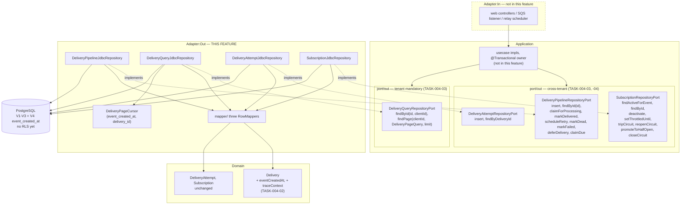

# FEAT-004: Outbound Persistence Adapters

## Revision note (2026-09-20, Tech Lead directive)

This feature was first planned as adapter-only work against the FEAT-003 ports exactly as committed. The Tech Lead then directed a set of **contract** changes before implementation starts. No implementation had happened (every task was `Not Started`), so this file and the whole task breakdown are rewritten rather than patched, and the task numbering changed.

What the directive changed, and where each change is now recorded as an ADR amendment:

| Change | ADR amendment |
|---|---|
| Generic `transitionStatus` replaced by named intent-revealing operations, each one atomic conditional `UPDATE` with its companion columns | ADR-003 A1 |
| `DeliveryRepositoryPort` split into a cross-tenant pipeline port and a tenant-mandatory query port | ADR-003 A2, ADR-007 E1, ADR-005 D1 |
| `trace_context` written on insert and returned by the worker's read | ADR-003 A3 |
| `event_created_at` denormalized onto `deliveries`; the list endpoint's date filter and keyset move onto it | ADR-003 A4, ADR-005 D2 |
| Generic `transitionCircuitState` replaced by `tripCircuit` / `reopenCircuit` / `promoteToHalfOpen` / `closeCircuit`, with `tripCircuit` and `reopenCircuit` kept separate because their guards differ | ADR-006 B1, B2 |
| `deferDelivery`, guarded on `QUEUED`, touching neither `attempt_count` nor `last_error` nor `delivery_attempts` | ADR-003 A1, ADR-002 C1 |
| Step 1's claim and step 6's promotion named | ADR-002 C1, C2 |

Three of the four gaps this feature logged in `docs/concerns.md` on its first pass are **closed** by this directive rather than deferred: the missing companion columns, the unapplied interface-segregation split, and the unwritten `trace_context`. A fourth, the `created_at`-versus-event-timestamp contradiction, is resolved **against** the first pass's choice, and the reasoning is worth keeping: ADR-005 §1 always said "filters by event creation date range", and for a replayed row `deliveries.created_at` is when the replay was requested. The first pass optimised for index-servability and picked the wrong column; denormalization gets both.

`TenantId` (ADR-007 §5.1) and RLS plus the two database roles (§5.4) remain deferred to ADR-007's own breakdown, unchanged from the first pass. The port split is about which interface a method lives on; `TenantId` is about the parameter's type. Only the former is in scope here.

## Source ADR

All five verified `Accepted` by reading the `status:` front matter and the `## Status` section before this file was written, and again after amending. **No `Status` field was touched.** Amendments are in-place `## Amendments` sections plus targeted inline notes, following the post-acceptance-correction pattern `docs/concerns.md` and TASK-003-12's own "Addendum" already establish in this repo. No new ADR file was created, because none of the amendments reverses a decision: each names something an ADR already specified but left unnamed, or adds a column the design needed and did not have.

| ADR | Status | Amended | What this feature takes from it |
|-----|--------|---------|---------------------------------|
| ADR-003 | Accepted | A1-A4 | §1.1's write table, now one named operation per row; §2's idempotency violation; §3's data model plus the two new columns |
| ADR-002 | Accepted | C1-C2 | §2.1's due-query verbatim; §2.2's per-message flow, now naming its operations |
| ADR-006 | Accepted | B1-B3 | §1.2's four circuit transitions, their differing guards, and the cooldown exponent |
| ADR-005 | Accepted | D1-D2 | §1's keyset pagination, now on `event_created_at` |
| ADR-007 | Accepted | E1 | §5.2's tenant boundary, now applied to the delivery port |

## Scope

### In scope

1. One **`dba` migration** (`V4`) adding `event_created_at` and swapping the list-endpoint index.
2. Three **`backend-engineer` contract tasks**: the `Delivery` record's two new components, the delivery port split with its intent-revealing operations, and `SubscriptionRepositoryPort`'s four circuit operations. These come first, because `dba` implements adapters against ports and TASK-003-12's own boundary makes port files `backend-engineer`'s.
3. Four **`dba` adapter classes** with their row mappers, cursor codec and Testcontainers tests.

| Adapter | Implements | Tenant |
|---|---|---|
| `DeliveryPipelineJdbcRepository` | `DeliveryPipelineRepositoryPort` | none, cross-tenant by design |
| `DeliveryQueryJdbcRepository` | `DeliveryQueryRepositoryPort` | mandatory on every method |
| `DeliveryAttemptJdbcRepository` | `DeliveryAttemptRepositoryPort` | none (no `client_id` column) |
| `SubscriptionJdbcRepository` | `SubscriptionRepositoryPort` | none, cross-tenant by design |

**The two correctness-critical queries are unchanged in substance**, and each still gets its own implementation task and its own test task:

1. **The relay due-query** (ADR-002 §2.1), `claimDue`: the `SELECT ... JOIN subscriptions ... FOR UPDATE OF d SKIP LOCKED` with the circuit and throttle gates, then the batch `QUEUED` claim with `next_attempt_at` pushed. TASK-004-11, tested by TASK-004-12.
2. **The conditional claim** (ADR-002 §2.2 step 1), now named `claimForProcessing` instead of a generic transition: `UPDATE ... WHERE delivery_id = :id AND status = 'QUEUED'`, returning whether exactly one row was affected. TASK-004-07, tested by TASK-004-08.

### Explicitly out of scope

Unchanged from the first pass: any `application/usecase` class and therefore any `@Transactional` on an adapter; `TenantId` and `AuthenticatedTenantResolver`; the ArchUnit rules; RLS, the two database roles, two connection pools, `TenantSessionBinder`, `SET LOCAL app.client_id`; Spring Security and controllers; the public `delivery_status` mapping; `limit` clamping and the default 30-day window (ADR-005 §1, applied on the way in); SQS and the webhook client; monitoring aggregate queries over `delivery_attempts`.

Added to the out-of-scope list by this revision:

- **No retro-edit of the FEAT-003 task files.** TASK-003-04 and TASK-003-12 stay `Ready for Review` with their original text. They accurately record what was built; rewriting them to match a later directive would erase the fact that the contract moved. The ADR amendments are the durable record. Logged in `docs/concerns.md`.
- **No editing of `V2__deliveries.sql`.** See the migration decision below.
- **No database-level immutability trigger** on `event_created_at`, consistent with ADR-003 §3's existing rejection of triggers for the idempotency invariant. Immutability is an adapter property and a test assertion.

## Decisions this feature records

### 1. The delivery port split, and the full operation list

`DeliveryRepositoryPort` becomes two interfaces (ADR-003 A2, ADR-007 E1). `DeliveryAttemptRepositoryPort` and `SubscriptionRepositoryPort` stay single cross-tenant interfaces, unaffected.

**`DeliveryPipelineRepositoryPort`** — cross-tenant, no `client_id` parameter anywhere. Every transition is one atomic conditional `UPDATE` returning `boolean` from the affected row count, and **zero rows affected is always a normal outcome, never an exception** (ADR-002 §2.2 step 2, TASK-003-12's own convention).

| Method | Guard | Writes beyond `status` and `updated_at` |
|---|---|---|
| `Delivery insert(Delivery delivery)` | partial unique index (ADR-003 §2) | all columns, including `trace_context` and `event_created_at` |
| `Optional<Delivery> findById(UUID deliveryId)` | - | read; cross-tenant, see below |
| `boolean claimForProcessing(UUID deliveryId, Instant now)` | `status = 'QUEUED'` | - |
| `boolean markDelivered(UUID deliveryId, Instant deliveredAt)` | `status = 'PROCESSING'` | `delivered_at`, `next_attempt_at = NULL` |
| `boolean scheduleRetry(UUID deliveryId, Instant nextAttemptAt, String lastError, Instant now)` | `status = 'PROCESSING'` | `attempt_count = attempt_count + 1`, `next_attempt_at`, `last_error` |
| `boolean markDead(UUID deliveryId, String lastError, Instant now)` | `status = 'PROCESSING'` | `next_attempt_at = NULL`, `last_error` |
| `boolean markFailed(UUID deliveryId, String lastError, Instant now)` | `status IN ('QUEUED', 'PROCESSING')` | `last_error` |
| `boolean deferDelivery(UUID deliveryId, Instant nextAttemptAt)` | `status = 'QUEUED'` | `next_attempt_at` only; **status unchanged** |
| `List<Delivery> claimDue(int batchLimit, Instant asOf)` | `FOR UPDATE OF d SKIP LOCKED` | batch `-> QUEUED`, `next_attempt_at` pushed 5 minutes |

**`DeliveryQueryRepositoryPort`** — tenant mandatory on every method, no unscoped overload:

| Method |
|---|
| `Optional<Delivery> findById(UUID deliveryId, String clientId)` |
| `DeliveryPage findPage(String clientId, DeliveryPageQuery query, int limit)` — filters carried by the `DeliveryPageQuery` record (`port/out/persistence/dto`): `Optional<Instant> eventCreatedFrom`, `Optional<Instant> eventCreatedTo`, `Optional<DeliveryStatus> status`, `Optional<String> cursor`. No `Optional` in the parameter list (ADR-005 Amendment D3, Effective Java Item 55). TASK-004-20. |

Three points on this list that a reviewer should not have to reverse-engineer:

**`claimForProcessing` is an addition to the seven operations the directive enumerated.** The directive named the outcome transitions and the deferral but not the worker's claim, and dropping it would delete ADR-003 §1.1's "Worker (claim)" row, ADR-002 §2.2 step 1 and ADR-003's own Q3 resolution: the single mechanism that guarantees a delivery is never double-sent. Added so the operation set covers §1.1's table completely. Recorded in ADR-003 A1.

**`markFailed` is guarded on a status set, not one expected state.** ADR-003 §1's machine admits both `QUEUED -> FAILED` and `PROCESSING -> FAILED` (see `DeliveryStatus.legalTargets()`), because a message reaches the DLQ from either and the DLQ consumer does not know which. It is still a guard: the three terminal states are excluded, so a late DLQ message can never overwrite a row that already reached `DELIVERED`.

**The pipeline port gains an unscoped `findById(UUID)`, and this is the one change that has to justify itself against ADR-007.** §5.2 says "There is no `findById(DeliveryId)`. Not deprecated, not discouraged: absent." That still holds on the client-facing port, which has no unscoped overload. The worker, however, must load the row it just claimed for `event_id`, `subscription_id`, the authoritative `attempt_count` and `trace_context` (ADR-002 §2.2 steps 5-6), and it runs with no principal; §5.2's own carve-out for cross-tenant pipeline ports covers exactly this. The decisive part is that **before the split this method would have sat on the same interface a client-facing use case injects, which is the hole §5.2 exists to close; after the split it cannot.** Full argument in ADR-007 Amendment E1.

### 2. `Delivery` gains `eventCreatedAt` and `traceContext`

Both are `backend-engineer` scope (TASK-004-02), flagged rather than assumed, with the blast radius listed in `docs/concerns.md`.

`Delivery`'s committed javadoc groups `trace_context` with `created_at` and `updated_at` as persistence-only. That grouping is corrected: **a field belongs in the aggregate when a use case reads or writes it.** `trace_context` is written by the ingest use case and read by the worker (ADR-002 §3.1's fallback when the SQS message attribute is absent); `event_created_at` is written at insert and is the value the query use case filters and orders by, which is business semantics rather than audit metadata. `created_at` and `updated_at` are read by no use case and stay out.

Putting `traceContext` on the aggregate also means **the insert signature does not change**. The directive asked for `trace_context` "on the delivery insert and the worker's read"; with the field on `Delivery`, `insert(Delivery)` writes it and `findById` returns it, and a separate parameter would be redundant. Same for `eventCreatedAt`, which additionally lets the adapter build the keyset cursor from the returned record rather than needing a side channel.

`eventCreatedAt` is a required `Instant`, not an `Optional`: every row has one, including a replay, which copies the original's value because it is the same event.

### 3. The four circuit operations, and why `tripCircuit` and `reopenCircuit` are two

On `SubscriptionRepositoryPort`, replacing `transitionCircuitState`:

| Method | Guard | Sets |
|---|---|---|
| `boolean tripCircuit(UUID subscriptionId, Duration baseCooldown, Duration maxCooldown, Instant now)` | `circuit_state = 'CLOSED'` | `'OPEN'`, `circuit_opened_at = now`, `circuit_backoff` computed, `consecutive_opens + 1` |
| `boolean reopenCircuit(UUID subscriptionId, Duration baseCooldown, Duration maxCooldown, Instant now)` | `circuit_state = 'HALF_OPEN'` | identical `SET` clause to `tripCircuit` |
| `boolean promoteToHalfOpen(UUID subscriptionId, Instant asOf)` | `circuit_state = 'OPEN' AND circuit_opened_at < asOf - circuit_backoff` | `'HALF_OPEN'` |
| `boolean closeCircuit(UUID subscriptionId, Instant now)` | `circuit_state = 'HALF_OPEN'` | `'CLOSED'`, `circuit_opened_at = NULL`, `circuit_backoff = NULL`, `consecutive_opens = 0` |

`tripCircuit` and `reopenCircuit` write an identical `SET` clause and differ only in their guard, which is the entire reason they are two operations. Collapsing them into one that takes the expected state as a parameter would reintroduce exactly the generic shape this revision removes, and would let a caller pass the wrong precondition: a probe outcome applied to a `CLOSED` circuit trips a destination nothing is currently failing against, and a trip applied to a `HALF_OPEN` circuit double-counts a cooldown escalation. A failed probe depends on the `HALF_OPEN` guard. Recorded in ADR-006 B2.

`promoteToHalfOpen` keeps ADR-006 §1.2's compound guard so the elapsed-cooldown check is inside the atomic update rather than a read-then-write race between two relay instances, and takes the relay's `asOf` so one poll cycle uses one clock.

`baseCooldown`/`maxCooldown` are passed rather than the computed interval, because the exponent reads `consecutive_opens` from the row and reading it first would be the race the conditional update exists to avoid. **The exponent uses the pre-update column value** (`base * 2^consecutive_opens`, capped at `maxCooldown`), which is what makes ADR-006 §1.2's prose and its SQL agree; writing `consecutive_opens + 1` would silently double every cooldown. Recorded in ADR-006 B3.

### 4. `V4` migration, not an edit to `V2`

`event_created_at` and the index swap ship as a **new additive `V4__deliveries_event_created_at.sql`**, and `V2__deliveries.sql` is not touched.

Flyway records a checksum per applied migration and validates it on every subsequent start. `V1`-`V3` have already been applied against the local compose Postgres and against every Testcontainers run in FEAT-002's test suite, so editing `V2` in place would fail validation for any database that already ran it, and the only remedies are `flyway repair` or dropping the database. A forward migration is correct here for the ordinary reason: applied migrations are immutable.

Statement order matters and is specified in TASK-004-01, because `NOT NULL` cannot be added before the column has values: add nullable, backfill from `notification_events`, then `SET NOT NULL`. The table is empty today, but a migration that only works on an empty table is a latent failure.

The old `idx_deliveries_client_created_at` is **dropped**, because after the filter moves it has no consumer: the due-query's `created_at` predicate is served by `idx_deliveries_due`. The `created_at` **column** stays, since ADR-002 §2.1's 30-second `PENDING` grace reads it. `V2`'s comment block still describes the dropped index; `V4` carries a comment saying it supersedes that one, which is the best available option given `V2` is immutable.

### 5. `NamedParameterJdbcTemplate`, not a Spring Data `CrudRepository`

Unchanged from the first pass, and the intent-revealing operations strengthen it: nine of the pipeline port's methods are conditional updates whose affected row count is the return value, which no derived-query repository expresses. Explicit SQL bound through `NamedParameterJdbcTemplate` (ADR-005 §1's A05 row names it specifically; CLAUDE.md requires explicit SQL per repository call). No `@Table`-annotated entity. `JdbcClient` is acceptable as a fluent facade over the same machinery. No concatenated SQL anywhere, and no value reaching SQL other than as a bound parameter.

## Architecture

**Dependency rule.** `domain/` and `application/` are edited only by TASK-004-02, -03 and -04, all `backend-engineer`, and only to change the contract the directive changed. No `dba` task edits a file under either package.

**Virtual-thread pinning.** Ordinary blocking JDBC on virtual threads, which is the intended model. No `synchronized` in any adapter (ADR-002 §2 names this), no adapter-introduced `ThreadLocal`. The concurrency test in TASK-004-12 uses `java.util.concurrent` primitives in the **test** only.

## Port Contracts

Introduced or changed by this feature, all in TASK-004-02 through -04 (`backend-engineer`), fully specified in decisions 1 through 3 above:

- **New:** `DeliveryPipelineRepositoryPort`, `DeliveryQueryRepositoryPort`.
- **Deleted:** `DeliveryRepositoryPort`.
- **Changed:** `SubscriptionRepositoryPort` (`transitionCircuitState` replaced by four operations), `Delivery` (two new components).
- **Unchanged:** `DeliveryAttemptRepositoryPort`, `DeliveryPage`, every `port/in` interface and its DTOs.

`DeliveryPointer` and `AttemptDeliveryCommand` already carry `Optional<String> traceparent`, so the SQS-attribute path of ADR-002 §3.1 needs no change; only the persisted-column fallback needed the port work.

## Data Model Impact

One additive migration, `V4__deliveries_event_created_at.sql` (TASK-004-01): add `event_created_at timestamptz` nullable, backfill from `notification_events.created_at`, `SET NOT NULL`, create `idx_deliveries_client_event_created_at` on `(client_id, event_created_at)`, drop `idx_deliveries_client_created_at`, and comment both the column and the new index in the style `V1`-`V3` already use.

Schema facts the adapters must respect, carried forward from the first pass and still binding: `updated_at` has no trigger and **every** `UPDATE` in this feature must set it explicitly (`V2`'s own comment calls this a hard constraint on the adapter task, and ADR-002 §2.1's 60-second `PROCESSING` staleness reclaim reads it); native Postgres enums need an explicit `::delivery_status`-style cast, not `setObject` of a Java enum; `event_types` is `text[]` with a GIN index so containment must use `@>`; `circuit_backoff` is an `interval`; `response_excerpt` is `varchar(1000)` and the adapter truncates before binding; `delivery_attempts.id` is identity and never bound.

New with this revision: `event_created_at` appears in exactly one `INSERT` and in **no** `UPDATE`. TASK-004-09 and TASK-004-10 assert that the outcome and deferral writes leave it untouched, which is how immutability is enforced in the absence of a trigger.

## Security Impact

**Authn/authz introduced: none.** No endpoint and no principal exists in this feature.

| OWASP Top 10:2025 | Exposure | Control |
|---|---|---|
| **A01 Broken Access Control (IDOR)** | The two `DeliveryQueryRepositoryPort` methods are the only ones that can return another tenant's rows. ADR-007 §I-B's stated weakness is that the compiler cannot see whether the adapter bound the parameter it was handed. | `client_id` bound in both statements, plus a cross-tenant Testcontainers test per method (TASK-004-13, -15). **Strengthened by this revision:** the split means a client-facing use case cannot even inject the port that has an unscoped read. Layers 1, 3b and 4 remain deferred and logged. |
| **A05 Injection** | `client_id`, the event-date range, the status filter, the batch limit and the opaque cursor all reach SQL; the cursor is the one client-supplied structured value that round-trips. | Bound parameters only, in every statement. The cursor is decoded into a typed `(Instant, UUID)` before binding and a malformed cursor is rejected rather than degraded to page 1 (TASK-004-14). |
| **A09 Logging & Alerting Failures** | `response_excerpt` and `content` are the PII layer (ADR-002 §3.1). An adapter is where one lands in a debug log or an exception message. | No adapter logs a row payload; failures are logged by id. Stated per task. |
| **A10 Mishandling of Exceptional Conditions** | Three error paths decide whether the pipeline fails open. `claimDue` outside a transaction takes no locks and lets every relay claim the same batch, a silent double-send. Any conditional operation that threw on zero rows would turn ADR-002 §2.2 step 2's benign duplicate into a crash loop at `maxReceiveCount = 3`. A deferral that incremented `attempt_count` would consume the retry budget for attempts that never happened. | `claimDue` asserts an active transaction and throws before touching a row (TASK-004-11). Every conditional operation returns `false` on zero rows, asserted per method (TASK-004-08, -09, -10, -19). `deferDelivery`'s must-not-touch columns are asserted (TASK-004-10). |
| **A03 Software Supply Chain** | None. | No new dependency. |

**Handed to `security-engineer`?** Not yet, same as the first pass. The A01 control here is one bound predicate per statement, which a test proves better than a review. Sentinel's review belongs to ADR-007's feature, where the resolver, filter chains, RLS and roles arrive together. One item is now worth carrying into that review explicitly, recorded in ADR-007 E1: an ArchUnit rule of the form "every `port/out` method takes a `TenantId`" would be **wrong** after this split, because the pipeline port deliberately takes none. The rule must be scoped to the client-facing ports.

## Task Breakdown

Nineteen tasks: one `dba` migration, three `backend-engineer` contract tasks, fifteen `dba` adapter and test tasks. Numbered so no task depends on a higher number. The three contract tasks are sequenced **ahead of** every adapter task that needs the new shapes, because `dba` implements against ports and does not write them (TASK-003-12's own boundary).

Implementation and tests are separate tasks for the two correctness-critical queries and for `findPage`, where the test is a first-class reviewable artifact; elsewhere an adapter method and its test ship together as two files, one concern.

| # | Task | Agent | Depends on |
|---|------|-------|------------|
| 01 | [`V4` migration: `event_created_at` and the index swap](tasks/TASK-004-01-v4-event-created-at.md) | dba | - |
| 02 | [`Delivery` record: `eventCreatedAt` and `traceContext`](tasks/TASK-004-02-delivery-record-fields.md) | backend-engineer | - |
| 03 | [Split the delivery port and define the pipeline operations](tasks/TASK-004-03-delivery-port-split.md) | backend-engineer | 02 |
| 04 | [`SubscriptionRepositoryPort`: the four circuit operations](tasks/TASK-004-04-subscription-port-circuit-ops.md) | backend-engineer | 03 |
| 05 | [Row mappers and Postgres type-mapping conventions](tasks/TASK-004-05-row-mappers.md) | dba | 01, 02 |
| 06 | [`DeliveryPipelineJdbcRepository`: `insert` and cross-tenant `findById`](tasks/TASK-004-06-pipeline-insert-and-load.md) | dba | 03, 05 |
| 07 | [`claimForProcessing`: the conditional claim](tasks/TASK-004-07-claim-for-processing.md) | dba | 06 |
| 08 | [Testcontainers: insert round-trip and the zero-row claim](tasks/TASK-004-08-claim-and-insert-tests.md) | dba | 07 |
| 09 | [The four outcome writes, with tests](tasks/TASK-004-09-outcome-writes.md) | dba | 07 |
| 10 | [`deferDelivery`, with tests for what it must not touch](tasks/TASK-004-10-defer-delivery.md) | dba | 07 |
| 11 | [`claimDue`: the relay due-query](tasks/TASK-004-11-claim-due-query.md) | dba | 07 |
| 12 | [Testcontainers: two concurrent transactions claim disjoint batches](tasks/TASK-004-12-claim-due-concurrency-tests.md) | dba | 11 |
| 13 | [`DeliveryQueryJdbcRepository.findById`, with its cross-tenant test](tasks/TASK-004-13-query-find-by-id.md) | dba | 05 |
| 14 | [Cursor codec and `findPage` on `event_created_at`](tasks/TASK-004-14-find-page-keyset.md) | dba | 13 |
| 15 | [Testcontainers: `findPage` paging, filters, tenant scoping, plan](tasks/TASK-004-15-find-page-tests.md) | dba | 14 |
| 16 | [`DeliveryAttemptJdbcRepository`, with tests](tasks/TASK-004-16-delivery-attempt-adapter.md) | dba | 05 |
| 17 | [`SubscriptionJdbcRepository` reads, with tests](tasks/TASK-004-17-subscription-reads.md) | dba | 05 |
| 18 | [`SubscriptionJdbcRepository`: `deactivate` and `setThrottledUntil`, with tests](tasks/TASK-004-18-subscription-classification-writes.md) | dba | 17 |
| 19 | [`SubscriptionJdbcRepository`: the four circuit operations, with tests](tasks/TASK-004-19-subscription-circuit-ops.md) | dba | 04, 18 |

Dispatch 01 through 19 in order. Tasks 01 and 02 are independent and can run in parallel; 13 through 19 depend only on 05 and can be taken in any order after it.

## Status

Planned <!-- Planned | In Progress | Done -->
