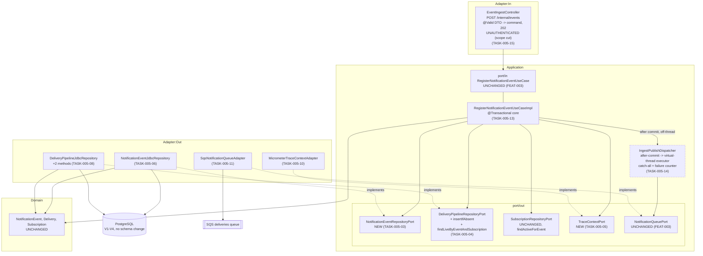

# FEAT-005: Event Ingest Use Case

## Source ADR

Every ADR below was verified `Accepted` by reading its `status:` front matter and its `## Status` section before this file was written. **No `Status` field was touched.** Two amendments were needed and were made in place, in the post-acceptance-correction style FEAT-004 already established for A1-A4 and C1-C2 — not as a new ADR, because neither reverses a decision.

| ADR | Status | Amended | What this feature takes from it |
|-----|--------|---------|---------------------------------|
| ADR-002 | Accepted | **C3 (new)** | §1.1's five ingest steps verbatim; §3.1's traceparent and PII rules |
| ADR-003 | Accepted | **A5 (new)** | §2's idempotency and tenant-isolation invariants; §3's two tables; A3/A4's two `Delivery` components |
| ADR-004 | Accepted | - | SS1's single publisher port and its four-field envelope |
| ADR-007 | Accepted | - | §5.2's tenant boundary and its cross-tenant carve-out for pipeline ports |

### The two amendments, and why they were genuine gaps rather than scope creep

**ADR-003 A5 — two missing return signals.** ADR-003 §2 says a partial-unique-index conflict "is treated as success (returning the existing delivery) rather than an error", but `DeliveryPipelineRepositoryPort.insert` returns `Delivery` and can only report the conflict by throwing. The sentence was unimplementable against the committed contract. And no port wrote `notification_events` at all — FEAT-003 defined ports for the other three tables, so ADR-002 §1.1 step 3's event insert had no way to reach the database. A5 adds `NotificationEventRepositoryPort` and the pair `insertIfAbsent` / `findLiveByEventAndSubscription`, keeping `insert` unchanged for replay and recovery, which must still fail loudly.

**ADR-002 C3 — the traceparent had no injection point.** ADR-003 A3 makes `trace_context` a value the ingest use case writes; ADR-002 §3.1 defines it as the current W3C traceparent; reading it requires Micrometer, and a use case in this codebase carries no framework type but `@Transactional`. C3 adds the one-method `TraceContextPort`. C3 also names step 5's mechanism, because "after the response" is a correctness property here, not prose.

Nothing else in ADR-002 §1.1 or ADR-003 §2 was reopened. The idempotency mechanism is exactly the one ADR-003 §2 already specifies — the partial unique index `idx_deliveries_live_pair` from `V2`, plus the `notification_events` primary key — and no alternative was considered.

## Scope

### In scope

1. **The transactional core.** `RegisterNotificationEventUseCaseImpl`, implementing the `port/in` interface FEAT-003 already committed. Resolve subscriptions by query predicate, insert the event row, insert one `PENDING` delivery per match, all in one `@Transactional`. No network call inside it.
2. **The two missing outbound persistence port methods and the missing event port** (ADR-003 A5), with their JDBC adapters and Testcontainers tests.
3. **`TraceContextPort`** and its Micrometer adapter (ADR-002 C3).
4. **The SQS publisher adapter** implementing the already-committed `NotificationQueuePort`, plus the build and configuration work it needs. The port has existed since FEAT-003 with no implementation; ingest is its first caller.
5. **The post-commit, off-request-thread, best-effort publish** and its failure counter (ADR-002 C3).
6. **The ingest HTTP endpoint** — controller, request DTO, `202` response. Unauthenticated; see the scope cut below.
7. **The three acceptance tests the Tech Lead named**, against real Postgres and real LocalStack SQS.

### Scope cut of 2026-09-20 (Tech Lead directive)

**Producer-to-gateway authentication and authorization are out of scope for FEAT-005.** The directive was given after this breakdown was first written; the `security-engineer` task that carried it (then TASK-005-16) is **removed**, not deferred inside the feature, and the two acceptance tasks are renumbered to 16 and 17 accordingly. No task in this feature is assigned to `security-engineer`.

What this changes and what it does not:

- **ADR-002 §1.1 step 1 is unchanged and remains `Accepted`.** Producers authenticating with AWS IAM / SigV4 is still the design; it is simply not built in this feature. This is a sequencing decision, not a reversal, so no ADR amendment was made — an ADR records the decision, and the decision stands.
- **The endpoint ships reachable without a credential.** That is a real, open exposure and is recorded as one in the Security Impact table below (A07) and in `docs/concerns.md`, not quietly dropped from the risk list.
- **No task may work around it.** TASK-005-15 must add no `SecurityFilterChain`, no `@PreAuthorize`, no permit-all matcher, and no bypass. TASK-005-16's test-side accommodation, if Boot's default security challenges the request, is test-scoped only.

### Explicitly out of scope

- **The relay, the worker, the DLQ consumer, and the webhook client.** Nothing in this feature reads a `deliveries` row back out of `PENDING`. The relay is what makes a lost publish harmless (ADR-001 §1, §2) and it is a separate feature; until it exists, a lost publish means the delivery waits, and that is the accepted state of the world at this step.
- **`publishBatch`.** Ingest publishes one pointer per delivery. The relay is the batch caller and the relay is out of scope. Implementing it now would be untested code written for a caller that does not exist (YAGNI). The adapter implements it as part of the interface; TASK-005-11 states the minimum.
- **All producer-to-gateway authentication**, including SigV4 verification in application code, any `SecurityFilterChain` for `/internal/**`, and ADR-002 Q10's open "edge vs. application" question, which stays open. See the scope cut above.
- **`TenantId`, RLS, the two database roles, the global `SecurityConfig` and the self-service API's per-client auth.** All ADR-007's own breakdown, unchanged.
- **Any schema change.** `V1`-`V4` already carry every table, column and index this feature needs. No `V5`.
- **Any change to `Delivery`, `NotificationEvent`, `Subscription`, `DeliveryPointer`, or any `port/in` DTO.** They are sufficient as committed; see "Port Contracts".
- **Producer-side rate limiting, request size caps beyond Bean Validation, and an ingest bulk endpoint.**

## Decisions this feature records

### 1. The transaction boundary contains no network call, and the publish is not on the request thread

ADR-002 §1.1 is explicit that steps 1-3 (database) and step 5 (queue) are strictly sequential and never share a unit of work, and that step 5 happens after the response. Two mechanisms are rejected before naming the one used:

- **Publishing inside `@Transactional`** — forbidden outright. It makes the queue a participant in the commit, which is the exact inversion ADR-001 §1 exists to prevent, and it holds a database connection across a network round trip.
- **Publishing on the request thread after the use case returns** — meets "outside the transaction" but not "after the response", and a slow `SendMessage` becomes producer-visible latency on a path whose entire contract is `202` and go.

**Used:** the use case registers an after-commit callback that **submits** the publish to a virtual-thread executor and returns immediately. Ordering is guaranteed by the callback (nothing is published before it is committed); isolation from the request is guaranteed by the submission. Every throwable is caught at the submission boundary, logged by `delivery_id`, and counted.

This is the one place in the feature where a design choice could make the publish able to fail the request, so it is a single small class (TASK-005-14) rather than a few lines inside the use case, and it is the subject of its own acceptance test (TASK-005-17).

**Virtual-thread pinning.** The executor is `Executors.newVirtualThreadPerTaskExecutor()`. No `synchronized` anywhere on this path — not in the use case, not in the dispatcher, not in the adapter. The AWS SDK v2 sync `SqsClient` performs ordinary blocking I/O, which unmounts a virtual thread correctly; an `synchronized` block wrapped around it would pin a carrier thread for the duration of a network call, which is the one failure mode that turns a best-effort publish into a throughput cliff. Stated as an acceptance criterion on TASK-005-11 and TASK-005-14.

### 2. Idempotency is the two constraints the schema already has, and nothing else

No application-level "have I seen this event" check, no side table, no cache — `V2`'s comment on `idx_deliveries_live_pair` already calls it "the single mechanism - no side table, no trigger, no application-level check", and that is honored.

Replaying `event_id` `E` for a client with subscriptions `S1`, `S2`:

| Step | First ingest | Replay while deliveries are live | Replay after both went `DEAD` |
|---|---|---|---|
| `insertIfAbsent(event)` | `true` | `false`, row untouched | `false`, row untouched |
| `insertIfAbsent(delivery)` per match | `Optional.of(row)` | `Optional.empty()` for both | `Optional.of(new row)` for both |
| fallback read | not taken | `findLiveByEventAndSubscription` returns the live row | not taken |
| result | 2 ids, `newlyCreated = true` | **the same 2 ids**, `newlyCreated = false` | 2 **new** ids, `newlyCreated = true` |
| response | `202` | `202` | `202` |

The third column is not an accident to be defended against — it is what ADR-003 §2 means by "once a delivery reaches a terminal state, the pair is free again", and it is the same property `POST /replay` depends on (ADR-005 §1). TASK-005-09 tests it so a later reader does not mistake it for a bug.

`newlyCreated` is decided **per call, from the delivery inserts**, not from the event insert: a crash between the event insert and the delivery inserts is impossible (one transaction), but a replay after a partial fan-out change — a subscription added between two ingests of the same event — legitimately creates some rows and not others. `newlyCreated = true` when at least one delivery row was inserted by this call.

### 3. Zero matching subscriptions is a success, and it is not the same as an unknown client

ADR-003 §2: the event is stored, no `deliveries` row is written, no error. The response is `202` with an empty `deliveryIds`.

This feature deliberately does **not** distinguish "client has no subscription for this event type" from "client does not exist". Both produce the same stored event and the same empty `202`. Distinguishing them would require a client registry this system does not own, and the difference would be an enumeration oracle on an endpoint reachable by every internal producer. The event is stored either way, which is what makes the case debuggable after the fact — §1.1 step 3's "for audit/debugging" is the whole reason the row is written.

### 4. Tenant isolation is structural, and there is exactly one query that could break it

`SubscriptionRepositoryPort.findActiveForEvent(clientId, eventType)` — already implemented and tested in FEAT-004 (TASK-004-17) — is the only subscription read on this path. The use case passes `command.clientId()` straight into it and never compares a `clientId` afterward. **The use case must contain no `clientId` equality check**, because writing one would imply the query might return foreign rows, which is exactly the fetch-then-compare pattern ADR-003 §2 corrected away from. TASK-005-13 states this as an acceptance criterion in the negative: a reviewer should see the absence.

The `clientId` written onto each `Delivery` comes from the **event**, not from the subscription, and the two are identical by construction because of the query predicate. The event's value is used because the event is the source of truth for what was ingested.

### 5. `event_created_at` is read back from the stored event, never taken from the command

ADR-003 A4's column is denormalized `notification_events.created_at`. On a first ingest, the command's `occurredAt` becomes both. On a **re-ingest**, `insertIfAbsent` returns `false` and the stored row is unchanged (`notification_events` is append-only, §3) — so if the second command carries a different `occurredAt`, the command's value must be discarded, or the new delivery rows would disagree with their own parent event about when the event happened. The use case reads the stored event (`findById`) whenever `insertIfAbsent` returned `false`, and uses that `createdAt`. Tested in TASK-005-16.

### 6. The publisher adapter resolves the queue URL once, at startup

`application-local.yaml` already forward-declares `challenge.sqs.queues.deliveries` as a queue **name** (FEAT-001). The adapter resolves name to URL via `GetQueueUrl` once when the bean is built, not per publish, so a per-message SQS round trip is not added to a path whose reason for existing is latency. A queue that does not exist therefore fails at startup, loudly — except in the one test that deliberately points at a missing queue to force a publish failure (TASK-005-17), which overrides the resolved URL rather than the name.

## Architecture

The dashed boundary around the dispatcher is the transaction boundary's edge: everything above it is inside `@Transactional`, everything from `D` rightward is after the commit and off the request thread.

**Dependency rule.** `domain/` is not edited by any task in this feature. `application/` is edited only by TASK-005-03, -04, -05, -13 and -14, all `backend-engineer`. No `dba` task edits a file outside `adapter/out/persistence` and its tests.

## Port Contracts

### New

**`application/port/out/persistence/NotificationEventRepositoryPort`** (ADR-003 A5, TASK-005-03)

| Method | Contract |
|---|---|
| `boolean insertIfAbsent(NotificationEvent event)` | `true` when this call inserted; `false` when already stored. Never throws on a duplicate. |
| `Optional<NotificationEvent> findById(String eventId)` | The stored row, for its authoritative `createdAt`. |

**`application/port/out/tracing/TraceContextPort`** (ADR-002 C3, TASK-005-05)

| Method | Contract |
|---|---|
| `Optional<String> currentTraceparent()` | The active W3C traceparent, or `empty()` when no span is active. Never throws. |

### Changed

**`DeliveryPipelineRepositoryPort`** gains two methods (ADR-003 A5, TASK-005-04). `insert`, and every other method, is unchanged.

| Method | Contract |
|---|---|
| `Optional<Delivery> insertIfAbsent(Delivery delivery)` | The inserted row, or `empty()` when a live row exists for the pair. |
| `Optional<Delivery> findLiveByEventAndSubscription(String eventId, UUID subscriptionId)` | The live row for the pair, at most one. |

### Unchanged, deliberately

`RegisterNotificationEventUseCase` and its `Command`/`Result` records are sufficient as FEAT-003 committed them: `Result` already carries `deliveryIds` plus `newlyCreated`, which is precisely the idempotent-replay signal this feature needs. `NotificationQueuePort`, `DeliveryPointer`, `Subscription`, `Delivery`, `NotificationEvent`: untouched.

## Data Model Impact

**None. No migration.** `V1`'s `notification_events` (PK on `event_id`, the idempotency mechanism for the event row) and `V2`'s `deliveries` with `idx_deliveries_live_pair` (the idempotency mechanism for the fan-out), plus `V4`'s `event_created_at`, already carry everything. The FEAT-004 schema facts stay binding on every new statement: native enum casts (`::delivery_status`, `::delivery_origin`), `event_types` containment via `@>`, `updated_at` written explicitly on every `UPDATE` (this feature writes no `UPDATE`), and bound parameters only.

Rows this feature writes, and nothing else: one `notification_events` row per new `event_id`; one `deliveries` row per matched subscription, `status = 'PENDING'`, `origin = 'INGEST'`, `attempt_count = 0`, `replayed_from` null, `event_created_at` from the stored event, `trace_context` from `TraceContextPort`.

## Security Impact

**Authn/authz introduced: none.** Producer-to-gateway authentication was cut from this feature by Tech Lead directive (see the scope cut above). ADR-002 §1.1 step 1's IAM/SigV4 requirement stands as an `Accepted` decision and is simply not implemented yet. The consequence is stated plainly below rather than dropped from the risk list, because the exposure is real and the next feature to touch this endpoint needs to see it.

| OWASP Top 10:2025 | Exposure | Control |
|---|---|---|
| **A07 Authentication Failures** | **OPEN, ACCEPTED, UNMITIGATED.** `POST /internal/events` is reachable by anyone who can reach the service. An unauthenticated caller can write arbitrary `notification_events` and `deliveries` rows for any `clientId`, which — once the worker exists — becomes the ability to make the platform POST attacker-chosen payloads to any client's registered webhook endpoint. | None in this feature, by directive. The only thing standing between this endpoint and the internet is deployment-level network placement, which this feature does not own and does not verify. **This must be closed before any deployment reachable by untrusted traffic, and before the worker lands.** Recorded in `docs/concerns.md`; the follow-up is a `security-engineer` task in a later feature, implementing ADR-002 §1.1 step 1 and resolving Q10's edge-vs-application question. |
| **A01 Broken Access Control** | The request body carries `clientId`, and the caller chooses it. A caller can therefore create deliveries for any tenant. | Intended **given an authenticated internal producer** — the producer *is* the platform, emitting on behalf of every client, which is what §1.1's "the caller is a platform-internal service, not a client" means. With the A07 row open, that premise does not hold, so this row is currently **not controlled either**: the two are one exposure, not two. The client-facing boundary, where `clientId` comes from the principal and not the body, is ADR-007's and is unaffected. |
| **A01 — IDOR at the fan-out** | If the subscription lookup were a broad read filtered in application code, an event could fan out to another tenant's endpoint — a cross-tenant payload leak, the worst outcome this system has. | `client_id` is in the query predicate (ADR-003 §2); the use case performs no `clientId` comparison at all, asserted in the negative on TASK-005-13; TASK-005-16 seeds two clients with the same `event_type` and asserts the fan-out touches exactly one. |
| **A05 Injection** | `eventId`, `clientId`, `eventType` and `content` all reach SQL, and `content` is producer-supplied free text of unbounded shape. | Bound parameters only, in both new adapters. No concatenation. Bean Validation caps length and charset at the controller (TASK-005-15). |
| **A09 Logging & Alerting Failures** | `content` is the PII layer (ADR-002 §3.1). The ingest path is where it first enters the process, and the publish-failure log is written on an error path, which is where payloads usually leak. | No log line, span attribute, MDC entry or exception message in this feature carries `content`. The failure log is `delivery_id` only. Stated per task on -06, -11, -13 and -14. A publish failure that is invisible to the caller is counted (`notification.ingest.publish.failed`), so silence is not the only signal. |
| **A10 Mishandling of Exceptional Conditions** | Three paths decide fail-open vs fail-closed. A publish failure that propagated would fail a request whose data is already durable — failing closed on a step the design calls optional. A duplicate-key exception surfacing from either `insertIfAbsent` would turn ADR-003 §2's idempotent replay into a 500 that a retrying producer would hammer. A publish submitted *before* commit would enqueue a pointer to a row that may never exist. | Catch-all at the submission boundary, tested with a real failing publish (TASK-005-17). `ON CONFLICT DO NOTHING` in both statements, so no exception exists to swallow, tested (-07, -09, -16). After-commit registration, not in-transaction (-14). |
| **A03 Software Supply Chain** | One new runtime dependency: `software.amazon.awssdk:sqs`, currently `testImplementation` only. | Promoted to `implementation` at a pinned version, no dynamic version, no additional SDK service modules, asserted in TASK-005-01's criteria. With the security task cut, that task's own acceptance criteria are the only check; there is no review pass behind it. |

**Handed to `security-engineer`:** no — the directive removed the only task that would have been. Two consequences worth stating rather than leaving implicit: the A07/A01 exposure above ships open, and the A03 dependency promotion goes in without a second pair of eyes. The remaining controls (bound parameters, the catch-all, the absent `clientId` comparison) are ones tests prove, and they are tested.

## Task Breakdown

Seventeen tasks, after the security task was cut (see the scope cut above). Numbered so no task depends on a higher number. Infrastructure and contracts first, then adapters, then the use case, then the endpoint, then the three acceptance tests — the ordering the Tech Lead's constraint requires: every port method and the outbound SQS adapter exist before the use case that calls them, and the use case exists before its controller and tests. No task is assigned to `security-engineer`.

| # | Task | Agent | Depends on |
|---|------|-------|------------|
| 01 | [AWS SDK SQS as a runtime dependency; LocalStack in `TestcontainersConfiguration`](tasks/TASK-005-01-sqs-dependency-and-testcontainers.md) | devops-engineer | - |
| 02 | [`SqsClient` bean and `challenge.sqs` properties binding](tasks/TASK-005-02-sqs-client-config.md) | devops-engineer | 01 |
| 03 | [`NotificationEventRepositoryPort`](tasks/TASK-005-03-notification-event-port.md) | backend-engineer | - |
| 04 | [`DeliveryPipelineRepositoryPort`: `insertIfAbsent` and the live-pair read](tasks/TASK-005-04-pipeline-port-idempotent-insert.md) | backend-engineer | - |
| 05 | [`TraceContextPort`](tasks/TASK-005-05-trace-context-port.md) | backend-engineer | - |
| 06 | [`NotificationEventJdbcRepository`](tasks/TASK-005-06-notification-event-adapter.md) | dba | 03 |
| 07 | [Testcontainers: event insert is idempotent and non-destructive](tasks/TASK-005-07-notification-event-adapter-tests.md) | dba | 06 |
| 08 | [Pipeline adapter: `ON CONFLICT DO NOTHING` on the partial index](tasks/TASK-005-08-pipeline-adapter-idempotent-insert.md) | dba | 04 |
| 09 | [Testcontainers: live-pair conflict, and the pair freed by a terminal state](tasks/TASK-005-09-pipeline-idempotency-tests.md) | dba | 08 |
| 10 | [`MicrometerTraceContextAdapter`, with tests](tasks/TASK-005-10-trace-context-adapter.md) | backend-engineer | 05 |
| 11 | [`SqsNotificationQueueAdapter`](tasks/TASK-005-11-sqs-queue-adapter.md) | backend-engineer | 02 |
| 12 | [LocalStack test: the published envelope and its `traceparent` attribute](tasks/TASK-005-12-sqs-adapter-tests.md) | backend-engineer | 01, 11 |
| 13 | [`RegisterNotificationEventUseCaseImpl`: the transactional core](tasks/TASK-005-13-ingest-use-case.md) | backend-engineer | 03, 04, 05, 06, 08 |
| 14 | [`IngestPublishDispatcher`: after-commit, off-thread, best-effort](tasks/TASK-005-14-post-commit-publish.md) | backend-engineer | 11, 13 |
| 15 | [`EventIngestController` and its validated request DTO](tasks/TASK-005-15-ingest-controller.md) | backend-engineer | 13 |
| 16 | [Acceptance: idempotent replay, and the zero-subscription case](tasks/TASK-005-16-ingest-acceptance-tests.md) | backend-engineer | 15 |
| 17 | [Acceptance: a forced publish failure leaves the rows durable and the response `202`](tasks/TASK-005-17-publish-failure-acceptance-test.md) | backend-engineer | 14, 16 |

Dispatch in order. 01 and 03/04/05 are independent and can run in parallel; 06-07, 08-09 and 10 are independent of each other once their ports exist.

## Status

Planned <!-- Planned | In Progress | Done -->
