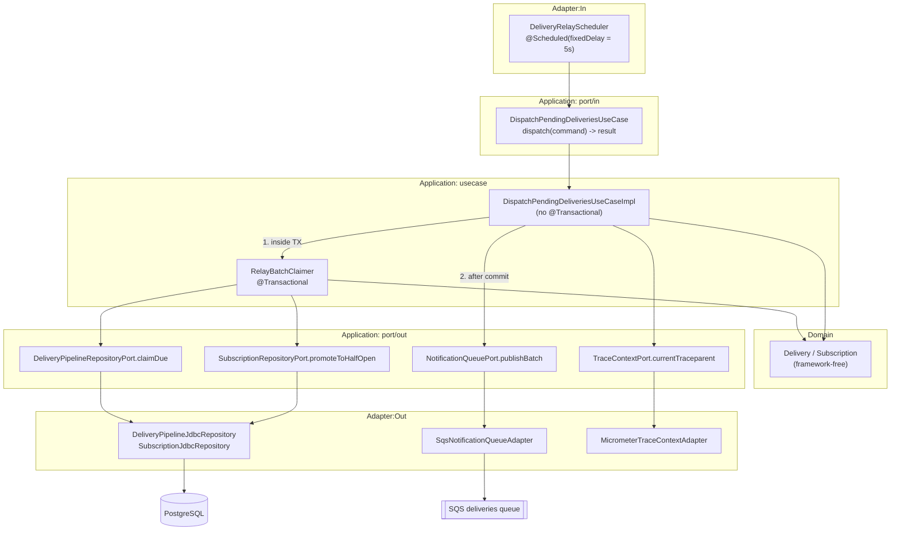

# FEAT-006: Delivery Relay Dispatch

## Source ADR

Both source ADRs were verified `Accepted` by reading their `status:` front matter and their
`## Status` section before this file was written. **No `Status` field was touched, and no ADR
body was amended by this feature.**

| ADR | Status | What this feature takes from it |
|-----|--------|---------------------------------|
| ADR-002 | Accepted | §2.1 in full — the due-query, its six predicates, the claim transaction, the 5-minute forward push, `SendMessageBatch` in groups of 10, partial-failure handling, and Amendment C2's `promoteToHalfOpen` |
| ADR-006 | Accepted | §1.1's queue settings (batch size 10, `VisibilityTimeout` 30s, `maxReceiveCount` 3 — already configured in FEAT-001/005); §1.2's `OPEN -> HALF_OPEN` row, its compound guard, and the one-probe admission rule |
| ADR-005 | Accepted | §2's deliverability rule (a subscription is not deliverable until `VERIFIED`), applied at the claim gate |
| ADR-003 | Accepted | §3's per-subscription `max_concurrency` in-flight cap, which ADR-006 §2 restates as a claim-query predicate |

No design decision is reopened, re-proposed or questioned here. Every contract below either
already exists in merged code or is the minimum addition required to express something the ADRs
already specify.

### Two predicates that are required but do not appear in ADR-002 §2.1's literal SQL block

ADR-002 §2.1's fenced SQL shows six predicates. Two further exclusions are mandatory and are
specified in prose rather than in that block. They are **not additions of this feature's own
invention** — each traces to an accepted decision:

1. **Deliverability gate — `s.active AND s.verification_state = 'VERIFIED'`.** ADR-005 §2 makes
   verification the precondition for ever calling a target URL, and the merged domain model
   already encodes it as `Subscription.isDeliverable()`. A relay that enqueues work for an
   inactive or unverified subscription hands the worker a delivery it is forbidden to attempt.
   Required by Tech Lead directive of 2026-09-21 as a mandatory claim-query exclusion.
2. **Per-subscription in-flight cap.** ADR-002 §2.1: "The per-subscription in-flight cap the
   batch is built against is therefore `0` while `OPEN`-and-cooling, `1` while `HALF_OPEN`, and
   `max_concurrency` while `CLOSED`." ADR-006 §1.2 restates it as the one-probe rule and ADR-006
   §2 as `max_concurrency`'s definition. The merged `claimDue` does not implement it.

Both are implemented as predicates of the existing `claimDue` statement, not as a second query
and not as a post-filter in Java. Filtering in the application would mean the rows had already
been locked and moved to `QUEUED`, which is precisely the over-admission the cap exists to
prevent.

### The cap must bound candidate selection per subscription, not filter a global pool

The cap is not only a count limit, it is a **fairness boundary**. If candidates are selected
globally — one ranked pool, one `LIMIT :batch_limit`, cap applied afterwards — a single saturated
subscription starves every other one. Concretely: subscription A has 10,000 due `PENDING` rows and
`max_concurrency = 10` with 10 already in flight, so none of its rows are admissible; its 10,000
rows nonetheless fill the global candidate `LIMIT`, the cap discards all of them, and subscription
B's single due row is never examined. B stays undelivered for as long as A stays saturated. The
batch is not merely smaller than it could be — it is empty of the work that was actually
deliverable.

`claimDue` therefore selects candidates **per subscription, through a `LATERAL` join driven by
`subscriptions`**: each deliverable, non-throttled, non-cooling subscription contributes at most
`GREATEST(0, effective_cap - already_in_flight)` of its oldest due rows, and only then does the
outer query order the union of those bounded sets and apply `LIMIT :batch_limit`. One saturated
subscription can consume at most its own allowance of the batch. TASK-006-01 specifies the join
shape, the two `ORDER BY`/`LIMIT` levels and the placement of `FOR UPDATE OF d SKIP LOCKED`;
TASK-006-02 pins the property with a dedicated starvation regression test (scenario 8).

## Scope (MVP / Post-MVP)

### In scope

1. **Completing the due-query** (`DeliveryPipelineJdbcRepository.claimDue`) with the two
   exclusions above, restructured so candidate selection is bounded per subscription by a
   `LATERAL` join, keeping the six existing predicates byte-for-byte.
2. **The relay claim transaction** — claim the batch, mark `QUEUED`, push `next_attempt_at`
   forward 5 minutes, and issue the `OPEN -> HALF_OPEN` promotions, all in one transaction that
   commits before any network call.
3. **Circuit promotion and one-probe admission** — ADR-006 §1.2's `promoteToHalfOpen` row,
   driven off the claimed batch, with the effective cap of `1` applied at claim time.
4. **Partial-failure-aware batched publish** — `NotificationQueuePort.publishBatch` gains a
   return value so a partially failed `SendMessageBatch` is observable. Failed entries are
   **not** compensated; the already-pushed clock is the recovery mechanism (ADR-002 §2.1).
5. **`DispatchPendingDeliveriesUseCaseImpl`** — the `port/in` interface FEAT-003 already
   committed, implemented for the first time.
6. **The scheduled trigger** — `@Scheduled(fixedDelay)` inbound adapter, its configuration
   properties, and virtual-thread-safe scheduling.
7. **The seven Testcontainers/LocalStack scenarios** named by the Tech Lead, plus the starvation
   regression test that pins the per-subscription bound. No mocks.

### Explicitly out of scope

- **The worker.** `AttemptDeliveryUseCase`, the SQS listener, the webhook client, signing, the
  bulkhead, `tripCircuit`/`closeCircuit`/`reopenCircuit`, and the DLQ consumer are all ADR-002
  §2.2 and belong to a later feature. This feature produces messages; nothing consumes them yet.
  Every relay test therefore asserts against the `deliveries` table and the SQS queue, never
  against a delivery outcome.
- **Any schema change.** `V1`-`V4` already carry every column and index this feature reads. The
  in-flight count is served by `idx_deliveries_subscription_status (subscription_id, status)`
  from `V2`; the deliverability gate is a predicate on the joined `subscriptions` row, reached by
  its primary key. **There is no `V5` in this feature.**
- **Any change to `Delivery`, `Subscription`, `DeliveryPointer`, `DispatchPendingDeliveriesCommand`
  or `DispatchPendingDeliveriesResult`.** All are sufficient as merged.
- **`SubscriptionRepositoryPort`.** `promoteToHalfOpen(subscriptionId, asOf)` already exists with
  exactly the guard this feature needs (ADR-002 Amendment C2, ADR-006 Amendment B1). Nothing is
  added to that port.
- **Producer-to-gateway authentication.** Still open from FEAT-005, still logged in
  `docs/concerns.md`. The relay adds no HTTP surface, so it neither worsens nor closes it.
- **Tuning the numbers.** Poll interval 5s, batch limit 500, forward push 5 minutes and batch
  chunk 10 are taken verbatim from ADR-002 §2.1 and ADR-006 §1.1. They become configuration keys
  with those defaults; choosing different values is not this feature's decision.

## Architecture



**The ordering in that diagram is the correctness property of this feature**, not a drawing
convenience: every database write of a cycle commits before the first `SendMessageBatch` byte
leaves the process, and no network call is ever made inside a transaction (ADR-001 §1, ADR-002
§1.1's closing paragraph, restated for the relay side).

The split between `DispatchPendingDeliveriesUseCaseImpl` and `RelayBatchClaimer` is what makes
that ordering enforceable rather than remembered. Spring's `@Transactional` is proxy-based, so a
transactional method invoked on `this` from within the same bean runs with **no transaction at
all** — and `claimDue` deliberately throws when no transaction is active, because `SKIP LOCKED`
outside a transaction acquires no lasting locks and every relay instance would claim the same
batch. Two beans, one boundary, no self-invocation.

## Port Contracts

### Changed — `application/port/out/queue/NotificationQueuePort`

```java
void publish(DeliveryPointer pointer);                    // unchanged, ingest's single-message path
PublishBatchResult publishBatch(List<DeliveryPointer> pointers);   // was: void
```

```java
// application/port/out/queue/dto/PublishBatchResult.java
public record PublishBatchResult(int publishedCount, List<UUID> failedDeliveryIds) { }
```

**Why the signature changes.** ADR-002 §2.1 states "`SendMessageBatch` is partially fallible.
Failed entries stay `QUEUED` and are recovered by the already-pushed clock — no special-case
error handling needed for a partial batch failure." The *handling* is indeed nothing; the
*reporting* is not. A `void` method cannot tell the use case how many pointers actually reached
the queue, which `DispatchPendingDeliveriesResult.publishedCount` requires, and cannot feed the
counter that makes a degraded publish path visible to operations (ADR-002 §3, OWASP A09). This
is a contract addition that reverses no decision: the recovery mechanism stays exactly the pushed
clock, and no caller compensates, rolls back, or re-publishes in-cycle.

`failedDeliveryIds` is an **empty list**, never `null`, when every entry succeeded (Effective Java
Item 54). The adapter maps SQS's per-entry failure `Id` back to the `deliveryId` of the pointer at
that index; the batch entry `Id` is an index into the chunk, so that mapping is total.

### Unchanged but newly implemented — `application/port/in/pipeline/DispatchPendingDeliveriesUseCase`

`dispatch(DispatchPendingDeliveriesCommand) -> DispatchPendingDeliveriesResult`, exactly as
FEAT-003 committed it. `batchLimit` and `asOf` come in on the command, which is what lets every
test drive the relay clock deterministically instead of sleeping.

### Unchanged — `DeliveryPipelineRepositoryPort.claimDue(int batchLimit, Instant asOf)`

The signature is sufficient. Its **contract** tightens: the javadoc must state the two added
exclusions and the effective-cap rule, because they are guarantees a caller relies on and an
implementer must not drop.

### Unchanged — `SubscriptionRepositoryPort.promoteToHalfOpen(UUID, Instant)`

Already carries ADR-006 §1.2's compound guard
(`circuit_state = 'OPEN' AND circuit_opened_at < asOf - circuit_backoff`). The relay calls it for
each **distinct subscription id in the claimed batch** and counts the `true` returns.

**Why the relay does not first ask which subscriptions are `OPEN`-and-cooled.** It would be a
second read racing the write it informs. The compound guard already makes the promotion atomic and
first-writer-wins, so calling it for a `CLOSED` subscription affects zero rows, writes nothing,
and leaves `subscriptions` as cold as ADR-006 §1.2 requires — a zero-row `UPDATE` is not a write.
The cost is one bounded statement per distinct subscription per cycle, against a batch capped at
500 rows. Adding a `findCooledOpenCircuits` port method to avoid it would be a new contract for a
saving nothing has measured (YAGNI), and a strictly less safe one, since it reintroduces the
read-then-write race Amendment C2 exists to remove.

## Data Model Impact

**No migration.** No table, column, constraint or index is created, altered or dropped.

Columns read that the merged `claimDue` does not read yet: `subscriptions.active`,
`subscriptions.verification_state`, `subscriptions.max_concurrency`. All three exist since `V1`.

Index coverage for the two added predicates:

| Predicate | Served by | Origin |
|---|---|---|
| per-subscription candidate scan on `subscription_id` + `status` + `next_attempt_at` | `idx_deliveries_subscription_status (subscription_id, status)`, with `idx_deliveries_due` (partial) still available for the `next_attempt_at` bound | `V2`, ADR-002 §2.1 |
| `s.active`, `s.verification_state`, `s.max_concurrency`, circuit columns | `subscriptions` is now the outer relation of the `LATERAL` join and is filtered directly | `V1` |
| per-subscription in-flight count | `idx_deliveries_subscription_status (subscription_id, status)` | `V2` |

The `LATERAL` restructure changes the driving relation from `deliveries` to `subscriptions`, so
the plan shape changes with it. If TASK-006-01's or TASK-006-02's `EXPLAIN` shows a sequential
scan on `deliveries` inside the `LATERAL`, or an unbounded sequential scan of `subscriptions` as
the outer relation, that is a finding to report, not a licence to add an index inside this
feature — a new index is a `dba` task in its own right with its own migration.

## Security Impact

**Authentication: none, and none is possible.** The relay has no inbound HTTP surface. Its only
trigger is an in-process `@Scheduled` method. **No task in this feature may expose the relay over
HTTP**, add a controller, an actuator custom endpoint, or any other externally reachable trigger.

**Authorization: cross-tenant by design, and bounded by which port is injected.** The relay reads
and writes `deliveries` and `subscriptions` rows belonging to every client at once. That is the
carve-out ADR-007 §5.2 grants to internal pipeline ports and the reason
`DeliveryPipelineRepositoryPort` is split from the client-facing `DeliveryQueryRepositoryPort`
(ADR-007 Amendment E1). No relay class may inject `DeliveryQueryRepositoryPort`.

| OWASP Top 10:2025 | Exposure in this feature | Mitigation, and which task owns it |
|---|---|---|
| **A05 Injection** | The due-query is the largest hand-written SQL statement in the codebase and gains a new `CASE` expression, a correlated count, and two `LATERAL` subqueries — one of which takes a computed `LIMIT`. | Every value bound through `MapSqlParameterSource`; no predicate, interval, cap or status literal built by string concatenation from any caller-supplied value. TASK-006-01, reviewed in TASK-006-12. |
| **A10 Mishandling of Exceptional Conditions** | Three distinct failure paths: the claim transaction, the batch publish, and the scheduled trigger itself. A throw on the wrong one of these silently stops all delivery. | Claim failure rolls back and the cycle is a no-op (fail-closed, nothing enqueued). Publish failure must **not** roll back the committed claim and must not propagate. The scheduler must catch `Throwable` so one bad cycle never kills the scheduled task. TASK-006-07, TASK-006-09, reviewed in TASK-006-12. |
| **A09 Logging & Alerting Failures** | A relay that silently claims nothing, or publishes nothing, looks identical to an idle one. | Counters for claimed, published, failed entries, and circuit promotions (ADR-002 §3). Never log `content` or `response_excerpt`; `delivery_id`/`subscription_id` only (ADR-002 §3.1's PII rule). TASK-006-07. |
| **A01 Broken Access Control** | Cross-tenant reads, and the one-probe rule is a control that bounds traffic to a destination already believed unhealthy. | Pipeline-port-only injection (above); the cap is enforced in SQL at claim time, never in Java after the rows are already `QUEUED`, and it bounds candidate selection per subscription so one client's backlog cannot deny service to another's deliveries. TASK-006-01, TASK-006-02 scenario 8, TASK-006-06. |
| **A03 Software Supply Chain Failures** | None. No new dependency — `software.amazon.awssdk:sqs` and Spring's scheduling support are both already on the classpath. | Nothing to do. TASK-006-08 must add no dependency. |

Handed to `security-engineer` for the review pass in TASK-006-12: the exposures flagged above are
named here, not designed here.

## Task Breakdown

| # | Task | Agent | Depends on |
|---|------|-------|------------|
| 01 | Due-query: deliverability gate + effective in-flight cap | dba | - |
| 02 | Due-query predicate tests (scenarios 1-5, the two new exclusions, and the starvation regression) | dba | 01 |
| 03 | `NotificationQueuePort.publishBatch` returns `PublishBatchResult` | backend-engineer | - |
| 04 | `SqsNotificationQueueAdapter`: partial-failure-aware batched send | backend-engineer | 03 |
| 05 | LocalStack test: partial `SendMessageBatch` failure at the adapter | backend-engineer | 04 |
| 06 | `RelayBatchClaimer`: the claim transaction + circuit promotions | backend-engineer | 01 |
| 07 | `DispatchPendingDeliveriesUseCaseImpl` + relay counters | backend-engineer | 03, 06 |
| 08 | Relay configuration properties and scheduling enablement | devops-engineer | - |
| 09 | `DeliveryRelayScheduler` inbound adapter | backend-engineer | 07, 08 |
| 10 | Acceptance test: half-open promotion and the one-probe rule (scenario 6) | backend-engineer | 06, 07 |
| 11 | Acceptance test: partial batch failure and clock-based recovery (scenario 7) | backend-engineer | 07 |
| 12 | Security review of the relay slice | security-engineer | 09, 10, 11 |
| 13 | Fix `promoteToHalfOpen` SQL: drop the out-of-contract `updated_at` write (bug found by task 10; targets merged FEAT-004 code, independent of 01-12) | dba | - |

### The seven required scenarios, mapped to their owning task

| # | Scenario | Task |
|---|---|---|
| 1 | `PENDING` younger than the 30s grace window is not claimed | 02 |
| 2 | `PENDING` older than the grace window is claimed | 02 |
| 3 | Open (still cooling) circuit excludes the row | 02 |
| 4 | Active throttle excludes the row | 02 |
| 5 | `next_attempt_at` in the future is not claimed | 02 |
| 6 | Cooled-down circuit promotes to `HALF_OPEN`, exactly one delivery admitted | 10 |
| 7 | Partial `SendMessageBatch` failure leaves failed rows `QUEUED` and recoverable | 05 (adapter), 11 (end to end) |

One further scenario is required beyond the Tech Lead's seven, added after review of the first
draft of this design:

| # | Scenario | Task |
|---|---|---|
| 8 | **Starvation regression.** One subscription with 10,000 due `PENDING` rows and `max_concurrency = 10` (so at most 10 cap admits), plus a second subscription with exactly 1 due row: a single relay cycle claims the second subscription's row. | 02 |

Scenarios 1, 2 and 5 are partially covered by the merged `ClaimDuePredicateTest`. TASK-006-02
extends that class rather than duplicating it, so every predicate of one statement is asserted in
one place.

## Status

Planned <!-- Planned | In Progress | Done -->
