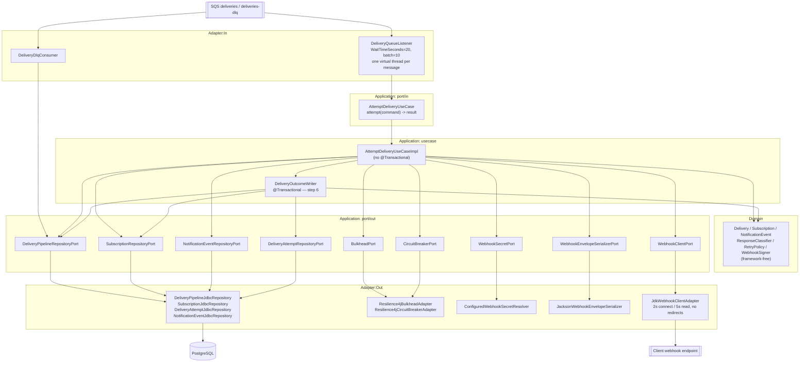

# FEAT-007: Delivery Worker

## Source ADR

Every source ADR was verified `Accepted` by reading its `status:` front matter and its
`## Status` section before this file was written. **No `Status` field was touched and no ADR
body was amended by this feature.**

| ADR | Status | What this feature takes from it |
|-----|--------|---------------------------------|
| ADR-002 | Accepted | §2.2 in full — long poll 20s, batch 10, virtual thread per message, the seven-step per-message flow, the `DeleteMessage`-on-every-path invariant, the steps 6-then-7 ordering, and Amendment C1's operation names; §3/§3.1 for counters, MDC and the PII rule |
| ADR-004 | Accepted | §1's response classification, retry schedule, per-attempt timeout budget, `DEAD` vs. SQS DLQ distinction and the `FAILED` write; §1.1's outbound envelope and its three headers; §2's signing location and two-slot secret rotation |
| ADR-006 | Accepted | §1.1's queue settings and the "no `ChangeMessageVisibility` anywhere" rule; §1.2's circuit breaker (in-memory counts, four conditional transitions, local reset on a `CLOSED` read); §1.3's per-subscription bulkhead and its deferral write |
| ADR-003 | Accepted | §1/§1.1's state machine and write table, already encoded in the merged `DeliveryStatus` and the pipeline port |
| ADR-005 | Accepted | §2's deliverability rule, already enforced upstream by FEAT-006's claim gate; nothing new here |

No design decision is reopened, re-proposed or questioned here. Where an ADR leaves a value or a
mechanism explicitly open, this feature makes the minimum concrete choice needed to ship, labels
it as such, and logs it in `docs/concerns.md` rather than amending the ADR.

## What already exists in merged code

This feature is the last piece of the pipeline; most of its collaborators are merged.

| Already merged | Used how |
|---|---|
| `AttemptDeliveryUseCase`, `AttemptDeliveryCommand`, `AttemptDeliveryResult` | the `port/in` contract, implemented for the first time here |
| `WebhookClientPort`, `WebhookRequest`, `WebhookResponse` | the `port/out` contract, implemented for the first time here |
| `ResponseClassifier`, `AttemptOutcome`, `TransportFailure`, `RetryPolicy` | the whole of ADR-004 §1's classification and backoff, already pure and tested |
| `DeliveryPipelineRepositoryPort` (`claimForProcessing`, `findById`, `markDelivered`, `scheduleRetry`, `markDead`, `markFailed`, `deferDelivery`) | every delivery-row write this feature makes |
| `SubscriptionRepositoryPort` (`findById`, `deactivate`, `setThrottledUntil`, `tripCircuit`, `reopenCircuit`, `closeCircuit`) | every subscription write this feature makes |
| `DeliveryAttemptRepositoryPort`, `DeliveryAttempt` | the attempt-history insert |
| `NotificationEventRepositoryPort.findById`, `NotificationEvent` | `content`, `event_type` and the authoritative `created_at` for the outbound envelope |
| `SqsClient` bean, `SqsProperties` (including `queues.deliveries-dlq`), `docker/localstack/init-sqs.sh` with `maxReceiveCount = 3` | the consumer's transport and the DLQ redrive policy |
| `LocalWebhookStubController` (`local` profile only) | the demo receiver, for `bootRun` — not used by any test in this phase |

**No port on the persistence side changes.** Every write this feature needs was already named by
ADR-002 Amendment C1 and ADR-006 Amendment B1 and delivered by FEAT-004.

## Scope (MVP / Post-MVP)

### In scope for this phase

1. **The SQS consumer** — long poll `WaitTimeSeconds = 20`, `MaxNumberOfMessages = 10`, one virtual
   thread per message, `DeleteMessage` on every path, `ChangeMessageVisibility` nowhere.
2. **`AttemptDeliveryUseCaseImpl`** — ADR-002 §2.2's per-message flow, in the fixed order below.
3. **The outbound HTTP adapter** — `WebhookClientPort` over the JDK `HttpClient`, 2s connect /
   5s read, redirects never followed, TLS validation never disabled.
4. **Signing** — ADR-004 §1.1's envelope, HMAC over body + `X-Cobre-Timestamp`, computed in the
   application layer before the request reaches `WebhookClientPort`, with the rotation-window
   second signature of ADR-004 §2.
5. **Resilience** — the per-subscription bulkhead (permit set, 2s acquire) and the per-subscription
   pod-local circuit breaker, both behind `port/out` interfaces with Resilience4j adapters, plus
   the four conditional `subscriptions` writes the worker owns.
6. **The DLQ consumer** — reads `deliveries-dlq`, correlates by the `delivery_id` message
   attribute (body parse as fallback), writes `FAILED`, deletes, and alerts.
7. **Application-level SSRF validation, at send time** — HTTPS only, DNS resolved and
   private/reserved/loopback/link-local/metadata addresses rejected, redirects never followed,
   validated on **every attempt** rather than at subscription creation, so DNS rebinding is
   caught. Cheap, code-level, and shipped here (TASK-007-19, TASK-007-20).
8. **Unit tests only** — plain JUnit, no Spring context, no Testcontainers, no LocalStack. Every
   behavior below is designed to be unit-testable against fake or mocked ports; see
   **Testing scope for this phase**.

### Deferred to a later phase (designed for, not built here)

- **Every Testcontainers / LocalStack integration test.** The repo convention (CLAUDE.md
  *Testing*) is Testcontainers against real Postgres and LocalStack with a stub HTTP receiver,
  and that remains the eventual bar for this slice. It is explicitly **out of scope for the task
  files in this feature**. Two scenarios can only ever be proven that way and are named here so
  they are not lost:
  - a poison message reaching `deliveries-dlq` after `maxReceiveCount = 3` is exceeded;
  - the DLQ consumer marking the corresponding `deliveries` row `FAILED` end to end.
  Their *unit-testable halves* (the DLQ consumer's correlation and `markFailed` call; the
  listener's delete-on-every-path behavior) are in scope, in TASK-007-17 and TASK-007-18.
- **Network-level egress controls only** — security groups, egress restriction, a controlled
  NAT/proxy path. Infrastructure, not code, and they do not apply to a local run. These stay
  deferred exactly as ADR-007 §Downstream leaves them. **Application-level SSRF validation is
  NOT deferred and is in scope** — see item 8 of the in-scope list below.
- **Producer-to-gateway authentication.** Still open from FEAT-005, still in `docs/concerns.md`.
  **Not blocking this feature** (Tech Lead call, 2026-09-21): the events currently reaching the
  endpoint are mock-generated, so the practical exposure is low for now. The entry stays open and
  TASK-007-21 notes it; no task in FEAT-007 waits on it.
- **Subscription verification, subscription CRUD, secret rotation triggers.** ADR-005 §2 and
  Q9 territory. The worker honors `previous_secret_ref` if a row carries one; nothing here sets
  or clears it.
- **Any schema change.** `V1`-`V4` carry every column this feature reads or writes. **There is
  no `V5` in this feature**, and no task may add one.
- **Any change to the relay.** FEAT-006 is merged and untouched, except the one publisher change
  in TASK-007-16 (the `delivery_id` message attribute ADR-004 §1 already requires).
- **KEDA / autoscaling.** ADR-002 §2.2 names queue-depth scaling as the deployment model; no
  deployment manifests exist in this repository.
- **Tuning the numbers.** Every interval and threshold below is ADR text or a labelled proposal
  bound to a configuration key with that default.

## The fixed per-message order

This ordering is a correctness contract, not a suggestion, and **no task may reorder it**:

```
1. conditional claim              claimForProcessing(deliveryId, now)   guard: status = 'QUEUED'
   └─ zero rows  -> DeleteMessage, stop                                 (duplicate/race, ADR-002 §2.2 step 2)
2. load row + subscription + event
   └─ local breaker reset if the DB says circuit_state = 'CLOSED'       (ADR-006 §1.2, last bullet)
3. bulkhead permit, 2s
   └─ timeout    -> deferDelivery(now + 10-20s jittered), DeleteMessage (no attempt_count, no attempt row)
4. breaker gate
   └─ OPEN-and-cooling -> deferDelivery(...), DeleteMessage
   └─ HALF_OPEN        -> this delivery is the probe
5. sign + POST                    HMAC over body + X-Cobre-Timestamp
6. ONE transaction: insert delivery_attempts, update deliveries,
   and (probe only) the circuit transition; plus throttle/deactivate     COMMIT
7. DeleteMessage                                                         last, always
```

**Step 6 commits before step 7 runs.** Deleting first would lose the attempt record and strand the
row in `PROCESSING` until the relay's 60s staleness reclaim — ADR-002 §2.2's closing paragraph
states exactly this and gives the reason. Structurally, steps 1-6 are the use case and step 7 is
the listener, which deletes only after `attempt(...)` has returned: the transaction is closed
before the delete call is even reachable.

**Every path ends at step 7**: success, retry, dead, throttled, bulkhead-deferred,
breaker-deferred, duplicate claim. `ChangeMessageVisibility` appears nowhere in this feature;
ADR-006 §1.1 removed it from the design entirely, and `maxReceiveCount = 3` is only safe because
of that.

## Response-code handling

Already implemented and tested in the merged `ResponseClassifier`; this feature only maps its
output to writes. No task may re-derive or duplicate the classification.

| Response | `AttemptOutcome` | `deliveries` write | `subscriptions` write | Counts toward breaker |
|---|---|---|---|---|
| 2xx | `SUCCESS` | `markDelivered` | probe only: `closeCircuit` | resets the local count |
| 5xx, 408, timeout/reset/DNS/TLS | `RETRYABLE` | `scheduleRetry` (future `next_attempt_at`) or `markDead` when the schedule is exhausted | probe only: `reopenCircuit` | **yes** |
| 3xx | `NON_RETRYABLE_REDIRECT` | `markDead` | probe only: `reopenCircuit` | **yes** |
| 400, 401, 403, 422, other 4xx | `NON_RETRYABLE` | `markDead` | none | no |
| 404, 410 | `NON_RETRYABLE_DEACTIVATE_SUBSCRIPTION` | `markDead` | `deactivate` | no |
| 429 | `RETRYABLE_THROTTLED` | `scheduleRetry` | `setThrottledUntil` | **no** |

`AttemptOutcome.countsTowardCircuitBreaker()` is already the single source of that last column —
read it, never re-implement it.

### Two pre-HTTP outcomes, deliberately not one

The egress validator (TASK-007-19) runs before the POST and can end an attempt without a status
code. Its two failure kinds are classified differently, because they mean opposite things:

| Validator verdict | `AttemptOutcome` | `deliveries` write | Counts toward breaker | Why |
|---|---|---|---|---|
| DNS failure — timeout, NXDOMAIN, resolver error | `RETRYABLE` | `scheduleRetry` | **yes** | transient; the name may resolve on the next attempt, and ADR-004 §1 already lists DNS failure as breaker-counting |
| Resolution succeeded but the target is rejected — private/reserved range, `169.254.169.254`, non-HTTPS scheme | `NON_RETRYABLE` | `markDead` | **no** | retrying changes nothing; and it says the *configuration* is invalid, not that the client's endpoint is unhealthy |

**`NON_RETRYABLE` is the existing enum value** — it already terminates in `DEAD` (ADR-004 §1) and
already returns `false` from `countsTowardCircuitBreaker()`. This is a new row in the
classification, **not a contract change**: no `AttemptOutcome` value, no `TransportFailure` value,
no column and no enum is added.

Both kinds record a `delivery_attempts` row the way ADR-003 §3 already models a failure that
happened before any HTTP exchange: `error` populated, `http_status` absent. A policy rejection
additionally emits a **security signal** (see A01 in Security Impact) — a target that resolves
into a private or metadata range is possible SSRF or DNS rebinding, not a routine dead delivery,
and must not be silent.

## Architecture



**Why `DeliveryOutcomeWriter` is a second bean and not a method.** Spring's `@Transactional` is
proxy-based: a transactional method invoked on `this` from inside the same bean runs with no
transaction at all. Step 6 must be one transaction — attempt row, delivery row and (for a probe)
the circuit transition commit together or not at all (ADR-006 §1.2: "a crash between 'delivery
recorded' and 'circuit updated' is impossible"). Two beans, one boundary, no self-invocation.
This is the same split FEAT-006 used for `RelayBatchClaimer`, for the same reason. It is also
what makes the whole response-code matrix unit-testable: `DeliveryOutcomeWriter` is a plain object
over five mockable ports.

**Why the resilience primitives sit behind ports.** ADR-006 §1.2/§1.3 name Resilience4j, and this
project's domain and application layers carry no framework or library type but `@Transactional`.
`BulkheadPort` and `CircuitBreakerPort` keep the use case expressing *policy* (acquire a permit,
record a failure, did my local breaker just trip) while the Resilience4j registries live in
`adapter/out/resilience`. Swapping the library, or the counting strategy, touches two adapter
files and no use case — and the use case's trip/reset behavior is unit-testable against a fake
`CircuitBreakerPort` with no library in the test at all.

## Concurrency and virtual-thread pinning

`spring.threads.virtual.enabled=true` is set at project level. The listener creates one virtual
thread per received message and blocks on it; that is the intended model and no thread-pool tuning
belongs anywhere in this feature.

Pinning rules every task inherits, called out because this feature is where they actually bite:

- **No `synchronized` around any blocking call** — not around `SqsClient`, not around the HTTP
  call, not around JDBC, not inside the Resilience4j adapters. Where mutual exclusion is genuinely
  needed, use `ReentrantLock`; where a registry needs a per-subscription instance, use
  `ConcurrentHashMap.computeIfAbsent` with a **non-blocking** mapping function.
- **The HTTP client is the JDK `HttpClient`** (directly, or via a `RestClient` backed by it) — a
  legacy client with `synchronized` internals defeats the whole model (ADR-002 §2).
- **`SqsClient` is the synchronous client**, never `SqsAsyncClient`: its blocking I/O unmounts the
  carrier thread correctly (the merged `SqsClientConfig` javadoc already states this).
- **No `ThreadLocal`/MDC state held across a blocking call** beyond the tracing context, and MDC is
  cleared at span end so nothing leaks across carrier reuse (ADR-002 §3.1).

## Port Contracts

### New — `application/port/out/resilience/BulkheadPort`

```java
/** Per-subscription permit set (ADR-006 §1.3). Returns false when the wait times out. */
boolean tryAcquire(UUID subscriptionId, int maxConcurrency, Duration timeout);
void release(UUID subscriptionId);
```

The permit count is the subscription's own `max_concurrency`, passed in because the subscription
row is already loaded — the adapter never reads the database.

### New — `application/port/out/resilience/CircuitBreakerPort`

```java
/** The pod-local, in-memory failure count of ADR-006 §1.2. Nothing here writes to the database. */
void recordSuccess(UUID subscriptionId);
/** @return true when this failure just tripped the pod-local breaker (edge, not level) */
boolean recordFailure(UUID subscriptionId);
/** ADR-006 §1.2's last bullet: reset the local instance when the database says CLOSED. */
void resetIfOpenLocally(UUID subscriptionId);
```

`recordFailure` returns the **transition**, not the state, so the use case issues `tripCircuit`
exactly once per trip and never once per failure. Persisting the count is forbidden by ADR-006
§1.2's hot-row rule. Returning an edge rather than a level is also what makes "exactly one
conditional write" assertable in a unit test.

### New — `application/port/out/secrets/WebhookSecretPort`

```java
/** Resolves subscriptions.secret_ref to secret material. Never returns the reference itself. */
Optional<String> resolve(String secretRef);
```

ADR-004 §3 pins `secret_ref` as a *reference*, never the plaintext. No secrets manager exists in
this project and no ADR designs one, so the shipped adapter resolves the reference against
configuration. That inference is logged in `docs/concerns.md`; the port is the seam that makes
replacing it a one-adapter change.

### New — `application/port/out/webhook/WebhookEnvelopeSerializerPort` and `dto/WebhookEnvelope`

`WebhookEnvelope` is ADR-004 §1.1's seven fields, verbatim. The signature covers the serialized
body, so the exact bytes that are signed must be the exact bytes that are sent — the serializer is
a port so the use case holds that string, and the HTTP adapter never re-serializes.

### Changed — `application/port/in/pipeline/dto/AttemptDeliveryResult`

```java
public record AttemptDeliveryResult(DeliveryStatus status, Optional<AttemptOutcome> outcome)
```

`outcome` was non-null and had no way to express "no attempt was made", so the lost-claim and
deferral paths had to fabricate a classification (`NON_RETRYABLE`, `RETRYABLE`) to satisfy the
constructor — a false value in the one field whose entire job is to say what happened. It is now
**empty if and only if no HTTP attempt was made** (lost claim, bulkhead deferral, open-circuit
deferral), with `noAttempt(status)` / `of(status, outcome)` factories.

`Optional` rather than a `boolean attempted` flag, because a flag leaves the illegal state
representable — `attempted = false` next to a populated outcome is the same lie with a
contradicting field beside it. `status` stays non-null and is `QUEUED` on both no-attempt paths,
meaning "this call changed nothing", which is literally true of each.

A narrow widening of one field on one `port/in` DTO. **No `AttemptOutcome` value, no
`DeliveryStatus` value, no column, no port method.** Decided as TASK-007-14's follow-up 14a after
the implementation flagged the gap rather than guessing.

### Unchanged — `AttemptDeliveryUseCase`, `WebhookClientPort`, and every persistence port

All sufficient as merged. **No task may widen a persistence port.** If a write seems
inexpressible, that is a finding for `docs/concerns.md`, not a signature change.

### Decisions taken during implementation, recorded so they are not re-litigated at review

Three gaps surfaced by TASK-007-20's implementation. All three are settled; the rationale is
here and in the relevant task addendum.

1. **The local demo needs plaintext, and the HTTPS rule is what bends — not the TLS path.**
   (Tech Lead decision, 2026-09-21.) The stub receiver serves plain HTTP and nothing configures
   `server.ssl`, so the allowlist waived the range check and the attempt still died on the
   scheme. **No TLS is set up for the local stub** — overkill for local dev, and it would mean
   either a committed private key or a profile-specific `SSLContext` on the webhook client,
   relaxing the very TLS path ADR-004 §2 protects. Instead an allowlist entry waives **both**
   the HTTPS requirement and the private-range check, and only when **the host is in
   `challenge.egress.allowed-hosts` AND the active profile is `local`**. Every other profile
   keeps HTTPS mandatory with no exceptions. The profile is the second condition — there is no
   second flag and no startup guard, because there is no flag to police. TASK-007-19 addendum
   19a, TASK-007-20 addendum 20a; logged in `docs/concerns.md`. **No TLS follow-up is
   outstanding.**
2. **The verdict reason reaches the attempt row, not just the log.** A pre-flight rejection was
   persisting `"NON_RETRYABLE"` as `delivery_attempts.error` while the real reason lived only in
   a warn log. Accepting that was defensible and is rejected anyway: ADR-004 §1 justifies the
   attempt table by "you never called me at 14:02" being answerable, logs roll over, and the row
   is what a support engineer reads first. The writer now prefers an explicit `error` on the
   command over its derived one. TASK-007-12 addendum 12a, TASK-007-20 addendum 20b.
3. **The security log carries the resolved address.** `EgressVerdict` gains
   `Optional<String> resolvedAddress`, populated on a range-based rejection. Host alone cannot
   distinguish a reach for `169.254.169.254` from an ordinary misconfiguration, and that
   distinction is the whole operational value of the alert. TASK-007-19 addendum 19b.

### Application-context beans this feature adds

`Clock` (`Clock.systemUTC()`) and `RandomGenerator` (`RandomGenerator.getDefault()`), declared
once in `RetryPolicyConfig` alongside the `RetryPolicy` bean (TASK-007-03, addendum 3a). Neither
existed in this codebase before, and their absence is invisible to `compileJava` — constructor
injection compiles fine and only `bootRun` or a `@SpringBootTest` would fail.

## Data Model Impact

**No migration. No `V5`.** Columns written by this feature, all present since `V1`/`V2`/`V3`:

| Table | Columns written | By |
|---|---|---|
| `deliveries` | `status`, `attempt_count`, `next_attempt_at`, `last_error`, `delivered_at`, `updated_at` | `claimForProcessing`, `markDelivered`, `scheduleRetry`, `markDead`, `markFailed`, `deferDelivery` |
| `delivery_attempts` | full row (append-only) | `DeliveryAttemptRepositoryPort.insert` |
| `subscriptions` | `circuit_state`, `circuit_opened_at`, `circuit_backoff`, `consecutive_opens`, `throttled_until`, `active` | `tripCircuit`, `reopenCircuit`, `closeCircuit`, `setThrottledUntil`, `deactivate` |

`subscriptions` stays cold on the happy path: a `CLOSED`-circuit 2xx or 5xx attempt writes nothing
to it at all (ADR-006 §1.2). Only a trip, a probe outcome, a 429 and a 404/410 touch that row.

## Security Impact

**Authentication: none inbound.** The worker has no HTTP surface. Its only triggers are two SQS
poll loops. **No task in this feature may expose the worker over HTTP** — no controller, no
actuator custom endpoint.

**Authorization: cross-tenant by design.** The worker runs with no principal and reads and writes
rows for every client. That is ADR-007 §5.2's carve-out for internal pipeline ports. **No worker
class may inject `DeliveryQueryRepositoryPort`** — the client-facing port stays client-facing.

| OWASP Top 10:2025 | Exposure in this feature | Mitigation, and which task owns it |
|---|---|---|
| **A01 Broken Access Control — SSRF** | This is the feature that first calls a client-supplied URL from inside the platform network — the textbook vector for cloud metadata, internal services and loopback. | **Mitigated at the application level, here.** `OutboundUrlValidator` (TASK-007-19) enforces HTTPS only, resolves DNS and rejects private/reserved/loopback/link-local/metadata addresses, and runs on **every** attempt, not at subscription creation, so DNS rebinding is caught. Redirects are never followed (TASK-007-06). A rejection is classified `NON_RETRYABLE` -> `DEAD` (above), excluded from the breaker, and raised as a **security signal**: the counter `notification.webhook.egress.rejected` (untagged) plus a warn-level structured log carrying `delivery_id`, `subscription_id`, the host and the resolved address. Only the **network-level** half — security groups, controlled egress path — stays deferred as infrastructure. TASK-007-19, TASK-007-20, reviewed in TASK-007-21. |
| **A04 Cryptographic Failures** | HMAC signing, secret material in memory, and a rotation window with two live secrets. | Secrets never logged, never on a span, never in `delivery_attempts`, never in an exception message. HMAC-SHA256 over `timestamp + "." + body`, lowercase hex. TASK-007-07, TASK-007-08, reviewed in TASK-007-21. |
| **A03 Software Supply Chain Failures** | Two new runtime dependencies: `resilience4j-bulkhead` and `resilience4j-circuitbreaker`. | Exact pinned versions, no `resilience4j-spring-boot` starter (the programmatic registries are all this design uses). TASK-007-01, reviewed in TASK-007-21. |
| **A10 Mishandling of Exceptional Conditions** | Five distinct failure points: the claim, the HTTP call, the outcome transaction, `DeleteMessage`, and the poll loop itself. A throw in the wrong one silently stops all delivery or double-sends. | The outcome transaction fails closed (no delete, message redelivers, claim absorbs it). The poll loop catches `Throwable` per message and per cycle so one bad message never kills the consumer. An unexpected throw before the HTTP call leaves the message undeleted deliberately — that is what `maxReceiveCount = 3` and the DLQ exist for. TASK-007-14, TASK-007-17, TASK-007-18. |
| **A09 Logging & Alerting Failures** | The worker holds the event `content`, the client's response body, the target URL and the signature. | ADR-002 §3.1's PII rule: `content` and `response_excerpt` never reach a log line, an MDC key or a span attribute. Never log the signature or the secret. The target URL is likewise not logged on any routine path — with two deliberate, narrowly scoped exceptions, each of which is a security event rather than routine traffic: an egress policy rejection logs the host and resolved address (A01 row), and the DLQ consumer logs an uncorrelatable message in full (ADR-004 §1). Any DLQ arrival is an alert. TASK-007-17, TASK-007-18, TASK-007-20. |
| **A08 Software/Data Integrity Failures** | A duplicate POST would break the at-least-once contract's only guard. | The `status = 'QUEUED'` claim is the sole mechanism preventing a double send, and it is already merged and tested. No task may weaken its guard or send before checking the affected-row count. TASK-007-14, asserted in TASK-007-15. |

Handed to `security-engineer` for the review pass in TASK-007-21. Two of the rows above are also
*designed* by that agent in this feature — A01-SSRF at the application level (TASK-007-19,
TASK-007-20) and A04 signing/secrets (TASK-007-07, TASK-007-08) — so "named here, not designed
here" now applies only to the network-level egress half.

## Ambiguities resolved by inference

Each of these is an ADR-acknowledged open item, not a contradiction. Each is resolved to the
minimum concrete choice, bound to a configuration key, and logged in `docs/concerns.md`.

| # | Open in the ADR | Resolution taken here |
|---|---|---|
| 1 | ADR-004 §2: the signing scheme's "digest algorithm, canonicalization, header encoding" are a named follow-up. | HMAC-SHA256; signing string `<X-Cobre-Timestamp value> + "." + <body UTF-8>`; header value lowercase hex; second signature during a rotation window in `X-Cobre-Signature-Previous` (§2's own stated preference). |
| 2 | ADR-004 §3: `secret_ref` is "a secrets-manager key", but no secrets manager exists in this project. | `WebhookSecretPort` + a configuration-backed resolver (`challenge.webhook.secrets.<ref>`). **Confirmed by the Tech Lead on 2026-09-21 as a deliberate scope call for this phase, not an unaddressed gap**: a real secrets manager is a later decision, and the port is the seam that makes swapping the adapter the whole of that change. No plaintext in the database either way. |
| 3 | ADR-006 Q7: trip threshold and cooldown shape are "proposals, not derived numbers". | **Profile-specific**, per Tech Lead direction of 2026-09-21. Production: threshold 10, base cooldown 30s, cap 1h (escalation 30s -> 1m -> 2m -> ... -> 1h). Demo/local: threshold 3, base 10s, cap 60s (escalation 10s -> 20s -> 40s -> 60s). Configuration keys in both cases; the local values sit alongside the compressed retry backoff and 2s relay poll interval already in `application-local.yaml`. |
| 4 | ADR-004 §1: 429 honors `Retry-After` "when present and sane". "Sane" is undefined. | **Clamped, not rejected**: a parseable positive value above the cap becomes the cap (1h in production, matching the breaker cooldown cap deliberately). Zero, negative or unparseable falls back to the normal backoff schedule — a normal outcome, not an error. **Both RFC 7231 forms are accepted**: delta-seconds and HTTP-date. `throttled_until = attemptedAt + accepted value`, else `attemptedAt + next backoff`. |
| 5 | ADR-003 §1.1 names a DLQ-consumer actor; no ADR states its poll settings. | Same as the main consumer: `WaitTimeSeconds = 20`, batch 10. |
| 6 | ADR-004 §1 requires `delivery_id` as an SQS message attribute; the merged publisher sets only `traceparent`. | A gap in merged code, not an ambiguity. Closed by TASK-007-16 before the DLQ consumer needs it. |
| 7 | ADR-004 §1: "a URL that fails the egress allow-list check at attempt time" is `DEAD` immediately, with no `AttemptOutcome` value obviously expressing a non-retryable *pre-HTTP* failure. | **Resolved, not a deviation** (Tech Lead direction, 2026-09-21). A policy rejection maps to the **existing** `NON_RETRYABLE`, which already terminates in `DEAD` and already does not count toward the breaker. A DNS failure maps to `RETRYABLE`, as ADR-004 §1 already says. The attempt is recorded the way ADR-003 §3 already models a pre-HTTP failure: `error` set, `http_status` absent. **No enum value, no column, no port signature changes.** An earlier draft of this feature recorded a divergence here (a rejection classified `RETRYABLE`); that draft was wrong and the entry in `docs/concerns.md` is marked resolved. |

## Testing scope for this phase

**Unit tests only: plain JUnit, no Spring context, no Testcontainers, no LocalStack, no Docker.**
Every test in this feature constructs its subject directly and drives it through fakes or mocks of
the ports it depends on. This is a deliberate phase boundary, not a lowering of the repo's
Testcontainers convention (CLAUDE.md *Testing*), which still governs the deferred integration
phase named above.

**No task may run `./gradlew test` or `./gradlew build`.** The Tech Lead triggers the suite
explicitly once every task is complete. Implementing agents report status from compilation and
code review (`./gradlew compileJava` / `compileTestJava`, or the IDE's compile), and state plainly
that the tests are written and pending that later run.

The required scenarios, as unit tests, mapped to their owning task:

| Scenario | Unit-tested against | Task |
|---|---|---|
| 2xx -> `DELIVERED` | mocked pipeline/attempt/subscription ports | 13 |
| 500 -> `RETRYING` with a future `next_attempt_at` | mocked ports + a seeded `RetryPolicy` | 13 |
| 400 -> `DEAD`, no retry scheduled | mocked ports | 13 |
| 429 sets `throttled_until` and is excluded from the breaker count | mocked ports + fake `CircuitBreakerPort` | 13 |
| Consecutive breaker-counting failures trip the circuit with **exactly one** `tripCircuit` call | fake `CircuitBreakerPort` returning the trip edge once | 15 |
| A failed `HALF_OPEN` probe calls `reopenCircuit` (cooldown doubling asserted on the adapter's computation, not on a database) | mocked `SubscriptionRepositoryPort` | 15 |
| Bulkhead rejection defers and touches neither `attempt_count` nor `delivery_attempts` | fake `BulkheadPort` refusing the permit | 15 |
| Zero-row claim short-circuits without a POST | mocked pipeline port returning `false` | 15 |
| Every listener path deletes the message; none calls `ChangeMessageVisibility` | mocked `SqsClient`/use case | 17 |
| DLQ correlation (attribute first, body fallback) and `markFailed` | mocked ports | 18 |
| **An undeserializable body still correlates and is marked `FAILED`, using only the `delivery_id` message attribute** | mocked ports, a deliberately corrupt body | 18 |
| Under the default (non-local) profile, `localhost`, private ranges and `169.254.169.254` are all rejected | `OutboundUrlValidator` with production settings | 19 |
| A policy rejection yields `NON_RETRYABLE` -> `markDead`, no breaker call, no HTTP call, and an attempt row with `error` set and no `http_status` | mocked ports + a stub validator | 15, 13 |
| A DNS failure yields `RETRYABLE` -> `scheduleRetry` and **does** count toward the breaker | mocked ports + a stub validator | 15 |

Two scenarios are integration-only and are deferred with the phase: a poison message actually
reaching `deliveries-dlq` after `maxReceiveCount = 3`, and the end-to-end row transition to
`FAILED`. Neither appears in any task's acceptance criteria here.

## Task Breakdown

| # | Task | Agent | Depends on |
|---|------|-------|------------|
| 01 | Resilience4j bulkhead + circuit-breaker dependencies | devops-engineer | - |
| 02 | Worker configuration properties (`challenge.worker.*`) | devops-engineer | - |
| 03 | Retry schedule properties and the `RetryPolicy` bean | devops-engineer | - |
| 04 | Queue attributes, redrive policy and DLQ configuration keys | devops-engineer | 02 |
| 05 | `WebhookResponseMapper` — pure response/failure mapping | backend-engineer | - |
| 06 | `JdkWebhookClientAdapter` — `WebhookClientPort` over the JDK HttpClient | backend-engineer | 02, 05 |
| 07 | `WebhookSecretPort` and the configured secret resolver | security-engineer | - |
| 08 | `WebhookSigner` — HMAC-SHA256 and the rotation-window second signature | security-engineer | - |
| 09 | Outbound envelope record, serializer port and Jackson adapter | backend-engineer | - |
| 10 | `BulkheadPort` and `Resilience4jBulkheadAdapter` | backend-engineer | 01, 02 |
| 11 | `CircuitBreakerPort` and `Resilience4jCircuitBreakerAdapter` | backend-engineer | 01, 02 |
| 12 | `DeliveryOutcomeWriter` — step 6's single transaction | backend-engineer | 03 |
| 13 | Unit tests: the response-code matrix on `DeliveryOutcomeWriter` | backend-engineer | 12 |
| 14 | `AttemptDeliveryUseCaseImpl` — the per-message flow | backend-engineer | 06, 07, 08, 09, 10, 11, 12 |
| 15 | Unit tests: claim, deferral, breaker trip and probe paths | backend-engineer | 14 |
| 16 | `delivery_id` SQS message attribute on the publisher (**land early**) | backend-engineer | - |
| 17 | `DeliveryQueueListener` — the SQS consumer loop, with unit tests | backend-engineer | 02, 14, 16 |
| 18 | `DeliveryDlqConsumer` — correlate and mark `FAILED`, with unit tests | backend-engineer | 02, 16 |
| 19 | `OutboundUrlValidator` — application-level SSRF validation | security-engineer | - |
| 20 | Wire the validator into the use case's pre-flight, security signal, local-profile allowlist | security-engineer | 06, 14, 19 |
| 21 | Security review of the worker slice | security-engineer | 14, 15, 17, 18, 19, 20 |

### Sequencing note — TASK-007-16 goes first

TASK-007-16 has no dependencies and **must be implemented before any consumer task or its
tests**, in particular before TASK-007-18. The DLQ consumer's entire purpose is to mark a row
`FAILED` when the message body cannot be deserialized, and the only thing that makes that
possible is the `delivery_id` **message attribute** ADR-004 §1 requires and the merged publisher
does not yet set. Writing the DLQ tests first would mean writing them against a transport that
cannot satisfy them. Take it immediately after the configuration tasks, or in parallel with them.

`traceparent` was checked for the same defect and **does not have it**: the merged
`SqsNotificationQueueAdapter` already sets it as a message attribute (conditionally, when the
pointer carries one) as well as in the body, which is exactly what ADR-002 §3.1 asks for. No fix
is needed there, and TASK-007-16 must not change that behavior.

## Status

Planned <!-- Planned | In Progress | Done -->
