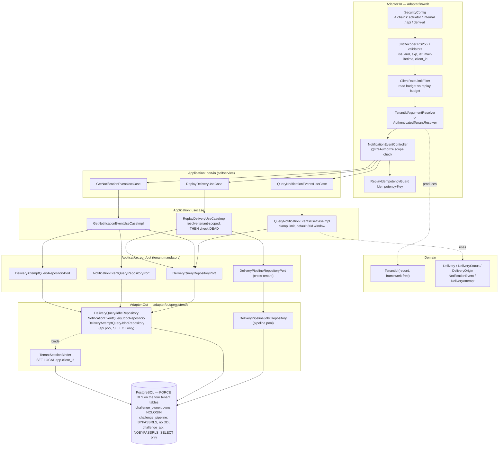

# FEAT-008: Self-Service API and Security

## Source ADR

Both source ADRs were verified `Accepted` by reading their `status:` front matter and their
`## Status` section before this file was written. **No `Status` field was touched and no ADR body
was amended by this feature.**

| ADR | Status | What this feature takes from it |
|-----|--------|---------------------------------|
| ADR-005 | Accepted | §1 in full — the three endpoints, keyset pagination on `(event_created_at, delivery_id)`, bounded page size (default 50, max 200, clamped not rejected), default 30-day window, replay-as-insert with `origin = 'REPLAY'` and `replayed_from`, `DEAD`-only acceptance, 409 otherwise, the required `Idempotency-Key` header, and the acknowledgment-not-outcome response shape. Amendments D1, D2, D3 |
| ADR-007 | Accepted | §2 filter chains, §3 token contract, §4 scope model, §5 tenant scoping (option I-D, both layers), §5.5 status-code table, §6 rate-limit placement, §7 per-environment key handling and the startup validator. Amendment E1 |
| ADR-002 | Accepted | §1.1 reserves `/internal/**` for the ingest chain; §2.1/§2.2 are the cross-tenant pipeline that must stay outside the API's role and pool |
| ADR-003 | Accepted | §3's `origin` / `replayed_from` columns and the partial unique index on `(event_id, subscription_id)` — already migrated in `V2` |
| ADR-004 | Accepted | §1's `DEAD` vs `FAILED` distinction — replay accepts `DEAD` only |
| ADR-006 | Accepted | nothing new; the breaker and bulkhead are worker-side and untouched here |

No design decision is reopened, re-proposed or questioned here. Two mechanism choices that the
ADRs leave to the feature breakdown are made below and labelled as such.

## What already exists in merged code

| Already merged | Used how |
|---|---|
| `QueryNotificationEventsUseCase`, `GetNotificationEventUseCase`, `ReplayDeliveryUseCase` and their command/result records (`application/port/in/selfservice`) | the `port/in` contracts, implemented for the first time here; their commands change from `String clientId` to `TenantId` (TASK-008-14) |
| `ReplayDeliveryResult` sealed hierarchy (`Accepted` / `Rejected`), `RejectionReason` | the typed replay outcome the controller maps to 202 or 409 — no new result type is added |
| `DeliveryQueryRepositoryPort` (`findById`, `findPage`), `DeliveryPageQuery`, `DeliveryPage` | the client-facing read port; the `String clientId` parameter becomes `TenantId` (TASK-008-10) |
| `DeliveryQueryJdbcRepository`, `DeliveryPageCursor` | the keyset SQL and the opaque cursor codec, already written and tested against Postgres |
| `DeliveryPipelineRepositoryPort.insertIfAbsent` | the **ingest** insert, unchanged. Replay gets its own guarded sibling, `insertReplayIfAbsent` (TASK-008-16A) |
| `Delivery`, `DeliveryStatus`, `DeliveryOrigin`, `DeliveryAttempt`, `NotificationEvent` | the domain the endpoints project |
| `V1`–`V4` migrations, including `idx_deliveries_client_event_created_at` and `idx_deliveries_live_pair` | every index the list endpoint and the replay guard need |
| `LocalWebhookStubSecurityConfig` (`local` profile) | its catch-all `defaultFilterChain` is replaced by this feature's terminal deny chain (TASK-008-19) |

**No new table and no new column.** `V5` and `V6` in this feature are roles, grants and policies
only.

## Scope (MVP / Post-MVP)

### In scope

1. **The three endpoints of ADR-005 §1** — list, get-with-attempt-history, replay.
2. **Cursor pagination** on the list endpoint, keyed on `(event_created_at, delivery_id)`, page
   size defaulting to 50 and clamped at 200, default 30-day window when neither
   `created_from` nor `created_to` is given.
3. **Replay** — `DEAD` only, 409 otherwise, `Idempotency-Key` required, a new row with
   `origin = 'REPLAY'` and `replayed_from` set, original row untouched.
4. **JWT resource server** per ADR-007 §2 and §3 — RS256-only decoder, `iss`/`aud`/`exp`/`iat`,
   maximum lifetime, `client_id` format validator, scope-to-authority mapping with an empty
   prefix. **No IdP container anywhere**; a committed dev key pair under `tools/dev-jwt/`.
5. **Tenant isolation, option I-D, both layers** — a mandatory `TenantId` parameter on every
   client-facing port method (compile time) **and** PostgreSQL RLS under a non-bypassing
   `challenge_api` role (runtime). Neither substitutes for the other.
6. **Deny-by-default filter chains** (actuator / ingest / client API / terminal deny), the startup
   `SecurityConfigurationValidator`, RFC 9457 error bodies, and the per-client rate-limit filter.
7. **Unit tests only** — plain JUnit, no Spring context, no Testcontainers, no Docker. Every
   Testcontainers scenario the Tech Lead named is **written down** in the owning task's
   acceptance criteria and **explicitly deferred**. See **Testing scope for this phase**.

### Deferred (designed for, not built here)

- **SSRF / egress controls** — already shipped by FEAT-007; nothing here changes them.
- **Producer SigV4 verification** on `/internal/**`. ADR-007 §2 reserves the path and states the
  chain is `authenticated()` with a distinct mechanism; the verification itself is a separate
  follow-up. TASK-008-19 reserves the chain and **must not** let a client JWT authenticate there.
- **Subscription CRUD and the ADR-005 §2 verification handshake.** Out of scope by Q9.
- **Edge / gateway rate limiting** (ADR-007 §6, first row). Infrastructure, not code.
- **JWKS wiring against a real IdP.** The production branch is configuration only
  (`issuer-uri`); nothing in this repo can exercise it.
- **Any new table, column or index.**

## Three mechanism choices made here, not in an ADR

All three are inside the latitude the ADRs leave to the feature breakdown. None changes an ADR.
All three were revised on the Tech Lead's review of 2026-09-21; the revisions are recorded in
`## Review revisions` at the end of this file.

**1. Replay's conflict is detected by a guarded insert statement, not by a pre-check and not by
catching a constraint violation.** ADR-005 §1 gives replay two 409 conditions — a **live** row
exists for the `(event_id, subscription_id)` pair, or a **`DELIVERED`** one does.
`idx_deliveries_live_pair` (V2) covers only the first: its predicate deliberately excludes
`DELIVERED`, `DEAD` and `FAILED`, because ADR-003 §2's idempotency invariant is about live rows.
So the `DELIVERED` half of ADR-005 §1 is enforced by no index and, in the merged code, by nothing
at all. TASK-008-16A adds one new method, `insertReplayIfAbsent`, whose single statement evaluates
both conditions — the live one via `ON CONFLICT` on the index, the `DELIVERED` one via
`WHERE NOT EXISTS` — and returns `Optional.empty()` for either. `insertIfAbsent` is untouched: its
rule that a `DELIVERED` row frees the pair is the ingest path's rule and is correct there. Getting
the outcome from the statement keeps `org.springframework.dao.*` out of the application layer,
which ADR-007 §5.1 rule 3 requires.

**2. The API pool holds `SELECT` only, and the replay insert runs on the pipeline pool.** The
reason is not "fewer permissions" — that would be an argument a `WITH CHECK` policy could answer.
The reason is that **the replay row is a pipeline row**: ADR-005 §1 makes replay re-enter through
the one insert shape the ingest gateway already uses ("it reuses one code path"), and that shape
lives on `DeliveryPipelineRepositoryPort`, whose adapter is cross-tenant and therefore cannot run
on the API pool. Granting `challenge_api` an `INSERT` and adding a `WITH CHECK` policy would not
merge the two transactions into one; it would require a **second** delivery-insert adapter on the
API pool, duplicating the column list, the `ON CONFLICT` inference predicate (which must match
`idx_deliveries_live_pair` verbatim or fail at runtime) and the replay guard — a second way to
write a delivery row, which is the thing ADR-005 §1 avoids. `SELECT`-only then follows as free
least privilege.

**The two transactions carry no race, and this is now provable rather than asserted.** After
mechanism choice 1:

- The target's `DEAD` state cannot go stale — `DEAD` is terminal (`DeliveryStatus.DEAD`'s legal
  targets are empty), so nothing moves a row out of it between the read and the insert.
- The pair's live/`DELIVERED` state is never read in a prior transaction at all. Both conditions
  are evaluated inside the insert statement, against committed state, at insert time.
- A crash between the two leaves the original `DEAD` row untouched — the same state as never
  having called.

One residual remains and is accepted, documented in TASK-008-16A: a pair committing to `DELIVERED`
in the instant between the statement's `NOT EXISTS` and its insert. Closing it needs `SERIALIZABLE`
or a pair-level advisory lock; the cost of not closing it is one duplicate webhook to a subscriber
that ADR-004's at-least-once contract already requires to be idempotent.

**3. Three database roles, not two, and `FORCE ROW LEVEL SECURITY` on.** ADR-007 §5.4's table names
two *runtime* roles; it does not say the pipeline role must own the tables, and it explicitly
requires `FORCE` whenever the owner and the pipeline role are the same principal. Ownership and
RLS-exemption are therefore separated into three roles, each holding one privilege:

| Role | Holds | Used by |
|---|---|---|
| `challenge_owner` | `NOLOGIN`. Owns the schema, the four tenant tables and their types | Nothing at runtime. Flyway reaches DDL by **membership** in it |
| `challenge_pipeline` | `LOGIN`, **`BYPASSRLS` explicitly**, `SELECT/INSERT/UPDATE`, **no DDL**, not the owner | Ingest, relay, worker, DLQ consumer — the primary pool |
| `challenge_api` | `LOGIN`, **`NOBYPASSRLS`**, `SELECT` only, not the owner, not an owner member | The three client endpoints — the API pool |

The earlier shape let the pipeline escape the policies **by being the owner**, with `FORCE` off.
That bundles the privilege actually wanted (read across tenants) with one nobody asked for
(`ALTER`, `DROP`, `TRUNCATE`), and it is the exact owner-equals-pipeline-with-`FORCE`-off pairing
ADR-007 §5.4 rules out. With ownership separated, `FORCE` costs the pipeline nothing (a
`BYPASSRLS` role bypasses RLS regardless) and closes the remaining hole: the Flyway user is an
owner member, and without `FORCE` any connection under that membership reads every tenant's rows
with no policy applying.

Where `BYPASSRLS` cannot be granted (it needs a superuser; a managed instance may refuse), the
documented fallback is an explicit permissive policy `TO challenge_pipeline USING (true)`. Both
forms are explicit and catalog-visible; exactly one is used and a test asserts which.

**The cost, stated plainly:** the primary pool stops connecting as the owner and starts connecting
as `challenge_pipeline`, and Flyway gets its own credentials. That is a configuration change to the
pipeline's runtime identity — no pipeline code, no pipeline SQL — and it lands in TASK-008-09. It
is the only part of FEAT-008 that touches the pipeline's wiring, and without it the three-role
model would be a schema decoration rather than a control.

## Architecture

## Port Contracts

### Changed

| Port | Before | After |
|---|---|---|
| `DeliveryQueryRepositoryPort` | `findById(UUID, String clientId)`, `findPage(String clientId, DeliveryPageQuery, int)` | `findById(UUID, TenantId)`, `findPage(TenantId, DeliveryPageQuery, int)` |
| `QueryNotificationEventsCommand` | `String clientId`, `createdFrom`, `createdTo` | `TenantId tenant`, `eventCreatedFrom`, `eventCreatedTo` (ADR-005 D2 naming) |
| `GetNotificationEventCommand`, `ReplayDeliveryCommand` | `String clientId` | `TenantId tenant` |
| `RejectionReason` | `TARGET_NOT_DEAD`, `LIVE_OR_DELIVERED_ROW_ALREADY_EXISTS` (both 409) | plus `TARGET_NOT_FOUND` (404). The sealed `ReplayDeliveryResult` has only `Accepted` and `Rejected`, so as merged there is no way for the replay use case to express not-found — which ADR-007 §5.5 requires for both a nonexistent id and another tenant's id. One constant, not a new result variant and not an `Optional` return that would change the `port/in` interface ADR-005 §1 fixes at one method in, one result out (TASK-008-19) |

### New

| Port | Method | Note |
|---|---|---|
| `NotificationEventQueryRepositoryPort` | `Optional<NotificationEvent> findById(String eventId, TenantId tenant)` | client-facing read of the event body for the GET detail. `eventId` is the `String` business key (`notification_events.event_id`, `text`, e.g. `EVT001`), read off the step-1 delivery row — **not** a `UUID` (corrected 2026-09-21, see `docs/concerns.md`). Separate from the cross-tenant `NotificationEventRepositoryPort` the pipeline uses — ISP, and it is what puts the two on different pools |
| `DeliveryAttemptQueryRepositoryPort` | `List<DeliveryAttempt> findByDeliveryId(UUID deliveryId, TenantId tenant)` | the attempt history of ADR-005 §1's GET row. `delivery_attempts` has no `client_id`, so both the SQL predicate and the RLS policy go through the parent `deliveries` row |

| `DeliveryPipelineRepositoryPort` | `Optional<Delivery> insertReplayIfAbsent(Delivery)` | **one added method, no signature changed.** Replay's guarded insert: `ON CONFLICT` on `idx_deliveries_live_pair` for the live condition plus `WHERE NOT EXISTS ... status = 'DELIVERED'` for the other half of ADR-005 §1's 409, both in one statement. Takes no `TenantId` — cross-tenant by design, like its siblings (TASK-008-16A) |

`SubscriptionRepositoryPort`, `NotificationEventRepositoryPort` and `DeliveryAttemptRepositoryPort`
are **unchanged**, and `DeliveryPipelineRepositoryPort`'s existing methods are unchanged: all
cross-tenant by design, per ADR-007 §5.2's carve-out and Amendment E1. An ArchUnit rule asserting
"every port method takes a `TenantId`" would be wrong and must be scoped to the client-facing ports
only.

### Domain

`TenantId` — a record in `domain/model/tenant`, validating ADR-007 §3's format (1–64 characters,
`[A-Za-z0-9_-]`) in its compact constructor. Framework-free. Constructible in production **only**
by `AuthenticatedTenantResolver`.

## Data Model Impact

No table, column or index changes. Two migrations, both role/policy only:

| Migration | Contents |
|---|---|
| `V5__database_roles.sql` | the three roles of mechanism choice 3, their grants, and `ALTER ... OWNER TO challenge_owner` on the schema, the four tenant tables, their sequences and enum types. `GRANT challenge_owner TO <Flyway user>` so later migrations keep DDL |
| `V6__row_level_security.sql` | `ENABLE` **and `FORCE`** `ROW LEVEL SECURITY` plus one `USING (client_id = current_setting('app.client_id', true))` policy per tenant table, scoped `TO challenge_api`; `delivery_attempts`' policy is expressed against its parent `deliveries` row |

`ALTER ... OWNER TO` is the only DDL either migration performs on an existing table. No table,
column, index or constraint is added, dropped or altered.

**`FORCE ROW LEVEL SECURITY` is set**, reversing this feature's first draft. The pipeline escapes
the policies by an explicit `BYPASSRLS` on `challenge_pipeline` (or the documented `TO
challenge_pipeline USING (true)` fallback), not by owning the tables — so `FORCE` costs it nothing
and removes ownership as an implicit authorization path. TASK-008-07's catalog test asserts the
role properties, TASK-008-08's asserts `relforcerowsecurity`, and TASK-008-09's startup assertion
fails the context if the API pool's role can bypass, owns a tenant table, or is an owner member.

## Security Impact

**Authentication:** every endpoint in this feature requires a valid RS256 JWT from the configured
issuer with the configured audience and a well-formed `client_id` claim. No permit-all outside the
three actuator health probes.

**Authorization:** `notifications:read` for both GETs, `notifications:replay` for the POST, at both
the URL level and the handler level (`@PreAuthorize`). No hierarchy — replay does not imply read.

| OWASP Top 10:2025 | Exposure | Where it is handled |
|---|---|---|
| **A01 Broken Access Control (IDOR)** | All three endpoints take a client-controlled id | Four layers: `TenantId` with one factory (08-04, 08-05), tenant-mandatory ports (08-12, 08-13), bound SQL predicates (08-15, 08-16), RLS (08-07, 08-08). 404 not 403 (08-25) |
| **A02 Security Misconfiguration** | Filter chains, actuator exposure, key configuration | Deny-by-default terminal chain (08-21), startup validator (08-22), health details `never` |
| **A03 Software Supply Chain** | One new runtime dependency (`spring-boot-starter-oauth2-resource-server`) and one test dependency (ArchUnit). The rate limiter is hand-rolled, so **no** Bucket4j | 08-01 pins both; 08-24 writes the buckets by hand |
| **A04 Cryptographic Failures** | JWT signature verification | RS256 single-algorithm allow-list, ≥2048-bit key checked at startup, dev key outside `src/main/resources` (08-02, 08-20, 08-22) |
| **A05 Injection** | `client_id` reaches SQL **and** a session-configuration statement; filters reach SQL | Format-validated in `TenantId`, bound parameters everywhere, and the tenant variable set via a bound `set_config` call rather than string interpolation (08-10) |
| **A06 Insecure Design** | A rule a developer must remember is not a control | The enforced path is the easy path: declare a `TenantId` parameter. ArchUnit makes the alternative fail the build (08-06) |
| **A07 Authentication Failures** | Public API | Identical 401 bodies for every distinct failure (08-23), stateless, no session |
| **A09 Logging & Alerting** | Tokens, keys and tenant data in logs | No token, signature or key material logged at any level; 401/403/429 logged structurally with `client_id`, `sub`, trace id (08-23, 08-24) |
| **A10 Mishandling of Exceptional Conditions** | Unset tenant variable, unreachable JWKS, misconfigured key | Every path fails closed: unset variable matches zero rows (08-11 proves it), no fallback trust anchor, startup refuses to boot (08-22) |

Security review of the assembled chain is TASK-008-30, assigned to `security-engineer`.

## Testing scope for this phase

**Unit tests only — plain JUnit, no Spring context, no Testcontainers, no Docker, no real
PostgreSQL.** Same phase rule FEAT-007 ran under, on Tech Lead direction of 2026-09-21.

| Writable now | Deferred until the Tech Lead says otherwise |
|---|---|
| Domain logic (`TenantId` format) | Anything needing a real PostgreSQL connection |
| Use-case logic against fake or mocked ports | RLS policy behavior, role privileges, catalog assertions |
| Cursor encode/decode and clamping/windowing arithmetic | Every `@SpringBootTest`, every Testcontainers fixture change |
| Filter, decoder, validator and resolver logic with mocked Spring Security types | End-to-end HTTP tests with a real token and a real database |
| ArchUnit rules (no container, no context) | Pool wiring proven against a live database |

**Every deferred scenario stays written down** in the owning task's acceptance criteria, tagged
`DEFERRED — Testcontainers`, so nothing is lost between phases. An implementing agent must not
write those tests now, and must not substitute an H2 or a mocked-JDBC imitation for them: a fake
database proves nothing about an RLS policy, and a green suite for the wrong reason is worse than
an absent one.

Verification command for this phase is `./gradlew compileJava compileTestJava` plus the unit
tests the task actually writes. **Do not run `./gradlew test` or `./gradlew build`** — the full
run is the Tech Lead's to trigger, as in FEAT-007.

Tasks 07, 08, 09, 10, 11, 15, 16, 16A, 28 and 29 are therefore **specification-and-production-code
tasks in this phase**: their production code and migrations are written and must compile, and
their verification is deferred with the rest.

## Named tests

Every scenario the Tech Lead listed, the task whose acceptance criteria own it, and whether it can
be written in this phase. **None may be dropped or weakened — the deferred ones are written down,
not discarded.**

| # | Scenario | Owning task | This phase |
|---|---|---|---|
| 1 | A token for client A requesting client B's delivery gets **404** (not 403, not 200) | TASK-008-28 | **DEFERRED — Testcontainers.** The use-case half (a foreign id yields `Optional.empty()` against a mocked port) is written now in TASK-008-18 |
| 2 | A repository call that omits the tenant parameter **must not compile** | TASK-008-12 + TASK-008-06 | **Now.** Structural — no such method exists — plus an ArchUnit rule, neither of which needs a database |
| 3 | With RLS active and **no tenant context set**, a direct query returns **zero rows** | TASK-008-11 | **DEFERRED — Testcontainers.** Cannot be faked; the policy is the thing under test |
| 4 | Replaying a **non-`DEAD`** delivery returns **409** | TASK-008-19 (use case) + TASK-008-28 (HTTP) | **Split.** The use-case half is written now against mocked ports; the HTTP 409 is deferred |
| 5 | **Two rapid replays create one delivery** | TASK-008-28 | **DEFERRED — Testcontainers.** The guarantee is `idx_deliveries_live_pair`, which only a real database evaluates |
| 6 | Cursor pagination returns **each row exactly once** across pages **with concurrent inserts** | TASK-008-29 | **DEFERRED — Testcontainers.** The cursor codec's own unit tests already exist and stay green |
| 7 | A nonexistent delivery id and **another tenant's** delivery id produce **results equal to each other** at the use case | TASK-008-19 | **Now.** Against a tenant-answering mock port; one test method asserting equality, not two asserting the same constant. Added on the Tech Lead's review |
| 8 | Replaying a pair that already has a **`DELIVERED`** row inserts **nothing** and returns 409 | TASK-008-16A (statement) + TASK-008-28 (HTTP) | **DEFERRED — Testcontainers.** The guard is a `WHERE NOT EXISTS` inside the insert; only a real database evaluates it. Added on the Tech Lead's review |
| 9 | `challenge_api` is **not** an owner and has **no** `BYPASSRLS`; `challenge_pipeline` has **no DDL** | TASK-008-07 (catalog) + TASK-008-11 (behavioral) | **Split.** A plain-JUnit text guard over the `V5` SQL is written now (TASK-008-07); the authoritative catalog assertions need `pg_roles`/`pg_class` and stay deferred |

Scenario 3 is the one most likely to pass for the wrong reason whenever it is implemented: a test
connecting as the table owner bypasses every policy. TASK-008-11 records that it must connect as
`challenge_api` and must assert it is neither the owner nor `BYPASSRLS` before asserting anything
about rows.

## Task Breakdown

Waves are the dependency structure. Tasks within a wave have no dependency on each other and may
be worked in parallel. No task depends on a higher-numbered task.

| Wave | Tasks | Theme |
|---|---|---|
| 0 | 01–06 | build dependencies, dev key tooling, `TenantId` and its one factory, ArchUnit |
| 1 | 07–11 | database roles, RLS policies, the API pool and the pipeline's connection identity, the session binder, the fail-closed test |
| 2 | 12–14 | port signatures — tenant mandatory (must land before any caller) |
| 3 | 15, 16, 16A | tenant-scoped persistence adapters on the API pool, and replay's guarded insert |
| 4 | 17–19 | use cases |
| 5 | 20–24 | security configuration |
| 6 | 25–27 | web adapter |
| 7 | 28–30 | integration tests and security review |

| # | Task | Agent | Depends on |
|---|------|-------|------------|
| 01 | [OAuth2 resource server and ArchUnit dependencies](tasks/TASK-008-01-security-and-archunit-dependencies.md) | devops-engineer | - |
| 02 | [Dev JWT key pair and token script](tasks/TASK-008-02-dev-jwt-tooling.md) | devops-engineer | - |
| 03 | [Per-environment JWT configuration](tasks/TASK-008-03-jwt-environment-configuration.md) | devops-engineer | 02 |
| 04 | [`TenantId` domain type](tasks/TASK-008-04-tenant-id-domain-type.md) | backend-engineer | - |
| 05 | [`AuthenticatedTenantResolver` and the argument resolver](tasks/TASK-008-05-authenticated-tenant-resolver.md) | security-engineer | 01, 04 |
| 06 | [ArchUnit rules for the tenant boundary](tasks/TASK-008-06-archunit-tenant-rules.md) | backend-engineer | 01, 04, 05 |
| 07 | [`V5` — `challenge_owner`, `challenge_pipeline`, `challenge_api`](tasks/TASK-008-07-v5-database-roles.md) | dba | - |
| 08 | [`V6` — row level security policies, `FORCE` on](tasks/TASK-008-08-v6-row-level-security.md) | dba | 07 |
| 09 | [API pool, and the principal each pool and Flyway connect as](tasks/TASK-008-09-api-datasource-and-tx-manager.md) | dba | 07 |
| 10 | [`TenantSessionBinder`](tasks/TASK-008-10-tenant-session-binder.md) | dba | 04, 09 |
| 11 | [RLS isolation fixture and fail-closed test](tasks/TASK-008-11-rls-isolation-test.md) | dba | 08, 09, 10 |
| 12 | [`DeliveryQueryRepositoryPort` takes `TenantId`](tasks/TASK-008-12-delivery-query-port-tenant-id.md) | backend-engineer | 04 |
| 13 | [Client-facing event and attempt query ports](tasks/TASK-008-13-event-and-attempt-query-ports.md) | backend-engineer | 04 |
| 14 | [`port/in` commands take `TenantId`](tasks/TASK-008-14-selfservice-commands-tenant-id.md) | backend-engineer | 04 |
| 15 | [`DeliveryQueryJdbcRepository` on the API pool](tasks/TASK-008-15-delivery-query-adapter-api-pool.md) | dba | 09, 10, 12 |
| 16 | [Event and attempt query adapters](tasks/TASK-008-16-event-and-attempt-query-adapters.md) | dba | 09, 10, 13 |
| 16A | [`insertReplayIfAbsent` — replay's guarded insert](tasks/TASK-008-16A-replay-insert-guard.md) | dba | - |
| 17 | [`QueryNotificationEventsUseCaseImpl`](tasks/TASK-008-17-query-notification-events-use-case.md) | backend-engineer | 12, 14 |
| 18 | [`GetNotificationEventUseCaseImpl`](tasks/TASK-008-18-get-notification-event-use-case.md) | backend-engineer | 12, 13, 14 |
| 19 | [`ReplayDeliveryUseCaseImpl`](tasks/TASK-008-19-replay-delivery-use-case.md) | backend-engineer | 12, 14, 16A |
| 20 | [JWT decoder, validators and authority mapping](tasks/TASK-008-20-jwt-decoder-and-validators.md) | security-engineer | 01, 03, 05 |
| 21 | [Four security filter chains](tasks/TASK-008-21-security-filter-chains.md) | security-engineer | 20 |
| 22 | [`SecurityConfigurationValidator`](tasks/TASK-008-22-security-configuration-validator.md) | security-engineer | 03, 20 |
| 23 | [RFC 9457 authentication and access-denied handlers](tasks/TASK-008-23-problem-detail-error-handlers.md) | security-engineer | 21 |
| 24 | [Per-client rate limit filter](tasks/TASK-008-24-client-rate-limit-filter.md) | security-engineer | 21 |
| 25 | [`NotificationEventController` — list and get](tasks/TASK-008-25-notification-event-controller-reads.md) | backend-engineer | 05, 17, 18, 21 |
| 26 | [Replay endpoint and `Idempotency-Key`](tasks/TASK-008-26-replay-endpoint.md) | backend-engineer | 19, 25 |
| 27 | [`ReplayIdempotencyGuard`](tasks/TASK-008-27-replay-idempotency-guard.md) | backend-engineer | 26 |
| 28 | [Cross-tenant, 409 and double-replay integration tests](tasks/TASK-008-28-tenant-isolation-integration-tests.md) | backend-engineer | 02, 11, 16A, 25, 26, 27 |
| 29 | [Cursor pagination exactly-once test](tasks/TASK-008-29-cursor-pagination-integration-test.md) | backend-engineer | 02, 11, 25 |
| 30 | [Security review of the assembled chain](tasks/TASK-008-30-security-review.md) | security-engineer | 28, 29 |

## Review revisions (Tech Lead review of 2026-09-21, before approval)

Three observations were raised against the first draft. All three were adopted. **No ADR `Status`
field was touched and no ADR body was amended.**

| # | Observation | Decision | Where |
|---|---|---|---|
| 1 | Two roles with owner == pipeline makes the pipeline's RLS escape implicit and hands it DDL | **Adopted.** Three roles; `FORCE ROW LEVEL SECURITY` on; explicit `BYPASSRLS`; the pipeline pool and Flyway get distinct principals | feature.md mechanism choice 3, TASK-008-07, -08, -09, -11 |
| 2 | `TARGET_NOT_FOUND` must be provably identical for a nonexistent and a foreign id | **Adopted as an explicit, named test of equivalence**, plus a written argument for why the design guarantees it structurally | TASK-008-19 |
| 3 | The `DELIVERED` condition is checked in a separate transaction from the insert | **Adopted, and widened.** The condition is not merely racy, it is unimplemented; it moves into the insert statement as a new port method | feature.md mechanism choice 1, TASK-008-16A, TASK-008-19 |

**Does any of this need an ADR change? No — but two things should be recorded, and neither is an
agent's to write.** Flagged here for the Tech Lead:

1. **ADR-003, advisable amendment (not required).** ADR-005 §1's 409 has two halves, and the
   design now enforces them by two different mechanisms: `idx_deliveries_live_pair` for the live
   half, a statement-level `WHERE NOT EXISTS` for the `DELIVERED` half. ADR-003 §2 currently reads
   as though the partial index is the single idempotency mechanism. It still is, for ingest; it is
   not the whole story for replay. An amendment recording that split would stop a future reader
   "fixing" the index by widening its predicate to include `DELIVERED`, which would silently change
   ingest's idempotency semantics. Nothing blocks implementation on it.
2. **ADR-007 §5.4, optional clarification.** Its role table names two roles and its prose assumes
   the owner may be the pipeline principal. The three-role model complies with the section (it
   satisfies the `FORCE` requirement by removing the condition that triggers it) but is not the
   shape the table depicts. A one-line amendment naming `challenge_owner` would make the ADR and
   the schema read the same. Also not blocking.

**One deviation from the numbering convention**, called out so it is a decision and not an
accident: Observation 3 needs a DBA task that TASK-008-19 depends on, and every number below 19 is
taken. It is numbered **TASK-008-16A** rather than renumbering 31 task files. The invariant the
convention protects — no task depends on a task ordered after it — still holds.

## Status

In Progress <!-- Planned | In Progress | Done -->
